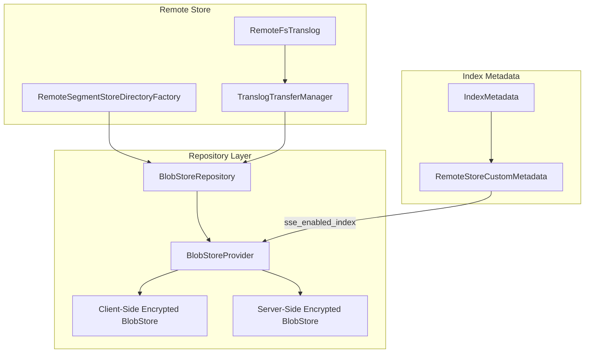

---
tags:
  - indexing
---

# Repository Encryption

## Summary

OpenSearch v3.4.0 adds support for S3 repositories with both server-side encryption (SSE) and client-side encryption enabled. This enhancement allows remote store indexes to use server-side encrypted repositories, providing improved data protection for remote-backed storage.

Previously, `BlobStoreRepository` only supported a single `BlobStore` created lazily, and once created, the repository was tied to that `BlobStore`. This change introduces a `BlobStoreProvider` that can create both client-side encrypted and server-side encrypted `BlobStore` instances, enabling repositories to support both encryption modes simultaneously.

## Details

### What's New in v3.4.0

This release introduces the ability to configure remote store repositories with server-side encryption enabled. The key changes include:

1. **BlobStoreProvider**: A new component responsible for creating and managing both client-side and server-side encrypted `BlobStore` instances
2. **SSE-enabled index metadata**: New index metadata key `sse_enabled_index` to track whether an index uses server-side encryption
3. **Cluster setting**: New `cluster.remote_store.server_side_encryption` setting to enable/disable SSE at the cluster level

### Technical Changes

#### Architecture Changes

#### New Components

| Component | Description |
|-----------|-------------|
| `BlobStoreProvider` | Manages creation of client-side and server-side encrypted `BlobStore` instances |
| `RemoteStoreCustomMetadataResolver.isRemoteStoreRepoServerSideEncryptionEnabled()` | Checks if SSE is enabled for remote store repositories |
| `RemoteStoreUtils.isServerSideEncryptionEnabledIndex()` | Utility to check if an index has SSE enabled |

#### New Configuration

| Setting | Description | Default |
|---------|-------------|---------|
| `cluster.remote_store.server_side_encryption` | Enables server-side encryption for remote store repositories | `true` |

#### Index Metadata Changes

A new custom metadata key `sse_enabled_index` is added under `remote_store` custom data to track whether an index was created with server-side encryption enabled.

### Usage Example

Server-side encryption is automatically enabled when:
1. The cluster setting `cluster.remote_store.server_side_encryption` is `true`
2. The repository supports server-side encryption (e.g., S3 with SSE enabled)
3. The minimum node version is v3.4.0 or later

For S3 repositories, the `S3Repository.isSeverSideEncryptionEnabled()` method always returns `true` since S3 is always server-side encrypted.

### Migration Notes

- Existing indexes created before v3.4.0 will not have the `sse_enabled_index` metadata
- When restoring from snapshots, the SSE setting is preserved from the original index metadata
- The feature requires all nodes in the cluster to be on v3.4.0 or later

## Limitations

- Server-side encryption support is currently implemented only for S3 repositories
- The `BlobStoreProvider` creates separate `BlobStore` instances for SSE and non-SSE operations, which may increase resource usage
- Mixed-version clusters (with nodes below v3.4.0) cannot use this feature

## References

### Documentation
- [Remote-backed storage documentation](https://docs.opensearch.org/3.0/tuning-your-cluster/availability-and-recovery/remote-store/index/): Official docs on remote store
- [S3 Server-side encryption](https://docs.aws.amazon.com/AmazonS3/latest/dev/serv-side-encryption.html): AWS documentation on S3 SSE

### Pull Requests
| PR | Description |
|----|-------------|
| [#19630](https://github.com/opensearch-project/OpenSearch/pull/19630) | Add support for repository with Server side encryption enabled and client side encryption |

### Issues (Design / RFC)
- [Issue #19235](https://github.com/opensearch-project/OpenSearch/issues/19235): Feature request for server-side encrypted repository support

## Related Feature Report

- [Full feature documentation](../../../../features/opensearch/opensearch-repository-encryption.md)
