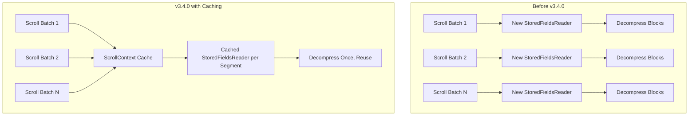
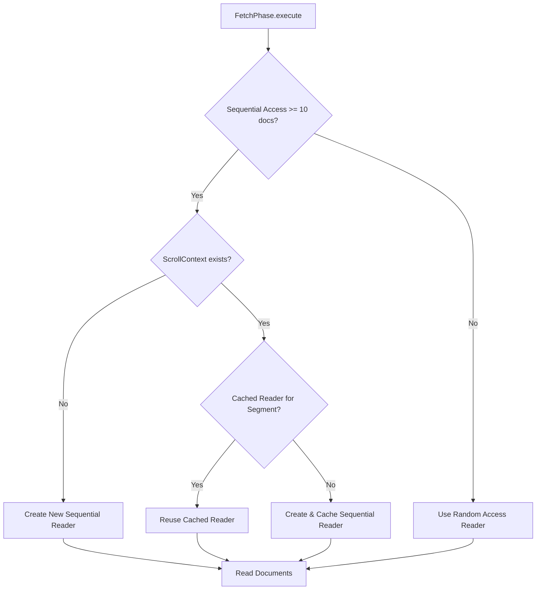

---
tags:
  - domain/core
  - component/server
  - indexing
  - performance
  - search
---
# Scroll Query Optimization

## Summary

OpenSearch v3.4.0 introduces a performance optimization for scroll queries by caching `StoredFieldsReader` instances across scroll batches. This addresses a significant performance regression that was observed in versions 2.6.0 and later, where scroll API response times increased linearly during large data retrievals.

## Details

### What's New in v3.4.0

The optimization caches the sequential `StoredFieldsReader` per segment within the `ScrollContext`, allowing it to be reused across multiple scroll batches. Previously, each scroll batch created a new reader instance, causing repeated decompression of stored field blocks and degraded performance over time.

### Technical Changes

#### Architecture Changes



#### Data Flow



#### New Components

| Component | Description |
|-----------|-------------|
| `ScrollContext.sequentialReaderCache` | Per-segment cache for `StoredFieldsReader` instances |
| `ScrollContext.getCachedSequentialReader()` | Retrieves cached reader for a segment key |
| `ScrollContext.cacheSequentialReader()` | Stores reader in cache for reuse |

#### Modified Components

| Component | Change |
|-----------|--------|
| `FetchPhase` | Added logic to check and use cached readers for scroll queries |
| `ScrollContext` | Implements `Releasable` to properly close cached readers |
| `LegacyReaderContext` | Registers `ScrollContext` for cleanup on close |

### Usage Example

No API changes required. The optimization is automatically applied to all scroll queries:

```json
GET /my-index/_search?scroll=10m
{
  "size": 10000,
  "query": {
    "match_all": {}
  }
}
```

Subsequent scroll requests automatically benefit from the cached readers:

```json
GET _search/scroll
{
  "scroll": "10m",
  "scroll_id": "DXF1ZXJ5QW5kRmV0Y2gBAAAAAAAAAAUWdmpUZDhnRFBUcWFtV21nMmFwUGJEQQ=="
}
```

### Performance Impact

Based on the PR analysis using the big5 scroll query benchmark:
- Eliminates repeated calls to `Lucene90CompressingStoredFieldsReader` for each batch
- Reduces CPU time spent on decompression of stored field blocks
- Addresses the linear response time increase observed in versions >= 2.6.0

### Migration Notes

No migration required. This is a transparent performance improvement that applies automatically to existing scroll queries.

## Limitations

- Cache is per-segment, so memory usage scales with the number of segments accessed during scroll
- Cached readers are cleaned up when the scroll context is closed
- Thread safety note: Scroll requests are serialized (client waits for response before sending next request), so the cache is safe for sequential single-threaded access across different threads

## References

### Documentation
- [Scroll API Documentation](https://docs.opensearch.org/3.4/api-reference/search-apis/scroll/)
- [OpenSearch Benchmark big5 Workload](https://github.com/opensearch-project/opensearch-benchmark-workloads/blob/main/big5/operations/default.json)

### Pull Requests
| PR | Description |
|----|-------------|
| [#20112](https://github.com/opensearch-project/OpenSearch/pull/20112) | Cache the `StoredFieldsReader` for scroll query optimization |

### Issues (Design / RFC)
- [Issue #16262](https://github.com/opensearch-project/OpenSearch/issues/16262): Performance degradation with Scroll API in OpenSearch versions >= 2.6

## Related Feature Report

- Full Scroll API documentation
