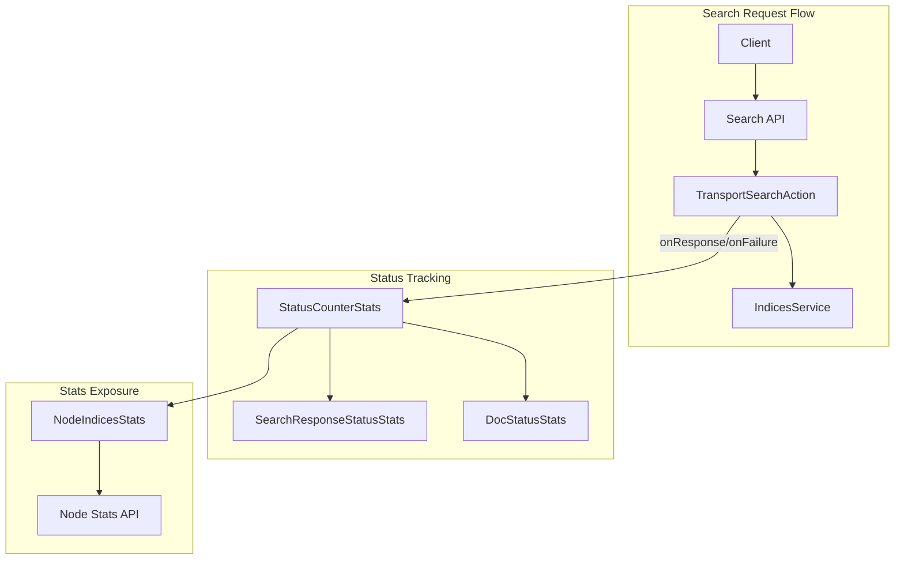

# Search API Tracker

## Summary

This release introduces a Search API Tracker that tracks response status codes for search API calls at the coordinator node level. The feature addresses a gap in observability where `_msearch` requests return HTTP 200 even when individual sub-requests fail, making it difficult to detect partial failures without client-side inspection.

The tracker adds a new `status_counter` section to the Node Stats API response, providing counters for both document indexing (`doc_status`) and search response (`search_response_status`) statuses, categorized by error type: `success`, `user_error`, and `system_failure`.

## Details

### What's New in v3.4.0

- New `StatusCounterStats` class that aggregates both `DocStatusStats` and `SearchResponseStatusStats`
- Search response status tracking in `TransportSearchAction` at the coordinator node
- Refactored `DocStatusStats` from `IndexingStats` to a standalone class with improved architecture
- New `status_counter` section in Node Stats API response under `indices`
- Error type categorization using `RestStatus.getErrorType()` method

### Technical Changes

#### Architecture Changes



#### New Components

| Component | Description |
|-----------|-------------|
| `StatusCounterStats` | Container class holding both `DocStatusStats` and `SearchResponseStatusStats` |
| `SearchResponseStatusStats` | Tracks search response status codes by HTTP status family |
| `DocStatusStats` (refactored) | Moved from `IndexingStats.Stats` to standalone class in `action.admin.indices.stats` |

#### New Configuration

No new configuration settings are required. The feature is enabled by default.

#### API Changes

The Node Stats API (`GET /_nodes/stats`) response now includes a `status_counter` section:

```json
{
  "indices": {
    "status_counter": {
      "doc_status": {
        "success": 1000,
        "user_error": 5,
        "system_failure": 0
      },
      "search_response_status": {
        "success": 500,
        "user_error": 10,
        "system_failure": 2
      }
    }
  }
}
```

### Usage Example

Query node stats to retrieve search API tracking information:

```bash
GET /_nodes/stats/indices
```

Response includes the new `status_counter` section showing cumulative counts since node startup:

```json
{
  "nodes": {
    "node_id": {
      "indices": {
        "status_counter": {
          "doc_status": {
            "success": 15000,
            "user_error": 25,
            "system_failure": 0
          },
          "search_response_status": {
            "success": 8500,
            "user_error": 150,
            "system_failure": 5
          }
        }
      }
    }
  }
}
```

### Error Type Categories

| Category | HTTP Status Codes | Description |
|----------|-------------------|-------------|
| `success` | 1xx, 2xx, 3xx | Successful operations |
| `user_error` | 4xx | Client errors (bad request, not found, etc.) |
| `system_failure` | 5xx | Server errors (internal error, service unavailable, etc.) |

### Migration Notes

- The `doc_status` field has been moved from `indices.indexing` to `indices.status_counter`
- The output format changed from HTTP status family codes (e.g., `2xx`, `4xx`) to error type names (`success`, `user_error`, `system_failure`)
- Uses `LongAdder` instead of `AtomicLong` for better concurrent performance

## Limitations

- Statistics are cumulative since node startup and reset on node restart
- Tracking occurs at the coordinator node level, not at the shard level
- The PR was closed without being merged as of the investigation date

## Related PRs

| PR | Description |
|----|-------------|
| [#18601](https://github.com/opensearch-project/OpenSearch/pull/18601) | Add search API tracker |

## References

- [Issue #18377](https://github.com/opensearch-project/OpenSearch/issues/18377): Feature request for tracking non-successful Search API calls
- [Issue #18438](https://github.com/opensearch-project/OpenSearch/issues/18438): Bug report requesting DocStatusStats refactoring
- [Node Stats API Documentation](https://docs.opensearch.org/3.0/api-reference/nodes-apis/nodes-stats/): Official documentation

## Related Feature Report

- [Full feature documentation](../../../features/opensearch/search-api-tracker.md)
