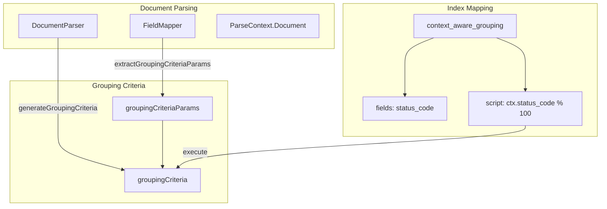

# Segment Grouping Mapper

## Summary

This release adds a new `context_aware_grouping` mapper that enables users to define grouping criteria for Context Aware Segments. The mapper allows specifying which field(s) determine how documents are grouped into segments, with optional Painless script support for transforming field values into grouping criteria.

## Details

### What's New in v3.4.0

This PR introduces the indexing-side implementation for context-aware segment grouping:

- New `context_aware_grouping` mapper type for defining grouping criteria in index mappings
- Support for specifying source fields that determine document grouping
- Optional Painless script support for transforming field values into grouping criteria
- Integration with the document parsing pipeline to extract and store grouping criteria

### Technical Changes

#### Architecture Changes



#### New Components

| Component | Description |
|-----------|-------------|
| `ContextAwareGroupingFieldMapper` | Field mapper for parsing and validating `context_aware_grouping` mapping configuration |
| `ContextAwareGroupingFieldType` | Field type extending `CompositeMappedFieldType` for grouping criteria |
| `ContextAwareGroupingScript` | Script context for executing Painless scripts to compute grouping criteria |

#### New Configuration

| Setting | Description | Default |
|---------|-------------|---------|
| `context_aware_grouping.fields` | List of field names used to determine grouping (currently limited to single field) | Required |
| `context_aware_grouping.script` | Optional Painless script to transform field values into grouping criteria | `null` |

#### Supported Field Types

The following field types can be used as grouping criteria sources:

- `double`
- `float`
- `integer`
- `text`
- `date`
- `ip`

### Usage Example

```json
// Create index with context_aware_grouping mapper
PUT /logs-index
{
  "mappings": {
    "context_aware_grouping": {
      "fields": ["status_code"],
      "script": {
        "source": "String.valueOf(ctx.status_code / 100)"
      }
    },
    "properties": {
      "status_code": {
        "type": "integer"
      },
      "message": {
        "type": "text"
      }
    }
  }
}
```

```json
// Without script - uses field value directly as grouping criteria
PUT /tenant-index
{
  "mappings": {
    "context_aware_grouping": {
      "fields": ["tenant_id"]
    },
    "properties": {
      "tenant_id": {
        "type": "keyword"
      },
      "data": {
        "type": "text"
      }
    }
  }
}
```

### Migration Notes

- The `context_aware_grouping` mapper must reference fields defined in `properties`
- Currently only single-field grouping is supported; multiple fields will throw a parsing exception
- The `fields` parameter is required; omitting it will result in a `MapperParsingException`
- Only Painless scripts are supported; other script languages will be rejected

## Limitations

- **Single Field Only**: Currently limited to a single field for grouping criteria
- **Painless Only**: Only Painless scripts are supported for transformations
- **Field Validation**: Script field usage validation is limited; users can reference multiple fields in scripts while declaring only one, which may affect query optimizations
- **No Aggregation Support**: The `context_aware_grouping` field type cannot be used in aggregations

## Related PRs

| PR | Description |
|----|-------------|
| [#19233](https://github.com/opensearch-project/OpenSearch/pull/19233) | Add a mapper for context aware segments grouping criteria |

## References

- [RFC #19223](https://github.com/opensearch-project/OpenSearch/issues/19223): Context aware segments user experience
- [RFC #18576](https://github.com/opensearch-project/OpenSearch/issues/18576): Context Aware Segments

## Related Feature Report

- [Full feature documentation](../../../features/opensearch/context-aware-segments.md)
