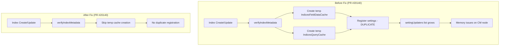

# Settings Bugfixes

## Summary

OpenSearch v3.4.0 includes two important bugfixes related to settings management: fixing duplicate registration of dynamic settings that caused memory issues on cluster manager nodes, and resolving build system issues when updating to patch versions other than 0.

## Details

### What's New in v3.4.0

#### Fix Duplicate Registration of FieldDataCache Dynamic Setting

A critical bug was discovered where the `indices.fielddata.cache.size` and `indices.queries.cache.skip_cache_factor` settings were being registered multiple times during index creation/update operations. This caused the `settingUpdaters` list to grow unbounded, eventually leading to memory issues on active cluster manager nodes.

**Root Cause**: During index metadata verification, temporary `IndicesFieldDataCache` and `IndicesQueryCache` objects were created, which registered their dynamic settings with the cluster settings. These temporary objects were later closed, but the settings remained registered, causing duplicates with each index operation.

**Fix**: The fix removes the creation of temporary cache objects during metadata verification, as they are not needed for validation purposes.

#### Fix Patch Version Update Issue

A bug in the build system prevented version bumps to patch versions other than 0 (e.g., 3.3.1). Running `./gradlew localDistro` would fail with:

```
Expected exactly 2 majors in parsed versions but found: [2, 3, 6, 7]
```

**Root Cause**: The `BwcVersions` class was parsing both the current version file and a legacy ES version file. When the patch version was non-zero, a code path was triggered that incorrectly included legacy ES major versions (6, 7) in the version list.

**Fix**: Removed references to the legacy ES version file, which is no longer relevant as ES versions are more than 2 major versions in the past.

### Technical Changes

#### Architecture Changes



#### Code Changes

| Component | Change | PR |
|-----------|--------|-----|
| `IndicesService.verifyIndexMetadata()` | Removed creation of temporary `IndicesFieldDataCache` and `IndicesQueryCache` | #20140 |
| `AbstractScopedSettings` | Added `getSettingUpdaters()` method for debugging/testing | #20140 |
| `GlobalBuildInfoPlugin` | Removed legacy ES version file parsing | #19377 |

#### New Test Coverage

| Test | Description |
|------|-------------|
| `ClusterSettingsIT.testWithMultipleIndexCreationAndVerifySettingRegisteredOnce` | Verifies settings are registered exactly once across multiple index operations |

### Usage Example

To verify settings are not duplicated, you can check the cluster settings:

```bash
GET /_cluster/settings?include_defaults=true&flat_settings=true
```

### Migration Notes

No migration required. These are internal bugfixes that take effect automatically after upgrading to v3.4.0.

## Limitations

- The fix for duplicate settings registration only prevents future duplicates; existing clusters with bloated `settingUpdaters` lists will need a cluster manager restart to clear the duplicates.

## References

### Documentation
- [Cluster Settings API](https://docs.opensearch.org/3.0/api-reference/cluster-api/cluster-settings/): Official API documentation

### Pull Requests
| PR | Description |
|----|-------------|
| [#20140](https://github.com/opensearch-project/OpenSearch/pull/20140) | Fix duplicate registration of FieldDataCache dynamic setting |
| [#19377](https://github.com/opensearch-project/OpenSearch/pull/19377) | Fix issue with updating core with a patch number other than 0 |

### Issues (Design / RFC)
- [opensearch-build#5720](https://github.com/opensearch-project/opensearch-build/issues/5720): Related build issue for patch version updates

## Related Feature Report

- [Full feature documentation](../../../../features/opensearch/settings-management.md)
