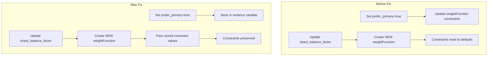

---
tags:
  - domain/core
  - component/server
  - indexing
---
# Shard Allocation

## Summary

This release fixes a bug where the `WeightFunction` allocation and rebalance constraints for primary shard balancing were incorrectly reset to default values when updating certain cluster settings. The fix ensures that primary shard balance settings (`cluster.routing.allocation.balance.prefer_primary` and `cluster.routing.allocation.rebalance.primary.enable`) remain effective even when other balance-related settings are modified.

## Details

### What's New in v3.4.0

The `BalancedShardsAllocator` uses a `WeightFunction` to calculate node weights for shard allocation decisions. This function includes constraints that control primary shard balancing behavior. Prior to this fix, updating settings like `indexBalanceFactor`, `shardBalanceFactor`, or `preferPrimaryShardRebalanceBuffer` would create a new `WeightFunction` instance that lost the previously configured primary shard balance constraints.

### Technical Changes

#### Root Cause

The bug occurred because:

1. Settings like `PREFER_PRIMARY_SHARD_BALANCE` and `PREFER_PRIMARY_SHARD_REBALANCE` updated constraints on the existing `WeightFunction` instance
2. Settings like `INDEX_BALANCE_FACTOR_SETTING`, `SHARD_BALANCE_FACTOR_SETTING`, and `PRIMARY_SHARD_REBALANCE_BUFFER` triggered `updateWeightFunction()` which created a new `WeightFunction`
3. The new `WeightFunction` was constructed without the current primary balance constraint states



#### Code Changes

The fix modifies the `WeightFunction` constructor to accept the current constraint states:

| Component | Change |
|-----------|--------|
| `WeightFunction` constructor | Added `preferPrimaryShardBalance` and `preferPrimaryShardRebalance` parameters |
| `updateWeightFunction()` | Now passes current constraint values to new `WeightFunction` |
| `WeightFunction` initialization | Applies constraint settings during construction |

#### Modified Files

| File | Description |
|------|-------------|
| `BalancedShardsAllocator.java` | Extended `WeightFunction` constructor and `updateWeightFunction()` |
| `SegmentReplicationAllocationIT.java` | Added integration test to verify fix |
| `BalanceConfigurationTests.java` | Added unit test for settings update scenario |
| `OpenSearchAllocationTestCase.java` | Added test helper method |

### Usage Example

The bug manifested when settings were updated in a specific order:

```json
// Step 1: Enable primary shard balance
PUT /_cluster/settings
{
  "persistent": {
    "cluster.routing.allocation.balance.prefer_primary": true
  }
}

// Step 2: Update shard balance factor (this previously reset prefer_primary)
PUT /_cluster/settings
{
  "persistent": {
    "cluster.routing.allocation.balance.shard": 0.5
  }
}

// After fix: prefer_primary constraint remains active
```

### Migration Notes

No migration required. This is a bug fix that ensures existing settings work as documented.

## Limitations

- The fix only addresses the constraint reset issue; it does not change the fundamental behavior of primary shard balancing
- Primary shard balance is still a best-effort optimization and may not achieve perfect balance in all scenarios

## References

### Documentation
- [Cluster Settings Documentation](https://docs.opensearch.org/3.0/install-and-configure/configuring-opensearch/cluster-settings/): Official cluster routing allocation settings
- [Segment Replication Documentation](https://docs.opensearch.org/3.0/tuning-your-cluster/availability-and-recovery/segment-replication/index/): Recommended settings for segment replication

### Pull Requests
| PR | Description |
|----|-------------|
| [#19012](https://github.com/opensearch-project/OpenSearch/pull/19012) | Fix Allocation and Rebalance Constraints of WeightFunction are incorrectly reset |

### Issues (Design / RFC)
- [Issue #13429](https://github.com/opensearch-project/OpenSearch/issues/13429): Original bug report

## Related Feature Report

- Full feature documentation
