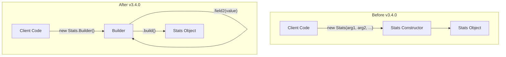

# Stats Builder Pattern Deprecations

## Summary

OpenSearch v3.4.0 deprecates existing constructors in over 30 Stats API classes in favor of the Builder pattern. This refactoring improves API evolvability, allowing new metrics to be added without breaking backward compatibility. The existing constructors are marked as deprecated and will be removed in a future major version.

## Details

### What's New in v3.4.0

This release introduces Builder classes for numerous Stats API classes across the codebase. The Builder pattern replaces direct constructor usage, providing a fluent API for creating stats objects.

### Technical Changes

#### Architecture Changes



#### Affected Classes

| Category | Classes |
|----------|---------|
| Index Stats | `IndexingStats.Stats`, `RefreshStats`, `DocStats`, `StoreStats`, `GetStats`, `FlushStats` |
| Cache Stats | `QueryCacheStats`, `FieldDataStats`, `CompletionStats`, `RequestCacheStats`, `Cache.CacheStats` |
| Thread/Transport | `ThreadPoolStats.Stats`, `TransportStats`, `HttpStats` |
| Remote Store | `RemoteTranslogTransferTracker.Stats`, `RemoteSegmentTransferTracker.Stats` |
| System Stats | `OsStats`, `ScriptStats`, `AdaptiveSelectionStats` |
| Shard Stats | `ShardStats`, `WarmerStats`, `IndexingPressureStats`, `IndexPressureStats` |
| Other | `TranslogStats`, `Condition.Stats`, `DirectoryFileTransferTracker.Stats`, `DeviceStats` |

#### Builder Pattern Implementation

Each affected class now includes a nested `Builder` class:

```java
public static class Builder {
    private long indexCount = 0;
    private long indexTimeInMillis = 0;
    // ... other fields with defaults

    public Builder indexCount(long count) {
        this.indexCount = count;
        return this;
    }

    public Builder indexTimeInMillis(long time) {
        this.indexTimeInMillis = time;
        return this;
    }

    // ... other setter methods

    public Stats build() {
        return new Stats(this);
    }
}
```

### Usage Example

```java
// Deprecated approach (will be removed in future version)
IndexingStats.Stats stats = new IndexingStats.Stats(
    indexCount, indexTimeInMillis, indexCurrent, indexFailedCount,
    deleteCount, deleteTimeInMillis, deleteCurrent, noopUpdateCount,
    isThrottled, throttleTimeInMillis, docStatusStats, maxLastIndexRequestTimestamp
);

// New Builder approach (recommended)
IndexingStats.Stats stats = new IndexingStats.Stats.Builder()
    .indexCount(indexCount)
    .indexTimeInMillis(indexTimeInMillis)
    .indexCurrent(indexCurrent)
    .indexFailedCount(indexFailedCount)
    .deleteCount(deleteCount)
    .deleteTimeInMillis(deleteTimeInMillis)
    .deleteCurrent(deleteCurrent)
    .noopUpdateCount(noopUpdateCount)
    .isThrottled(isThrottled)
    .throttleTimeInMillis(throttleTimeInMillis)
    .docStatusStats(docStatusStats)
    .maxLastIndexRequestTimestamp(maxLastIndexRequestTimestamp)
    .build();
```

### Migration Notes

1. **Deprecation Warning**: Existing constructors are marked `@Deprecated` and will emit compiler warnings
2. **No Functional Change**: The Builder pattern produces identical Stats objects
3. **Gradual Migration**: Migrate to Builder pattern before the next major version
4. **Default Values**: Builder fields have sensible defaults, allowing partial initialization

## Limitations

- Existing constructors remain functional but deprecated
- Plugin developers using Stats constructors should migrate to Builder pattern
- Serialization/deserialization behavior unchanged

## References

### Pull Requests
| PR | Description |
|----|-------------|
| [#19317](https://github.com/opensearch-project/OpenSearch/pull/19317) | ThreadPoolStats.Stats Builder |
| [#19306](https://github.com/opensearch-project/OpenSearch/pull/19306) | IndexingStats.Stats Builder |
| [#19835](https://github.com/opensearch-project/OpenSearch/pull/19835) | RefreshStats Builder |
| [#19863](https://github.com/opensearch-project/OpenSearch/pull/19863) | DocStats and StoreStats Builder |
| [#19862](https://github.com/opensearch-project/OpenSearch/pull/19862) | Condition.Stats and DirectoryFileTransferTracker.Stats Builder |
| [#19837](https://github.com/opensearch-project/OpenSearch/pull/19837) | RemoteTranslogTransferTracker.Stats and RemoteSegmentTransferTracker.Stats Builder |
| [#19935](https://github.com/opensearch-project/OpenSearch/pull/19935) | GetStats, FlushStats and QueryCacheStats Builder |
| [#19936](https://github.com/opensearch-project/OpenSearch/pull/19936) | FieldDataStats and CompletionStats Builder |
| [#19961](https://github.com/opensearch-project/OpenSearch/pull/19961) | TranslogStats and RequestCacheStats Builder |
| [#19991](https://github.com/opensearch-project/OpenSearch/pull/19991) | IndexPressureStats, DeviceStats and TransportStats Builder |
| [#20015](https://github.com/opensearch-project/OpenSearch/pull/20015) | Cache.CacheStats Builder |
| [#20014](https://github.com/opensearch-project/OpenSearch/pull/20014) | HttpStats, ScriptStats, AdaptiveSelectionStats and OsStats Builder |
| [#19966](https://github.com/opensearch-project/OpenSearch/pull/19966) | ShardStats, WarmerStats and IndexingPressureStats Builder |

### Issues (Design / RFC)
- [Issue #19225](https://github.com/opensearch-project/OpenSearch/issues/19225): Use Builder pattern instead of constructors for Stats API classes
- [Issue #18723](https://github.com/opensearch-project/OpenSearch/issues/18723): Related SearchStats refactoring

## Related Feature Report

- [Full feature documentation](../../../features/opensearch/stats-builder-pattern.md)
