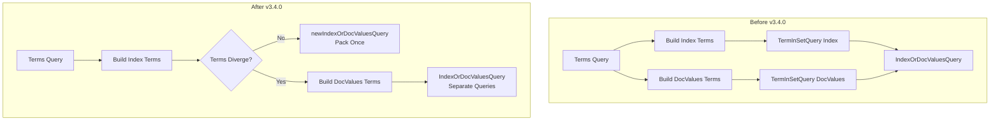

---
tags:
  - domain/core
  - component/server
  - indexing
  - performance
  - search
---
# Terms Query Optimization

## Summary

This release optimizes `terms` query creation for `keyword` fields that have both index and doc_values enabled. When the indexed terms and doc_values terms are identical (the common case), OpenSearch now packs the terms only once instead of twice, reducing CPU overhead and memory allocations during query construction.

## Details

### What's New in v3.4.0

The optimization targets the `termsQuery()` method in `KeywordFieldMapper.KeywordFieldType`. Previously, when both index and doc_values were enabled, OpenSearch would always create two separate `BytesRefsCollectionBuilder` instances and pack terms twice—once for the index query and once for the doc_values query. This was inefficient because in most cases, the indexed value and doc_value are identical.

The new implementation:
1. Lazily initializes the doc_values term builder only when needed
2. Detects when indexed terms and doc_values terms diverge (via `rewriteForDocValue()`)
3. Uses `TermInSetQuery.newIndexOrDocValuesQuery()` when terms are identical, packing once
4. Falls back to separate queries only when terms actually differ

### Technical Changes

#### Architecture Changes



#### Key Code Changes

| File | Change |
|------|--------|
| `KeywordFieldMapper.java` | Lazy initialization of `dVByteRefs`, divergence detection, use of `newIndexOrDocValuesQuery()` |
| `BytesRefsCollectionBuilder.java` | Documentation clarification |

#### New API Usage

The optimization leverages Lucene's `TermInSetQuery.newIndexOrDocValuesQuery()` method (introduced in Lucene via [apache/lucene#14435](https://github.com/apache/lucene/pull/14435)) which creates an `IndexOrDocValuesQuery` that shares the packed terms between both the index and doc_values queries.

```java
// When index and docValues terms are identical
return TermInSetQuery.newIndexOrDocValuesQuery(
    MultiTermQuery.CONSTANT_SCORE_BLENDED_REWRITE, 
    name(), 
    iBytesRefs.get()
);
```

### Usage Example

No API changes are required. The optimization is automatic for all `terms` queries on `keyword` fields with both index and doc_values enabled:

```json
GET my-index/_search
{
  "query": {
    "terms": {
      "status": ["active", "pending", "completed"]
    }
  }
}
```

### Performance Impact

This optimization reduces:
- CPU time spent sorting and packing terms (especially noticeable with large term lists)
- Memory allocations by avoiding duplicate `BytesRef` collections
- GC pressure from reduced object creation

The improvement is most significant for queries with many terms, where the sorting overhead in `TermInSetQuery.packTerms()` was previously doubled.

## Limitations

- Only applies to `keyword` fields with both `index: true` and `doc_values: true`
- Fields using custom `rewriteForDocValue()` implementations that transform values will still use separate queries
- The optimization is transparent and cannot be disabled

## References

### Documentation
- [Terms Query Documentation](https://docs.opensearch.org/3.0/query-dsl/term/terms/): Official documentation
- [Forum Discussion](https://forum.opensearch.org/t/avoid-re-sorting-when-initializing-terminsetquery/23865): Original performance issue report
- [Lucene PR #14435](https://github.com/apache/lucene/pull/14435): Lucene enhancement enabling this optimization

### Pull Requests
| PR | Description |
|----|-------------|
| [#19350](https://github.com/opensearch-project/OpenSearch/pull/19350) | Pack terms once when `terms` query is created for indexed and docValues keyword field |
| [#17714](https://github.com/opensearch-project/OpenSearch/pull/17714) | Pass in-order terms as sorted to TermInSetQuery() (prerequisite) |

## Related Feature Report

- [Full feature documentation](../../../../features/opensearch/opensearch-terms-query.md)
