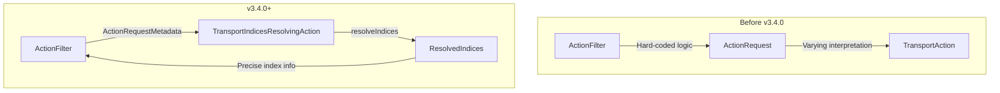

# Transport Actions API

## Summary

OpenSearch v3.4.0 introduces an internal API that allows `ActionFilter` implementations to retrieve precise metadata about the indices a transport action will operate on. This addresses a long-standing architectural issue where the security plugin had to maintain hard-coded knowledge of how each action request interprets index expressions, leading to fragile code and performance overhead.

## Details

### What's New in v3.4.0

This release introduces a new mechanism for transport actions to explicitly communicate their index resolution behavior to other components like `ActionFilter` implementations. Previously, filters had to guess or hard-code how each action interprets index patterns, date math expressions, and remote indices.

### Technical Changes

#### Architecture Changes



#### New Components

| Component | Description |
|-----------|-------------|
| `TransportIndicesResolvingAction<Request>` | Interface for transport actions to implement index resolution |
| `ActionRequestMetadata<Request, Response>` | Metadata object passed to `ActionFilter.apply()` with resolved indices |
| `ResolvedIndices` | Immutable class encapsulating resolved local and remote indices |
| `OptionallyResolvedIndices` | Base class for cases where indices may be unknown |
| `ResolvedIndices.Local` | Local indices, aliases, and data streams |
| `ResolvedIndices.Local.Concrete` | Concrete indices with `Index` objects |
| `ResolvedIndices.Remote` | Remote cluster indices |

#### API Changes

The `ActionFilter.apply()` method signature has been extended:

```java
// Before
void apply(Task task, String action, Request request, 
           ActionListener<Response> listener, 
           ActionFilterChain<Request, Response> chain);

// After (v3.4.0+)
void apply(Task task, String action, Request request,
           ActionRequestMetadata<Request, Response> actionRequestMetadata,
           ActionListener<Response> listener, 
           ActionFilterChain<Request, Response> chain);
```

Transport actions implementing `TransportIndicesResolvingAction` must provide:

```java
public interface TransportIndicesResolvingAction<Request extends ActionRequest> {
    OptionallyResolvedIndices resolveIndices(Request request);
}
```

### Usage Example

```java
// Implementing TransportIndicesResolvingAction in a transport action
public class TransportSearchAction extends HandledTransportAction<SearchRequest, SearchResponse>
    implements TransportIndicesResolvingAction<SearchRequest> {
    
    @Override
    public ResolvedIndices resolveIndices(SearchRequest request) {
        return ResolvedIndices.of(
            indexNameExpressionResolver.concreteResolvedIndices(clusterState, request)
        );
    }
}

// Using resolved indices in an ActionFilter
public class SecurityActionFilter implements ActionFilter {
    @Override
    public <Request extends ActionRequest, Response extends ActionResponse> void apply(
        Task task, String action, Request request,
        ActionRequestMetadata<Request, Response> metadata,
        ActionListener<Response> listener,
        ActionFilterChain<Request, Response> chain
    ) {
        OptionallyResolvedIndices resolved = metadata.resolvedIndices();
        
        if (resolved instanceof ResolvedIndices resolvedIndices) {
            Set<String> indices = resolvedIndices.local().names();
            // Perform authorization based on precise index information
        } else {
            // Handle unknown case - assume all indices
        }
        
        chain.proceed(task, action, request, metadata, listener);
    }
}
```

### Migration Notes

- **ActionFilter implementations**: Update `apply()` method signature to include `ActionRequestMetadata` parameter
- **Custom transport actions**: Consider implementing `TransportIndicesResolvingAction` for precise index reporting
- **Security plugins**: Can now rely on core-provided index resolution instead of maintaining hard-coded logic

## Limitations

- This is an internal API marked with `@ExperimentalApi` - subject to change in future versions
- Not all transport actions implement `TransportIndicesResolvingAction` yet; `OptionallyResolvedIndices.unknown()` is returned for those
- The API is primarily designed for the security plugin use case

## Related PRs

| PR | Description |
|----|-------------|
| [#18523](https://github.com/opensearch-project/OpenSearch/pull/18523) | Explicit index resolution API - main implementation |

## References

- [Issue #5367](https://github.com/opensearch-project/security/issues/5367): Index pattern resolution improvements (security plugin)
- [PR #5399](https://github.com/opensearch-project/security/pull/5399): Security plugin draft implementation using this API

## Related Feature Report

- [Full feature documentation](../../../../features/opensearch/transport-actions-api.md)
