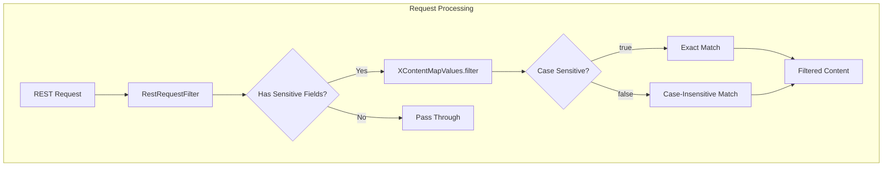

# XContent Filtering

## Summary

This release adds case-insensitive filtering support to `XContentMapValues.filter()`, enabling REST request handlers to filter sensitive fields from request bodies regardless of field name casing. This improvement simplifies the implementation of the `RestRequestFilter` extension point, which is used to prevent sensitive data (like passwords and API keys) from being logged.

## Details

### What's New in v3.4.0

The `XContentMapValues.filter()` method now accepts a `caseSensitive` boolean parameter that controls whether field name matching is case-sensitive or case-insensitive.

### Technical Changes

#### Architecture Changes



#### API Changes

The `XContentMapValues` class now provides an overloaded `filter()` method:

| Method | Description |
|--------|-------------|
| `filter(Map, String[], String[])` | Original method (case-sensitive, backward compatible) |
| `filter(Map, String[], String[], boolean)` | New method with case sensitivity control |
| `filter(String[], String[], boolean)` | Returns a reusable filter function |

#### New Method Signature

```java
public static Map<String, Object> filter(
    Map<String, ?> map, 
    String[] includes, 
    String[] excludes, 
    boolean caseSensitive
)
```

| Parameter | Description |
|-----------|-------------|
| `map` | The source map to filter |
| `includes` | Fields to include (null or empty = include all) |
| `excludes` | Fields to exclude |
| `caseSensitive` | `true` for exact matching, `false` for case-insensitive |

### Usage Example

```java
// RestRequestFilter implementation - now case-insensitive
public interface RestRequestFilter {
    default RestRequest getFilteredRequest(RestRequest restRequest) {
        Set<String> fields = getFilteredFields();
        if (restRequest.hasContent() && !fields.isEmpty()) {
            Map<String, Object> transformedSource = XContentMapValues.filter(
                result.v2(),
                null,                              // includes
                fields.toArray(Strings.EMPTY_ARRAY), // excludes
                false                              // case-insensitive
            );
            // ... create filtered request
        }
    }
}
```

**Before v3.4.0** - Required listing all case variations:
```java
@Override
public Set<String> getFilteredFields() {
    return Set.of("password", "Password", "PASSWORD", 
                  "apiKey", "ApiKey", "APIKEY", "apikey");
}
```

**After v3.4.0** - Single field name works for all cases:
```java
@Override
public Set<String> getFilteredFields() {
    return Set.of("password", "apikey");
}
```

### Migration Notes

- Existing code using `filter(Map, String[], String[])` continues to work unchanged (case-sensitive)
- To enable case-insensitive filtering, use the new 4-parameter method with `caseSensitive=false`
- The `RestRequestFilter` interface now uses case-insensitive filtering by default

## Limitations

- Case-insensitive matching uses `Locale.ROOT` for lowercase conversion
- Wildcard patterns in includes/excludes are also matched case-insensitively when `caseSensitive=false`
- Performance impact is minimal as the lowercase conversion happens once per filter operation

## Related PRs

| PR | Description |
|----|-------------|
| [#19976](https://github.com/opensearch-project/OpenSearch/pull/19976) | Add case sensitivity as an argument to XContentMapValues.filter |

## References

- [RestRequestFilter.java](https://github.com/opensearch-project/OpenSearch/blob/main/server/src/main/java/org/opensearch/rest/RestRequestFilter.java): Extension point for filtering sensitive request content
- [ML Commons Connector Documentation](https://docs.opensearch.org/latest/ml-commons-plugin/remote-models/index/#step-2-create-a-connector): Example use case with sensitive credentials

## Related Feature Report

- [Full feature documentation](../../../../features/opensearch/xcontent-filtering.md)
