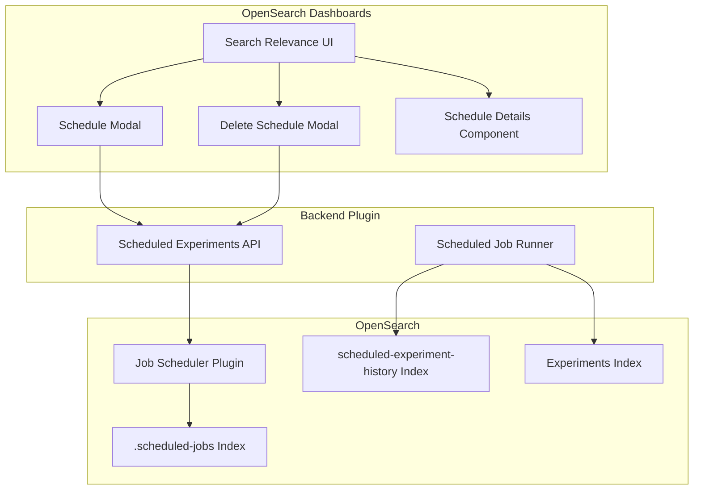

---
tags:
  - domain/search
  - component/server
  - dashboards
  - indexing
  - performance
  - search
---
# Scheduled Experiments

## Summary

Scheduled Experiments enables users to run search relevance experiments on a recurring basis using cron expressions. This feature allows continuous monitoring of search quality over time by automatically executing pointwise evaluation and hybrid optimizer experiments at specified intervals, storing historical results for trend analysis.

## Details

### What's New in v3.4.0

- New scheduling APIs for creating, retrieving, and deleting scheduled experiment jobs
- UI components for scheduling and descheduling experiments in OpenSearch Dashboards
- New "Pointwise Daily Scheduled Runs" dashboard for visualizing experiment results over time
- Historical experiment results stored with timestamps for trend analysis
- Data integrity support ensuring scheduled jobs are cleaned up when experiments are deleted

### Technical Changes

#### Architecture Changes



#### New Components

| Component | Description |
|-----------|-------------|
| `ScheduleModal` | UI modal for creating scheduled experiments with cron expression input |
| `DeleteScheduleModal` | UI modal for viewing and deleting existing schedules |
| `ScheduleDetails` | Component displaying schedule information on experiment detail pages |
| `ExperimentSchedule` | TypeScript type for scheduled experiment data |
| `ScheduledJob` | TypeScript type for job scheduler metadata |

#### New API Endpoints

| Endpoint | Method | Description |
|----------|--------|-------------|
| `/_plugins/_search_relevance/experiments/schedule` | POST | Create a scheduled experiment |
| `/_plugins/_search_relevance/experiments/schedule` | GET | List all scheduled experiments |
| `/_plugins/_search_relevance/experiments/schedule/{id}` | GET | Get a specific scheduled experiment |
| `/_plugins/_search_relevance/experiments/schedule/{id}` | DELETE | Delete a scheduled experiment |

#### New Indices

| Index | Description |
|-------|-------------|
| `.scheduled-jobs` | Stores currently running experiment schedules |
| `search-relevance-scheduled-experiment-history` | Stores historical experiment results with timestamps |

#### New Configuration

| Setting | Description | Default |
|---------|-------------|---------|
| `cronExpression` | Cron expression defining the schedule (e.g., `0 1 * * *` for daily at 1 AM) | Required |
| `timezone` | Timezone for cron expression evaluation | System default |

### Usage Example

#### Creating a Scheduled Experiment via API

```json
POST /_plugins/_search_relevance/experiments/schedule
{
  "experimentId": "abc123-def456",
  "cronExpression": "0 1 * * *"
}
```

#### Cron Expression Format

The cron expression follows standard Unix cron format:
- `0 1 * * *` - Run daily at 1:00 AM
- `0 */6 * * *` - Run every 6 hours
- `0 0 * * 0` - Run weekly on Sunday at midnight

### Migration Notes

- Existing experiments can be scheduled without modification
- Only `POINTWISE_EVALUATION` and `HYBRID_OPTIMIZER` experiment types support scheduling
- Experiments must be in `COMPLETED` status before scheduling

## Limitations

- Scheduling is only available for pointwise evaluation and hybrid optimizer experiments
- Cron expressions must use single spaces between parts
- Workload management and alerting integration are planned for future releases
- Resource monitoring for scheduled jobs is not yet available

## References

### Documentation
- [Job Scheduler Documentation](https://docs.opensearch.org/3.0/monitoring-your-cluster/job-scheduler/index/): OpenSearch Job Scheduler plugin
- [Cron Expression Reference](https://docs.opensearch.org/3.0/observing-your-data/alerting/cron/): Cron expression format

### Pull Requests
| PR | Repository | Description |
|----|------------|-------------|
| [#220](https://github.com/opensearch-project/search-relevance/pull/220) | search-relevance | Backend APIs and components for scheduled experiments |
| [#636](https://github.com/opensearch-project/dashboards-search-relevance/pull/636) | dashboards-search-relevance | UI for scheduling and descheduling experiments |
| [#324](https://github.com/opensearch-project/search-relevance/pull/324) | search-relevance | Data integrity support for deleting experiments |
| [#685](https://github.com/opensearch-project/dashboards-search-relevance/pull/685) | dashboards-search-relevance | GUID search support for Search Configuration |
| [#686](https://github.com/opensearch-project/dashboards-search-relevance/pull/686) | dashboards-search-relevance | Client-side filtering by type/status |
| [#670](https://github.com/opensearch-project/dashboards-search-relevance/pull/670) | dashboards-search-relevance | Experiment detail page title fix |

### Issues (Design / RFC)
- [Issue #213](https://github.com/opensearch-project/search-relevance/issues/213): Original feature request
- [Issue #226](https://github.com/opensearch-project/search-relevance/issues/226): Related scheduling requirements
- [Issue #238](https://github.com/opensearch-project/search-relevance/issues/238): Data integrity for experiment deletion

## Related Feature Report

- [Full feature documentation](../../../../features/search-relevance/search-relevance-scheduled-experiments.md)
