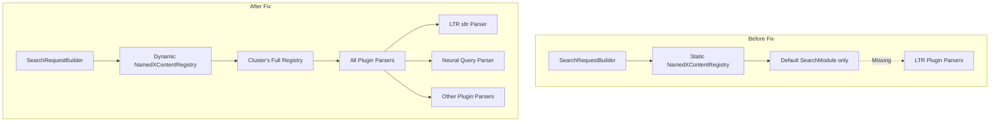

---
tags:
  - neural-search
  - search
---

# Search Relevance Bugfixes

## Summary

This release fixes a critical bug in the Search Relevance Workbench that caused experiments to fail when using search configurations containing Learning to Rank (LTR) plugin queries, such as `rescore_query` with `sltr`. The fix ensures proper query serialization for plugins that extend OpenSearch's DSL.

## Details

### What's New in v3.4.0

The Search Relevance plugin's `SearchRequestBuilder` was unable to parse queries from plugins that extend OpenSearch's query DSL (like the Learning to Rank plugin). When users created search configurations containing LTR `rescore_query` clauses, experiments would fail with the error: `[1:97] [query] failed to parse field [rescore_query]`.

### Technical Changes

#### Root Cause

The `SearchRequestBuilder` class used a static `NamedXContentRegistry` initialized with only the default `SearchModule` parsers. This registry lacked the query parsers registered by plugins like Learning to Rank, causing parsing failures for plugin-specific query types.

#### Architecture Changes



#### Solution

The fix introduces a dynamic initialization pattern:

1. `SearchRequestBuilder.initialize(NamedXContentRegistry)` - New static method to inject the cluster's full registry
2. Plugin initialization calls this method during `createComponents()` with the node's `xContentRegistry`
3. All plugin-registered query types are now available for parsing

#### Code Changes

| File | Change |
|------|--------|
| `SearchRequestBuilder.java` | Replace static registry with dynamic initialization via `initialize()` method |
| `ExperimentTaskManager.java` | Add debug logging for serialized search request body |
| `SearchRequestBuilderTests.java` | Add tests for rescore query parsing (object and array forms) |
| `MetricsHelperTests.java` | Initialize registry in test setup |
| `LtrSltrRescoreIT.java` | New integration test validating LTR sltr rescore parsing |

### Usage Example

Search configurations with LTR rescore queries now work correctly:

```json
{
  "query": {
    "match": {
      "title": "%SearchText%"
    }
  },
  "rescore": {
    "window_size": 10,
    "query": {
      "rescore_query": {
        "sltr": {
          "params": {
            "keywords": "%SearchText%"
          },
          "model": "my_ltr_model"
        }
      }
    }
  }
}
```

### Migration Notes

No migration required. Existing search configurations with LTR queries that previously failed will now work automatically after upgrading to v3.4.0.

## Limitations

- The fix requires the LTR plugin to be installed for `sltr` queries to work
- The integration test validates parsing recognition but does not require a trained LTR model

## References

### Documentation
- [Learning to Rank Documentation](https://docs.opensearch.org/latest/search-plugins/ltr/index/): Official LTR plugin docs

### Blog Posts
- [Search Relevance Workbench Blog](https://opensearch.org/blog/taking-your-first-steps-towards-search-relevance/): Introduction to Search Relevance Workbench

### Pull Requests
| PR | Description |
|----|-------------|
| [#260](https://github.com/opensearch-project/search-relevance/pull/260) | Fix query serialization for plugins (e.g., Learning to Rank) that extend OpenSearch's DSL |

### Issues (Design / RFC)
- [Issue #255](https://github.com/opensearch-project/search-relevance/issues/255): Learning to Rank plugin experiment error

## Related Feature Report

- [Full feature documentation](../../../../features/search-relevance/search-relevance-workbench.md)
