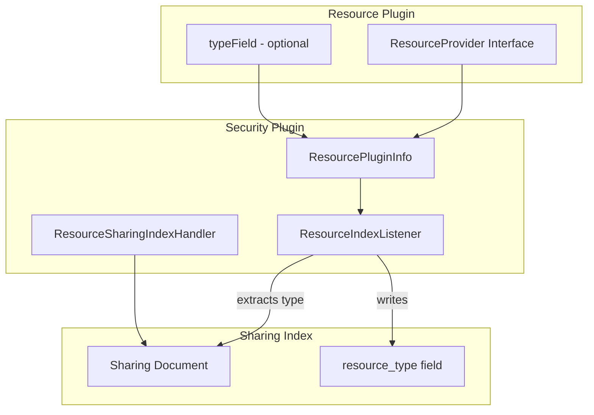

---
tags:
  - dashboards
  - indexing
  - security
---

# Resource Sharing Enhancements

## Summary

OpenSearch v3.4.0 introduces significant enhancements to the Resource Sharing framework in the Security plugin. Key improvements include support for multiple sharable resource types within a single index, tracking of resource types on sharing documents, refactoring of the ResourceProvider interface for better extensibility, and API improvements including POST support for the update sharing API.

## Details

### What's New in v3.4.0

#### Multiple Resource Types per Index

Previously, the Resource Sharing framework assumed a 1:1 relationship between resource types and indices. This release relaxes that constraint to allow multiple resource types in a single index (e.g., OpenSearch Dashboards saved objects).

**Key Changes:**
- `ResourceAccessControlClient` now references `resourceType` instead of `resourceIndex`
- Plugins can specify a `typeField` in the `ResourceProvider` to identify the resource type within documents
- Migration API updated to support multiple resource types with per-type default access levels

#### Resource Type Tracking

Sharing documents now include a `resource_type` field to disambiguate resources when multiple types share the same index.

**Updated Sharing Document Structure:**
```json
{
  "resource_id": "resource-123",
  "resource_type": "sample-resource",
  "created_by": {
    "user": "owner_username"
  },
  "share_with": {
    "READ_ONLY": {
      "users": ["user1"],
      "roles": ["viewer_role"]
    }
  }
}
```

#### ResourceProvider Interface Refactoring

The `ResourceProvider` has been refactored from a record to an interface for better extensibility:

```java
public interface ResourceProvider {
    String resourceType();
    String resourceIndexName();
    
    // New in v3.4.0 - optional type field for multi-type indices
    default String typeField() {
        return null;
    }
}
```

#### ResourceSharing Builder Pattern

The `ResourceSharing` class now uses the Builder pattern for construction:

```java
ResourceSharing sharingInfo = ResourceSharing.builder()
    .resourceId(resourceId)
    .resourceType(resourceType)
    .createdBy(new CreatedBy(user.getName(), user.getRequestedTenant()))
    .shareWith(shareWith)
    .build();
```

### Technical Changes

#### Architecture Changes



#### New Components

| Component | Description |
|-----------|-------------|
| `ResourceProvider.typeField()` | Optional method to specify the field containing resource type in documents |
| `ResourceSharing.Builder` | Builder pattern for constructing ResourceSharing objects |
| `ResourcePluginInfo.getResourceTypeForIndexOp()` | Resolves resource type from index operations |
| `ResourcePluginInfo.extractFieldFromIndexOp()` | Extracts field values from Lucene documents |

#### API Changes

**Migration API Update:**

The `default_access_level` parameter now accepts an object mapping resource types to access levels:

```json
POST /_plugins/_security/api/resources/migrate
{
  "source_index": ".sample_resource",
  "username_path": "/owner",
  "backend_roles_path": "/backend_roles",
  "default_access_level": {
    "sample-resource": "read_only",
    "sample-resource-group": "read-only-group"
  }
}
```

**POST Support for Update Sharing API:**

For environments that don't support PATCH, the update sharing API now accepts POST:

```
POST /_plugins/_security/api/resource/share
{
  "resource_id": "resource-123",
  "resource_type": "sample-resource",
  "add": {
    "READ_ONLY": { "users": ["charlie"] }
  },
  "revoke": {
    "READ_ONLY": { "users": ["alice"] }
  }
}
```

### Usage Example

**Implementing ResourceProvider with typeField:**

```java
public class SampleResourceExtension implements ResourceSharingExtension {
    @Override
    public Set<ResourceProvider> getResourceProviders() {
        return Set.of(new ResourceProvider() {
            @Override
            public String resourceType() {
                return "sample-resource";
            }

            @Override
            public String resourceIndexName() {
                return ".sample_resource";
            }

            @Override
            public String typeField() {
                return "resource_type";  // Field in document containing type
            }
        });
    }
}
```

### Migration Notes

1. **ResourceProvider Implementation**: If you implemented `ResourceProvider` as a record, update to implement the interface instead
2. **Multiple Types**: If your index contains multiple resource types, implement `typeField()` to return the field name containing the type
3. **Migration API**: Update migration scripts to use the new object format for `default_access_level`
4. **ShareWith Operations**: `add()` and `revoke()` methods now mutate the existing object instead of returning new instances

## Limitations

- The `typeField` must be present in the document mapping if multiple resource types share an index
- Resource type extraction happens during index operations via Lucene document inspection
- Java APIs for share/revoke have been removed in favor of REST APIs

## References

### Documentation
- [RESOURCE_SHARING_AND_ACCESS_CONTROL.md](https://github.com/opensearch-project/security/blob/main/RESOURCE_SHARING_AND_ACCESS_CONTROL.md): Complete developer guide

### Pull Requests
| PR | Repository | Description |
|----|------------|-------------|
| [#5713](https://github.com/opensearch-project/security/pull/5713) | security | Allow multiple sharable resource types in single resource index |
| [#5772](https://github.com/opensearch-project/security/pull/5772) | security | Keep track of resource_type on resource sharing document |
| [#5789](https://github.com/opensearch-project/security/pull/5789) | security | Requires default_owner for resource/migrate API |
| [#5717](https://github.com/opensearch-project/security/pull/5717) | security | Make migrate API require default access level |
| [#5718](https://github.com/opensearch-project/security/pull/5718) | security | Removes share and revoke Java APIs |
| [#5755](https://github.com/opensearch-project/security/pull/5755) | security | Refactor ResourceProvider to interface and ResourceSharing refactors |
| [#5799](https://github.com/opensearch-project/security/pull/5799) | security | Adds POST support for update sharing info API |
| [#2338](https://github.com/opensearch-project/security-dashboards-plugin/pull/2338) | security-dashboards-plugin | Changes PATCH update sharing API to POST |

### Issues (Design / RFC)
- [Issue #4500](https://github.com/opensearch-project/security/issues/4500): Resource Permissions and Sharing - main tracking issue

## Related Feature Report

- [Full feature documentation](../../../features/security/resource-access-control-framework.md)
