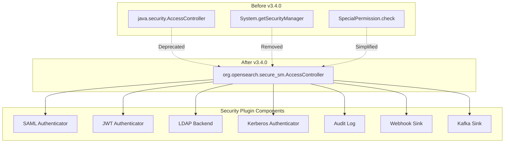

---
tags:
  - security
---

# Security AccessController Migration

## Summary

The OpenSearch Security plugin migrates from the deprecated `java.security.AccessController` to OpenSearch's custom `org.opensearch.secure_sm.AccessController`. This refactoring prepares the security plugin for Java 21+ compatibility and aligns with OpenSearch core's Java Security Manager (JSM) replacement strategy.

## Details

### What's New in v3.4.0

This release completes the migration of AccessController usage across the security plugin's sub-projects and discovery plugins:

1. **Sub-projects with SocketAccess class** - Replaced `java.security.AccessController` with `org.opensearch.secure_sm.AccessController`
2. **Discovery plugins** - Updated privileged action patterns for network operations

### Technical Changes

#### Architecture Changes



#### Code Migration Pattern

The migration follows a consistent pattern across all affected files:

**Before:**
```java
import java.security.AccessController;
import java.security.PrivilegedAction;
import java.security.PrivilegedActionException;
import java.security.PrivilegedExceptionAction;
import org.opensearch.SpecialPermission;

@SuppressWarnings("removal")
public void someMethod() {
    final SecurityManager sm = System.getSecurityManager();
    if (sm != null) {
        sm.checkPermission(new SpecialPermission());
    }
    
    return AccessController.doPrivileged(new PrivilegedAction<Result>() {
        @Override
        public Result run() {
            return performOperation();
        }
    });
}
```

**After:**
```java
import org.opensearch.secure_sm.AccessController;

public void someMethod() {
    return AccessController.doPrivileged(() -> performOperation());
}
```

#### Affected Components

| Component | File | Changes |
|-----------|------|---------|
| DefaultObjectMapper | `DefaultObjectMapper.java` | JSON serialization with privileged access |
| NonValidatingObjectMapper | `NonValidatingObjectMapper.java` | Non-validating JSON operations |
| OpenSearchSecurityPlugin | `OpenSearchSecurityPlugin.java` | Plugin initialization, file permission checks |
| AbstractAuditLog | `AbstractAuditLog.java` | External config logging |
| AuditLogImpl | `AuditLogImpl.java` | Shutdown hook management |
| KafkaSink | `KafkaSink.java` | Kafka producer initialization |
| WebhookSink | `WebhookSink.java` | HTTP webhook operations |
| HTTPJwtAuthenticator | `HTTPJwtAuthenticator.java` | JWT token parsing |
| AbstractHTTPJwtAuthenticator | `AbstractHTTPJwtAuthenticator.java` | JWT credential extraction |
| HTTPSpnegoAuthenticator | `HTTPSpnegoAuthenticator.java` | Kerberos/SPNEGO authentication |
| HTTPSamlAuthenticator | `HTTPSamlAuthenticator.java` | SAML metadata resolution |
| AuthTokenProcessorHandler | `AuthTokenProcessorHandler.java` | SAML token processing |
| Saml2SettingsProvider | `Saml2SettingsProvider.java` | SAML settings building |
| SamlHTTPMetadataResolver | `SamlHTTPMetadataResolver.java` | SAML HTTP metadata fetching |
| SamlFilesystemMetadataResolver | `SamlFilesystemMetadataResolver.java` | SAML filesystem metadata |
| LDAPAuthorizationBackend | `LDAPAuthorizationBackend.java` | LDAP connection management |
| LdapHelper | `LdapHelper.java` | LDAP search operations |

### API Changes

The new `AccessController` provides cleaner APIs:

| Old API | New API |
|---------|---------|
| `AccessController.doPrivileged(PrivilegedAction<T>)` | `AccessController.doPrivileged(Supplier<T>)` |
| `AccessController.doPrivileged(PrivilegedExceptionAction<T>)` | `AccessController.doPrivilegedChecked(CheckedSupplier<T, E>)` |
| `PrivilegedAction<Void>` returning `null` | `AccessController.doPrivileged(Runnable)` |

### Usage Example

```java
// Privileged file operation
AccessController.doPrivileged(() -> {
    final Path confPath = new Environment(settings, configPath).configDir().toAbsolutePath();
    if (Files.isDirectory(confPath, LinkOption.NOFOLLOW_LINKS)) {
        try (Stream<Path> s = Files.walk(confPath)) {
            return s.distinct().filter(p -> checkFilePermissions(p)).collect(Collectors.toList());
        }
    }
    return Collections.emptyList();
});

// Privileged operation with checked exception
return AccessController.doPrivilegedChecked(() -> {
    return objectMapper.readValue(string, clazz);
});
```

### Migration Notes

For plugin developers extending the security plugin:

1. Replace `java.security.AccessController` imports with `org.opensearch.secure_sm.AccessController`
2. Remove `@SuppressWarnings("removal")` annotations
3. Remove `SecurityManager` null checks and `SpecialPermission` checks
4. Convert `PrivilegedAction<T>` to lambda expressions
5. Use `doPrivilegedChecked` for operations that throw checked exceptions

## Limitations

- This is a refactoring change with no functional impact
- Existing `plugin-security.policy` files remain valid
- The migration is internal to the security plugin

## References

### Documentation
- [JEP 411](https://openjdk.org/jeps/411): Deprecate the Security Manager for Removal
- [JEP 486](https://openjdk.org/jeps/486): Permanently Disable the Security Manager

### Pull Requests
| PR | Description |
|----|-------------|
| [#5750](https://github.com/opensearch-project/security/pull/5750) | Replace AccessController and remove restriction on word Extension |
| [#5815](https://github.com/opensearch-project/security/pull/5815) | Clean up AccessController with Exception disambiguation |

### Issues (Design / RFC)
- [Issue #1687](https://github.com/opensearch-project/OpenSearch/issues/1687): RFC - Replace Java Security Manager
- [Issue #17181](https://github.com/opensearch-project/OpenSearch/issues/17181): Permanently turn-off Security Manager starting 3.0

## Related Feature Report

- [Java Agent AccessController](../../../../features/opensearch/java-agent-accesscontroller.md)
