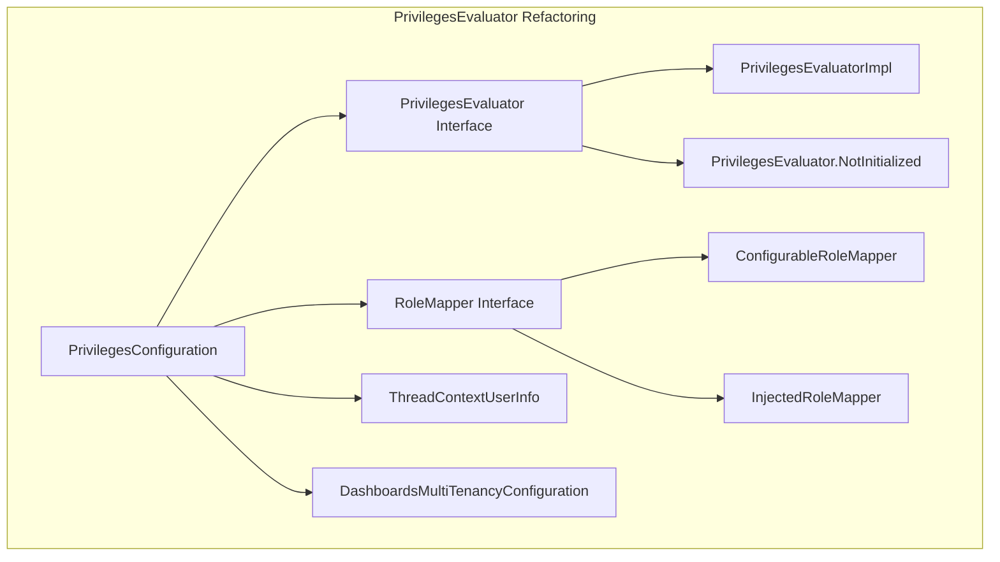

---
tags:
  - dashboards
  - indexing
  - security
---

# Security Bugfixes

## Summary

OpenSearch Security plugin v3.4.0 includes 16 bug fixes addressing issues in input validation, DLS/FLS handling, multi-tenancy, SSL configuration, audit logging, code modernization, and internal architecture refactoring. Key fixes include resolving `.kibana` index update operations in multi-tenancy mode, improving WildcardMatcher handling of empty strings, and migrating from deprecated `java.security.AccessController`.

## Details

### What's New in v3.4.0

This release focuses on stability improvements and code modernization:

1. **Multi-tenancy Fix**: Update operations on the virtual `.kibana` index now work correctly with DLS/FLS enabled
2. **Input Validation**: WildcardMatcher and array validators now properly handle empty/blank strings
3. **Audit Logging**: Enhanced sensitive parameter filtering using `RestRequestFilter.getFilteredRequest`
4. **SSL Configuration**: Demo certificates updated to use non-deprecated transport SSL settings
5. **BCFIPS Support**: Security provider loaded earlier in bootstrap for better BCFKS keystore compatibility
6. **Code Modernization**: Replaced deprecated `java.security.AccessController` with OpenSearch equivalent
7. **Architecture Refactoring**: Modularized `PrivilegesEvaluator` for future pluggability

### Technical Changes

#### Architecture Changes



#### Bug Fix Categories

| Category | PRs | Description |
|----------|-----|-------------|
| Input Validation | #5694, #5714 | WildcardMatcher and array validator improvements |
| DLS/FLS | #5721, #5778 | Fix internal request handling and `.kibana` index updates |
| Audit Logging | #5710 | Use RestRequestFilter for sensitive parameter redaction |
| SSL/TLS | #5723 | Update deprecated SSL transport settings in demo config |
| Bootstrap | #5749 | Load BCFIPS provider earlier for BCFKS keystore support |
| Code Modernization | #5750 | Replace AccessController, remove Extension restriction |
| Architecture | #5791, #5804 | Modularize PrivilegesEvaluator, clean up response class |
| Maintenance | #5816 | Remove reflective call to getInnerChannel |
| CI/Build | #1994, #5736 | Fix CI checks and build failures |

#### Key Fixes

**WildcardMatcher Empty String Handling (#5694)**
```java
// Before: Could create invalid matcher from empty string
WildcardMatcher.from("");  // Unexpected behavior

// After: Returns WildcardMatcher.NONE for empty strings
WildcardMatcher.from("");  // Returns NONE matcher
```

**Multi-tenancy `.kibana` Index Fix (#5778)**
- Update operations on `.kibana` index failed with "Update is not supported when FLS or DLS or Fieldmasking is active"
- Root cause: OpenSearch 3's "deny-by-default" model for DLS/FLS
- Fix: Evaluate `DocumentAllowList` in `DlsFlsValve.invoke()` for multi-tenancy redirected indices

**Audit Log Sensitive Parameter Filtering (#5710)**
- Wired up `RestRequestFilter.getFilteredRequest` extension point from OpenSearch core
- Allows plugins to declare API parameters as sensitive for audit log redaction
- Benefits other plugins that need to filter sensitive values from request payloads

### Migration Notes

**SSL Transport Settings**
If using demo certificates, update deprecated settings:
```yaml
# Deprecated
plugins.security.ssl.transport.enforce_hostname_verification: false

# New setting
transport.ssl.enforce_hostname_verification: false
```

## Limitations

- PrivilegesEvaluator refactoring is preparation for pluggable implementations (not yet available)
- BCFIPS provider timing change may affect custom bootstrap configurations
- Some fixes are backported to 2.19 and 3.3 branches

## References

### Pull Requests
| PR | Description |
|----|-------------|
| [#1994](https://github.com/opensearch-project/security/pull/1994) | Fix CI check with security failing due to empty string in password |
| [#1006](https://github.com/opensearch-project/security/pull/1006) | CVE fix upgrade jackson-core and Security fix related to host |
| [#5694](https://github.com/opensearch-project/security/pull/5694) | Create WildcardMatcher.NONE for empty string input |
| [#5714](https://github.com/opensearch-project/security/pull/5714) | Improve array validator to check for blank strings |
| [#5710](https://github.com/opensearch-project/security/pull/5710) | Use RestRequestFilter.getFilteredRequest for sensitive params |
| [#5723](https://github.com/opensearch-project/security/pull/5723) | Fix deprecated SSL transport settings in demo certificates |
| [#5721](https://github.com/opensearch-project/security/pull/5721) | Fix DlsFlsValveImpl condition for internal requests |
| [#5778](https://github.com/opensearch-project/security/pull/5778) | Fix `.kibana` index update operations in multi-tenancy |
| [#1342](https://github.com/opensearch-project/security/pull/1342) | Add null checks to prevent undefined property access |
| [#1361](https://github.com/opensearch-project/security/pull/1361) | Backport 1360 to 3.3 |
| [#5736](https://github.com/opensearch-project/security/pull/5736) | Fix build failure in SecurityFilterTests |
| [#5750](https://github.com/opensearch-project/security/pull/5750) | Replace AccessController and remove Extension restriction |
| [#5749](https://github.com/opensearch-project/security/pull/5749) | Add security provider earlier in bootstrap process |
| [#5791](https://github.com/opensearch-project/security/pull/5791) | Modularized PrivilegesEvaluator |
| [#5804](https://github.com/opensearch-project/security/pull/5804) | Cleaned up use of PrivilegesEvaluatorResponse |
| [#5816](https://github.com/opensearch-project/security/pull/5816) | Remove reflective call to getInnerChannel |

### Issues (Design / RFC)
- [Issue #1951](https://github.com/opensearch-project/observability/issues/1951): `.kibana` index update issue
- [Issue #5697](https://github.com/opensearch-project/security/issues/5697): Deprecated SSL transport settings
- [Issue #3420](https://github.com/opensearch-project/security/issues/3420): BCFKS keystore loading issue
- [Issue #5399](https://github.com/opensearch-project/security/issues/5399): Pluggable PrivilegesEvaluator
- [Issue #840](https://github.com/opensearch-project/performance-analyzer/issues/840): getInnerChannel reflection removal

## Related Feature Report

- [Full feature documentation](../../../../features/security/security-bugfixes.md)
