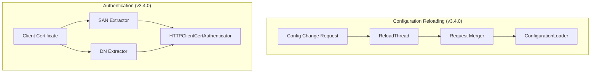

# Security Configuration

## Summary

OpenSearch v3.4.0 introduces significant improvements to security configuration management, including dedicated configuration reloading threads for improved node stability, dynamic resource sharing settings, X509v3 SAN-based authentication, performance optimizations, and a configurable timeout option for securityadmin.sh.

## Details

### What's New in v3.4.0

#### Configuration Reloading Thread
Security configuration reloading is now handled by a dedicated thread, preventing MANAGEMENT thread pool exhaustion during high-frequency configuration changes. The new `ReloadThread` class merges consecutive reload requests to minimize queue buildup.

#### Dynamic Resource Settings
Resource sharing settings can now be updated at runtime via the cluster-settings API without requiring a node restart. Plugins can choose codepaths based on protected resource types.

#### X509v3 SAN Authentication
Client certificate authentication now supports extracting the Principal from Subject Alternative Name (SAN) fields instead of just the Distinguished Name (DN). Supported SAN types include EMAIL, DNS, IP, and URI with glob pattern matching.

#### Performance Optimizations
- `AdminDns.isAdmin` is now called once per request instead of repeatedly for every field across all index mappings
- Header copying optimization prevents creating new maps on every `getHeaders()` call

#### SecurityAdmin Timeout Option
The `securityadmin.sh` script now accepts `--timeout` (`-to`) parameter for configurable request timeout (default: 30 seconds).

### Technical Changes

#### Architecture Changes



#### New Components

| Component | Description |
|-----------|-------------|
| ReloadThread | Dedicated thread for security configuration reloading with request merging |
| SAN Extractor | Extracts Principal from X509v3 SAN fields (EMAIL, DNS, IP, URI) |

#### New Configuration

| Setting | Description | Default |
|---------|-------------|---------|
| `username_attribute` | Certificate attribute for username extraction (`cn` or `san:TYPE:glob`) | `cn` (DN) |
| `--timeout` / `-to` | SecurityAdmin request timeout in seconds | `30` |

### Usage Example

#### SAN-based Authentication Configuration

```yaml
# config.yml - Client certificate authentication with SAN
clientcert_auth_domain:
  http_enabled: true
  transport_enabled: true
  order: 1
  http_authenticator:
    type: clientcert
    config:
      username_attribute: "san:EMAIL:*@example.com"
    challenge: false
  authentication_backend:
    type: noop
```

#### SecurityAdmin with Custom Timeout

```bash
# Use 60-second timeout for large configuration uploads
./securityadmin.sh -cd ../config/ -icl -nhnv \
  -cacert /path/to/root-ca.pem \
  -cert /path/to/admin.pem \
  -key /path/to/admin-key.pem \
  --timeout 60
```

#### Dynamic Resource Settings Update

```bash
# Update resource sharing settings at runtime
PUT _cluster/settings
{
  "persistent": {
    "plugins.security.experimental.resource_sharing.enabled": true,
    "plugins.security.experimental.resource_sharing.protected_types": ["saved_objects"]
  }
}
```

### Migration Notes

- Existing client certificate configurations using DN continue to work unchanged
- To use SAN-based authentication, update `username_attribute` to `san:TYPE:pattern` format
- SecurityAdmin scripts using default timeout behavior are unaffected

## Limitations

- SAN extraction requires certificates with properly configured X509v3 extensions
- Configuration reloading thread improvements are internal and not user-configurable

## References

### Documentation
- [Documentation: Client Certificate Authentication](https://docs.opensearch.org/3.4/security/authentication-backends/client-auth/)

### Pull Requests
| PR | Description |
|----|-------------|
| [#5479](https://github.com/opensearch-project/security/pull/5479) | Moved configuration reloading to dedicated thread |
| [#5677](https://github.com/opensearch-project/security/pull/5677) | Makes resource settings dynamic |
| [#5701](https://github.com/opensearch-project/security/pull/5701) | Add support for X509v3 extensions (SAN) for authentication |
| [#5752](https://github.com/opensearch-project/security/pull/5752) | Call AdminDns.isAdmin once per request |
| [#5769](https://github.com/opensearch-project/security/pull/5769) | Headers copy optimization |
| [#5787](https://github.com/opensearch-project/security/pull/5787) | Add --timeout option to securityadmin.sh |

### Issues (Design / RFC)
- [Issue #5464](https://github.com/opensearch-project/security/issues/5464): ActionPrivileges initialization performance issue
- [Issue #5643](https://github.com/opensearch-project/security/issues/5643): SAN authentication feature request
- [Issue #5653](https://github.com/opensearch-project/security/issues/5653): SocketTimeoutException in securityadmin
- [Issue #4209](https://github.com/opensearch-project/security/issues/4209): X509v3 SAN support request

## Related Feature Report

- [Full feature documentation](../../../../features/security/security-configuration.md)
