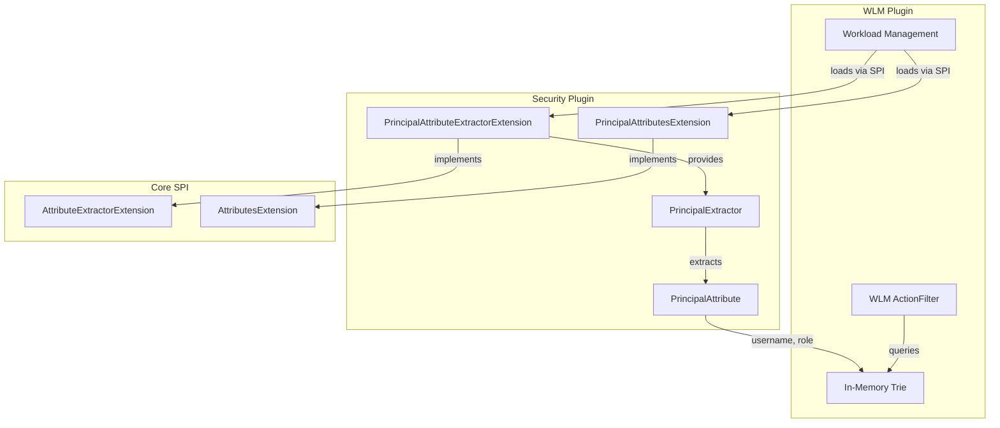

# WLM Security Attributes

## Summary

This release adds security attribute support for Workload Management (WLM) rule-based auto-tagging. The Security plugin now provides `PrincipalAttribute` extraction logic that enables WLM rules to match requests based on the authenticated user's username and roles, allowing administrators to route queries to specific workload groups based on security context.

## Details

### What's New in v3.4.0

The Security plugin implements the `AttributeExtractorExtension` SPI to provide user principal information (username and roles) to the WLM auto-tagging framework. This enables security-aware workload routing without requiring changes to client applications.

### Technical Changes

#### Architecture Changes



#### New Components

| Component | Description |
|-----------|-------------|
| `PrincipalAttribute` | Enum defining the `principal` attribute with `username` and `role` subfields |
| `PrincipalExtractor` | Extracts username and roles from the thread context's user info |
| `PrincipalAttributeExtractorExtension` | SPI extension providing the extractor to WLM |
| `PrincipalAttributesExtension` | SPI extension registering the `PrincipalAttribute` with the autotagging framework |

#### New Configuration

No new configuration settings are required. The feature is automatically enabled when both the Security plugin and Workload Management plugin are installed.

#### Dependencies

The Security plugin now depends on:
- `workload-management-wlm-spi` (optional)
- `autotagging-commons-spi`

### Usage Example

Create a rule that routes queries from users with the `all_access` role to a dedicated workload group:

```json
PUT /_rules/workload_group
{
  "description": "Route admin queries to high-priority workload group",
  "principal": {
    "role": ["all_access"]
  },
  "workload_group": "admin_workload_group_id"
}
```

Create a rule matching specific usernames:

```json
PUT /_rules/workload_group
{
  "description": "Route analytics team queries",
  "principal": {
    "username": ["alice", "bob"],
    "role": ["analyst"]
  },
  "workload_group": "analytics_workload_group_id"
}
```

### Migration Notes

No migration is required. Existing WLM rules using `index_pattern` continue to work. The `principal` attribute is additive and can be combined with `index_pattern` for more specific matching.

## Limitations

- Requires both the Security plugin and Workload Management plugin to be installed
- The `principal` attribute is only available when security is enabled
- Backend roles are not currently supported (only frontend roles)

## References

### Documentation
- [Rule-based Auto-tagging Documentation](https://docs.opensearch.org/latest/tuning-your-cluster/availability-and-recovery/rule-based-autotagging/autotagging/)
- [Workload Management Documentation](https://docs.opensearch.org/latest/tuning-your-cluster/availability-and-recovery/workload-management/wlm-feature-overview/)

### Pull Requests
| PR | Description |
|----|-------------|
| [#5606](https://github.com/opensearch-project/security/pull/5606) | Add logic to extract security attributes for rule-based autotagging |

## Related Feature Report

- [Full feature documentation](../../../../features/opensearch/workload-management.md)
