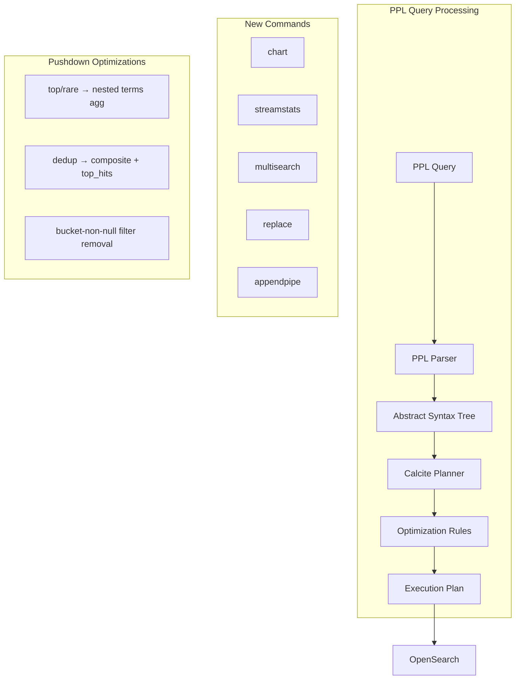

---
tags:
  - domain/search
  - component/server
  - performance
  - search
  - sql
---
# PPL Commands (Calcite)

## Summary

OpenSearch v3.4.0 introduces five new PPL commands and seven enhancements to existing commands, all implemented using the Calcite query engine. The new commands (`chart`, `streamstats`, `multisearch`, `replace`, `appendpipe`) expand PPL's data transformation capabilities, while enhancements to `top`, `rare`, `dedup`, `eventstats`, and `streamstats` improve null handling and query performance through aggregation pushdown.

## Details

### What's New in v3.4.0

This release adds significant PPL command functionality through the Calcite-based query engine:

**New Commands:**
- `chart`: Aggregation command for visualization-ready output
- `streamstats`: Running statistics over streaming data with window support
- `multisearch`: Combine results from multiple search subsearches
- `replace`: Text pattern replacement in specified fields
- `appendpipe`: Append subpipeline results to search results

**Enhancements:**
- `bucket_nullable` argument for `eventstats` and `streamstats`
- `usenull` option for `top` and `rare` commands
- Wildcard support for `replace` command
- Pushdown optimization for `top`, `rare`, and `dedup` commands

### Technical Changes

#### Architecture Changes



#### New Commands

| Command | Description | Key Features |
|---------|-------------|--------------|
| `chart` | Aggregation for visualization | `limit`, `useother`, `usenull`, span support |
| `streamstats` | Running statistics | `window`, `global`, `reset_before/after`, `bucket_nullable` |
| `multisearch` | Combine multiple searches | UNION ALL + ORDER BY architecture |
| `replace` | Text replacement | Literal and wildcard pattern support |
| `appendpipe` | Append subpipeline results | Subpipeline runs at command position |

#### New Configuration

| Setting | Description | Default |
|---------|-------------|---------|
| `bucket_nullable` | Include null buckets in group-by | Depends on `plugins.ppl.syntax.legacy.preferred` |
| `usenull` | Output null values in top/rare | Depends on `plugins.ppl.syntax.legacy.preferred` |

### Usage Examples

#### chart Command
```sql
-- Aggregate by status and host for visualization
source=logs | chart count OVER status BY host

-- With limit and useother
source=logs | chart limit=5 useother=true count BY category
```

#### streamstats Command
```sql
-- Running sum with window
source=data | streamstats window=5 sum(value) BY group

-- With reset condition
source=data | streamstats reset_before="(status='error')" count() as error_count
```

#### multisearch Command
```sql
-- Combine age group analysis
source=accounts | multisearch
  [search source=accounts | where age < 30 | eval age_group = "young"]
  [search source=accounts | where age >= 30 | eval age_group = "adult"]
| stats count by age_group
```

#### replace Command
```sql
-- Replace in single field
source=logs | replace 'error' WITH 'ERROR' IN message

-- Wildcard replacement
source=logs | replace 'err*' WITH 'ERROR' IN message, level
```

#### appendpipe Command
```sql
-- Append summary statistics
source=data | appendpipe [stats avg(value) as avg_value]
```

### Migration Notes

- The `usenull` default behavior depends on `plugins.ppl.syntax.legacy.preferred` setting
- When `legacy.preferred=true`: `usenull` defaults to `true`
- When `legacy.preferred=false`: `usenull` defaults to `false`

## Limitations

- `chart` command does not support dynamic pivoting (front-end pivoting required)
- `chart` currently supports single aggregation function only
- `dedup` pushdown does not support script expressions
- `streamstats` with `global=true + window + group` uses correlated joins which may impact performance on large datasets

## References

### Documentation
- [PPL Documentation](https://docs.opensearch.org/3.0/search-plugins/sql/ppl/index/): Official PPL documentation

### Pull Requests
| PR | Description |
|----|-------------|
| [#4579](https://github.com/opensearch-project/sql/pull/4579) | Support `chart` command in PPL |
| [#4297](https://github.com/opensearch-project/sql/pull/4297) | Support `streamstats` command with Calcite |
| [#4332](https://github.com/opensearch-project/sql/pull/4332) | Support `multisearch` command in Calcite |
| [#4451](https://github.com/opensearch-project/sql/pull/4451) | Support `replace` command in Calcite |
| [#4602](https://github.com/opensearch-project/sql/pull/4602) | Support `appendpipe` command in PPL |
| [#4831](https://github.com/opensearch-project/sql/pull/4831) | Add `bucket_nullable` argument for `streamstats` |
| [#4817](https://github.com/opensearch-project/sql/pull/4817) | Add `bucket_nullable` argument for `eventstats` |
| [#4843](https://github.com/opensearch-project/sql/pull/4843) | Remove redundant push-down-filters for bucket-non-null agg |
| [#4844](https://github.com/opensearch-project/sql/pull/4844) | Convert `dedup` pushdown to composite + top_hits |
| [#4698](https://github.com/opensearch-project/sql/pull/4698) | Support wildcard for replace command |
| [#4696](https://github.com/opensearch-project/sql/pull/4696) | Support `usenull` option in PPL `top` and `rare` commands |
| [#4707](https://github.com/opensearch-project/sql/pull/4707) | Pushdown `top`/`rare` commands to nested aggregation |

### Issues (Design / RFC)
- [Issue #399](https://github.com/opensearch-project/sql/issues/399): chart command feature request
- [Issue #4207](https://github.com/opensearch-project/sql/issues/4207): streamstats command feature request
- [Issue #4348](https://github.com/opensearch-project/sql/issues/4348): multisearch command feature request
- [Issue #3975](https://github.com/opensearch-project/sql/issues/3975): replace command feature request
- [Issue #4684](https://github.com/opensearch-project/sql/issues/4684): usenull option for top/rare
- [Issue #4671](https://github.com/opensearch-project/sql/issues/4671): top/rare pushdown optimization
- [Issue #4797](https://github.com/opensearch-project/sql/issues/4797): dedup pushdown optimization
- [Issue #4801](https://github.com/opensearch-project/sql/issues/4801): bucket_nullable for eventstats
- [Issue #4802](https://github.com/opensearch-project/sql/issues/4802): bucket_nullable for streamstats
- [Issue #4811](https://github.com/opensearch-project/sql/issues/4811): redundant filter optimization

## Related Feature Report

- [Full feature documentation](../../../features/sql/sql-ppl-commands-calcite.md)
