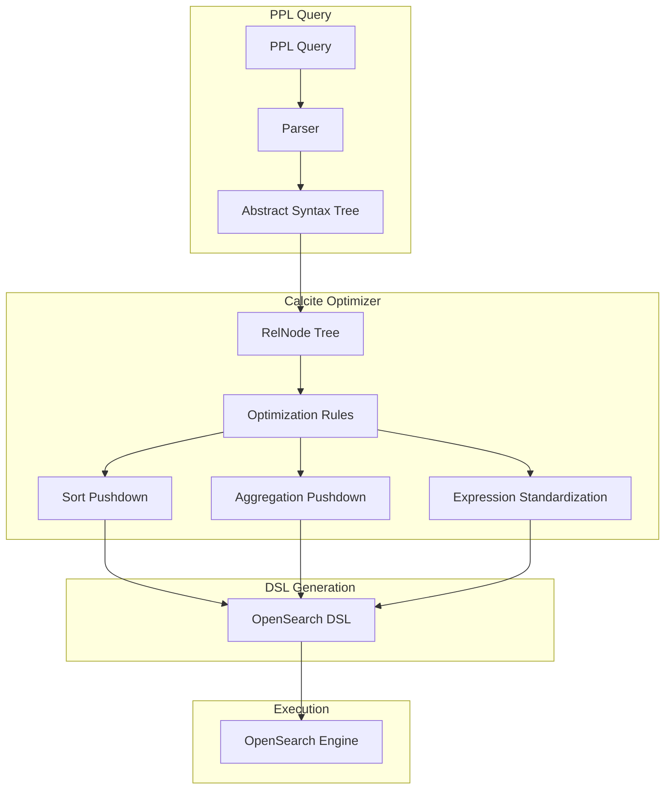

---
tags:
  - observability
  - performance
  - search
  - sql
---

# PPL Query Optimization

## Summary

OpenSearch v3.4.0 delivers 33 enhancements to PPL (Piped Processing Language) query optimization, focusing on aggregation pushdown, sort optimization, and new internal functions. These improvements leverage the Apache Calcite query engine to translate PPL operations into efficient OpenSearch DSL queries, significantly improving query performance for analytics workloads.

## Details

### What's New in v3.4.0

#### Sort Pushdown Enhancements

Multiple PRs improve sort operation pushdown to OpenSearch:

- **Sort by complex expressions** (#4750): Pushes sort operations with complex expressions directly to scan operations
- **Sort after limit** (#4657): Transforms `limit + sort` to `sort + limit` when safe, enabling pushdown for join/subsearch scenarios
- **Sort on aggregation measures** (#4603, #4759, #4867): Converts composite aggregations to terms/histogram/multi-terms aggregations when sorting by metrics

#### Aggregation Optimizations

- **Distinct count approx pushdown** (#4614): Pushes `DISTINCT_COUNT_APPROX` to OpenSearch cardinality aggregation using HyperLogLog++
- **Case function as range queries** (#4400): Converts CASE expressions in aggregations to efficient range aggregations
- **Merge group fields** (#4703): Optimizes aggregations with dependent group fields
- **Remove unnecessary aggregations** (#4867, #4877): Eliminates redundant count aggregations and filters for DateHistogram

#### New Internal Functions

| Function | PR | Description | Related Issue |
|----------|-----|-------------|---------------|
| `MAP_REMOVE` | #4511 | Remove keys from map structures |   |
| `MAP_APPEND` | #4515 | Append values to map structures |   |
| `MAP_CONCAT` | #4477 | Concatenate multiple maps |   |
| `JSON_EXTRACT_ALL` | #4489 | Extract all values from JSON |   |

#### Command Enhancements

- **fillnull command** (#4421): New option-style syntax `fillnull value=0 field1 field2`
- **Explain API YAML format** (#4446): Human-readable YAML output for query plans
- **Subsearch/join limits** (#4501, #4534): Configurable `plugins.ppl.subsearch.maxout` and `plugins.ppl.join.subsearch_maxout`
- **Composite bucket size** (#4544): Configurable via `plugins.query.buckets`

### Technical Changes

#### Architecture Changes



#### New Configuration

| Setting | Description | Default |
|---------|-------------|---------|
| `plugins.query.buckets` | Composite aggregation bucket size | 10000 |
| `plugins.ppl.subsearch.maxout` | Maximum rows from subsearch | 10000 |
| `plugins.ppl.join.subsearch_maxout` | Maximum rows for join subsearch | 50000 |

### Usage Examples

#### Sort Pushdown with Complex Expressions
```ppl
source=accounts | sort abs(balance - 1000) | head 10
```

#### Distinct Count Approximation
```ppl
source=logs | stats distinct_count_approx(user_id) as unique_users by host
```

#### Case Function as Range Aggregation
```ppl
source=bank | eval age_range = case(age < 30, 'young', age < 50, 'middle' else 'senior') 
| stats avg(balance) by age_range
```

Generated DSL uses range aggregation:
```json
{
  "aggregations": {
    "age_range": {
      "range": {
        "field": "age",
        "ranges": [
          {"key": "young", "to": 30},
          {"key": "middle", "from": 30, "to": 50},
          {"key": "senior", "from": 50}
        ]
      }
    }
  }
}
```

#### New fillnull Syntax
```ppl
source=accounts | fillnull value=0 balance age
source=accounts | fillnull value='N/A' name
```

#### YAML Explain Output
```ppl
explain format=yaml source=accounts | where age > 30
```

### Migration Notes

- Enable Calcite engine with `plugins.calcite.enabled=true` for advanced optimizations
- Review subsearch/join queries if they exceed new configurable limits
- YAML explain format is experimental and may change

## Limitations

- Sort pushdown for complex expressions requires Calcite engine
- Case-to-range pushdown only works with string literal results and numeric fields
- Range aggregations ignore null values (different from CASE function behavior)
- Some optimizations require specific query patterns to trigger

## References

### Documentation
- [PPL Commands Documentation](https://docs.opensearch.org/3.0/search-plugins/sql/ppl/functions/)

### Blog Posts
- [OpenSearch PPL Blog: Lookup, Join, and Subsearch](https://opensearch.org/blog/enhanced-log-analysis-with-opensearch-ppl-introducing-lookup-join-and-subsearch/)

### Pull Requests
| PR | Description |
|----|-------------|
| [#4703](https://github.com/opensearch-project/sql/pull/4703) | Merge group fields for aggregate with dependent group fields |
| [#4795](https://github.com/opensearch-project/sql/pull/4795) | RexNode expression standardization for script push down |
| [#4750](https://github.com/opensearch-project/sql/pull/4750) | Pushdown sort by complex expressions to scan |
| [#4881](https://github.com/opensearch-project/sql/pull/4881) | Refactor alias type field with project alias |
| [#4867](https://github.com/opensearch-project/sql/pull/4867) | Remove count aggregation for sort on aggregate measure |
| [#4877](https://github.com/opensearch-project/sql/pull/4877) | Remove unnecessary filter for DateHistogram |
| [#4759](https://github.com/opensearch-project/sql/pull/4759) | Support push down sort on aggregation measure for multiple buckets |
| [#4657](https://github.com/opensearch-project/sql/pull/4657) | Support push down sort after limit |
| [#4554](https://github.com/opensearch-project/sql/pull/4554) | Enhance dynamic source clause for metadata filter |
| [#4690](https://github.com/opensearch-project/sql/pull/4690) | Bin command error message enhancement |
| [#4732](https://github.com/opensearch-project/sql/pull/4732) | Update clickbench queries with bucket_nullable=false |
| [#4603](https://github.com/opensearch-project/sql/pull/4603) | Pushdown sort aggregate metrics |
| [#4586](https://github.com/opensearch-project/sql/pull/4586) | Allow renaming group-by fields to existing field names |
| [#4599](https://github.com/opensearch-project/sql/pull/4599) | Support automatic type conversion for REX/SPATH/PARSE |
| [#4400](https://github.com/opensearch-project/sql/pull/4400) | Pushdown case function in aggregations as range queries |
| [#4613](https://github.com/opensearch-project/sql/pull/4613) | Update GEOIP function to support IP types |
| [#4614](https://github.com/opensearch-project/sql/pull/4614) | Pushdown distinct count approx |
| [#4615](https://github.com/opensearch-project/sql/pull/4615) | Optimize pushdown script size with necessary fields |
| [#4138](https://github.com/opensearch-project/sql/pull/4138) | Support referring to implicit @timestamp field in span |
| [#4544](https://github.com/opensearch-project/sql/pull/4544) | Make composite bucket size configurable |
| [#4511](https://github.com/opensearch-project/sql/pull/4511) | Add internal MAP_REMOVE function |
| [#4515](https://github.com/opensearch-project/sql/pull/4515) | Add MAP_APPEND internal function |
| [#4569](https://github.com/opensearch-project/sql/pull/4569) | Use _doc + _shard_doc as sort tiebreaker |
| [#4434](https://github.com/opensearch-project/sql/pull/4434) | Error handling for illegal character in java regex |
| [#4489](https://github.com/opensearch-project/sql/pull/4489) | Add JSON_EXTRACT_ALL internal function |
| [#4534](https://github.com/opensearch-project/sql/pull/4534) | Set 0 and negative value of subsearch.maxout as unlimited |
| [#4501](https://github.com/opensearch-project/sql/pull/4501) | Add configurable system limitations for subsearch and join |
| [#4477](https://github.com/opensearch-project/sql/pull/4477) | Add MAP_CONCAT internal function |
| [#4456](https://github.com/opensearch-project/sql/pull/4456) | Support regex for replace eval function |
| [#4479](https://github.com/opensearch-project/sql/pull/4479) | Add data anonymizer for spath command |
| [#4440](https://github.com/opensearch-project/sql/pull/4440) | Support eval returns decimal division result |
| [#4421](https://github.com/opensearch-project/sql/pull/4421) | PPL fillnull command enhancement |
| [#4446](https://github.com/opensearch-project/sql/pull/4446) | Support format=yaml in Explain API |

### Issues (Design / RFC)
- [Issue #4201](https://github.com/opensearch-project/sql/issues/4201): Pushdown case function in aggregations
- [Issue #4282](https://github.com/opensearch-project/sql/issues/4282): Pushdown sort aggregate metrics
- [Issue #4533](https://github.com/opensearch-project/sql/issues/4533): Pushdown distinct count approx
- [Issue #4570](https://github.com/opensearch-project/sql/issues/4570): Support push down sort after limit
- [Issue #3912](https://github.com/opensearch-project/sql/issues/3912): Pushdown sort by complex expressions
- [Issue #4517](https://github.com/opensearch-project/sql/issues/4517): Make composite bucket size configurable
- [Issue #3731](https://github.com/opensearch-project/sql/issues/3731): Configurable limitations for subsearch/join

## Related Feature Report

- [Full feature documentation](../../../../features/sql/ppl-opensearch-query-optimization.md)
