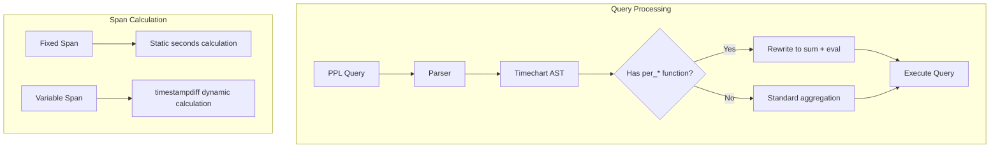

---
tags:
  - domain/search
  - component/server
  - indexing
  - observability
  - search
  - sql
---
# PPL Timechart Functions

## Summary

OpenSearch v3.4.0 introduces significant enhancements to the PPL `timechart` command with new rate-based aggregation functions (`per_second`, `per_minute`, `per_hour`, `per_day`), millisecond span support, custom timestamp field specification via `timefield`, and improved internal architecture by merging `timechart` and `chart` implementations.

## Details

### What's New in v3.4.0

#### Rate-Based Aggregation Functions

The `per_*` functions calculate rate-based metrics by normalizing aggregated values to specific time units:

| Function | Description | Multiplier |
|----------|-------------|------------|
| `per_second(field)` | Per-second rate | sum / span_seconds |
| `per_minute(field)` | Per-minute rate | sum / span_seconds × 60 |
| `per_hour(field)` | Per-hour rate | sum / span_seconds × 3600 |
| `per_day(field)` | Per-day rate | sum / span_seconds × 86400 |

#### Implementation Approach

The `per_*` functions use an **Eval Transformation** approach that rewrites the query at compile time:

```
-- Original query
source=events | timechart span=5m per_second(packets)

-- Rewritten internally to
source=events | timechart span=5m sum(packets) as `per_second(packets)`
             | eval `per_second(packets)` = `per_second(packets)` / 300
```

For variable-length spans (month/quarter/year), the implementation dynamically calculates bucket length:

```
-- For span=2mon, uses timestampdiff for accurate calculation
| eval `per_second(packets)` = `per_second(packets)` /
    timestampdiff(SECOND, @timestamp, timestampadd(MONTH, 2, @timestamp))
```

#### Custom Timestamp Field (`timefield`)

Users can now specify a custom timestamp field instead of the implicit `@timestamp`:

```
source=events | timechart timefield=start_at span=1hour count() by category
```

This resolves the limitation where indexes with non-standard timestamp field names required workarounds like renaming fields.

#### Millisecond Span Support

Fixed the bug where millisecond spans were incorrectly converted to microseconds. The `IntervalUnit` enum now includes `MILLISECOND`, enabling accurate time bucketing for sub-second precision:

```
source=logs | timechart span=500ms count()
```

#### Architecture Improvements

The `timechart` and `chart` command implementations have been merged. Since `timechart` is semantically a subset of `chart` (with row-split fixed to the timestamp field), this consolidation:

- Reduces code duplication
- Fixes several existing bugs in `timechart`
- Simplifies maintenance

### Technical Changes



#### New Configuration

| Setting | Description | Default |
|---------|-------------|---------|
| `timefield` | Custom timestamp field name | `@timestamp` |

### Usage Examples

#### Basic per_second calculation

```
source=network_logs
| timechart span=1m per_second(packets)
```

Result:
```
| @timestamp          | per_second(packets) |
|---------------------|---------------------|
| 2025-09-08 10:00:00 | 2.0                 |
```

#### Multiple rate functions

```
source=network_logs
| timechart span=1m per_second(packets), per_minute(packets), per_hour(packets)
```

#### Custom timestamp field

```
source=ocsf_events
| timechart timefield=event_time span=1h count() by category
```

#### Millisecond precision

```
source=high_frequency_logs
| timechart span=100ms per_second(requests)
```

### Migration Notes

- No breaking changes; existing `timechart` queries continue to work
- Users with custom timestamp fields can now use `timefield` instead of `rename` workaround
- Millisecond spans now work correctly without manual adjustments

## Limitations

- `per_*` functions work exclusively with the `timechart` command (due to implicit timestamp field dependency)
- Variable-length spans (month/quarter/year) require dynamic calculation which may have slight performance overhead

## References

### Documentation
- [PPL Commands Documentation](https://docs.opensearch.org/3.0/search-plugins/sql/ppl/functions/)

### Pull Requests
| PR | Description |
|----|-------------|
| [#4464](https://github.com/opensearch-project/sql/pull/4464) | Add `per_second` function support for `timechart` command |
| [#4531](https://github.com/opensearch-project/sql/pull/4531) | Add `per_minute`, `per_hour`, `per_day` function support |
| [#4672](https://github.com/opensearch-project/sql/pull/4672) | Support millisecond span |
| [#4755](https://github.com/opensearch-project/sql/pull/4755) | Merge the implementation of `timechart` and `chart` |
| [#4784](https://github.com/opensearch-project/sql/pull/4784) | Specify timestamp field with `timefield` in timechart command |

### Issues (Design / RFC)
- [Issue #4350](https://github.com/opensearch-project/sql/issues/4350): PPL `per_*` aggregation function support
- [Issue #4550](https://github.com/opensearch-project/sql/issues/4550): Span millisecond incorrectly converted to microsecond
- [Issue #4576](https://github.com/opensearch-project/sql/issues/4576): timechart with option to specify timestamp column

## Related Feature Report

- [Full feature documentation](../../../features/sql/sql-ppl-timechart-command.md)
