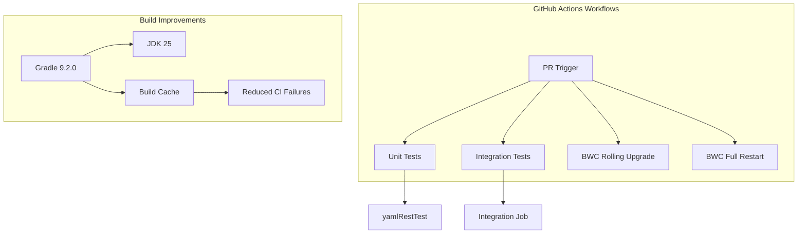

---
tags:
  - domain/search
  - component/server
  - performance
  - search
  - sql
---
# SQL CI/Tests

## Summary

OpenSearch SQL plugin v3.4.0 includes significant improvements to CI/CD infrastructure, test stability, and build tooling. These changes address flaky tests, disk space issues in backward compatibility tests, and modernize the build system with Gradle 9.2.0 and JDK 25 support.

## Details

### What's New in v3.4.0

This release focuses on CI/CD reliability and developer experience improvements:

- **Build System Modernization**: Upgraded to Gradle 9.2.0 and JDK 25
- **BWC Test Improvements**: Split backward compatibility tests to prevent disk space exhaustion
- **Test Stability Fixes**: Addressed multiple flaky integration tests
- **Maven Snapshots**: Onboarded internal modules for downstream reuse
- **Query Timeout Support**: Added configurable timeouts for Calcite queries

### Technical Changes

#### CI/CD Infrastructure



#### Key Changes

| Category | Change | PR |
|----------|--------|-----|
| Build System | Gradle 9.2.0 + JDK 25 | [#4824](https://github.com/opensearch-project/sql/pull/4824) |
| BWC Tests | Split into rolling-upgrade and full-restart | [#4716](https://github.com/opensearch-project/sql/pull/4716) |
| CI Stability | Build cache for jitpack dependencies | [#4646](https://github.com/opensearch-project/sql/pull/4646) |
| Test Organization | yamlRestTest moved to integration job | [#4838](https://github.com/opensearch-project/sql/pull/4838) |
| Query Timeouts | Configurable PPL query timeout | [#4857](https://github.com/opensearch-project/sql/pull/4857) |
| Maven Publishing | Internal modules for downstream reuse | [#4484](https://github.com/opensearch-project/sql/pull/4484) |

#### Gradle Plugin Updates

| Plugin | Old Version | New Version |
|--------|-------------|-------------|
| me.champeau.jmh | 0.6.8 | 0.7.3 |
| com.diffplug.spotless | 7.2.1 | 8.1.0 |
| googleJavaFormat | 1.17.0 | 1.32.0 |
| info.solidsoft.pitest | 1.9.0 | 1.19.0-rc.2 |

#### New Configuration

| Setting | Description | Default |
|---------|-------------|---------|
| `plugins.ppl.query.timeout` | PPL query execution timeout | 300s |

### Usage Example

```yaml
# Configure PPL query timeout
PUT _cluster/settings
{
  "persistent": {
    "plugins.ppl.query.timeout": "600s"
  }
}
```

### Migration Notes

- **Gradle Upgrade**: Projects depending on SQL plugin should ensure compatibility with Gradle 9.2.0
- **JDK 25**: CI now uses JDK 25; local development should use compatible JDK version
- **BWC Tests**: If running BWC tests locally, note they are now split into separate workflows

## Limitations

- Query timeout only applies to Calcite-based queries
- Build cache may need manual clearing if dependency issues occur

## References

### Pull Requests
| PR | Description |
|----|-------------|
| [#4890](https://github.com/opensearch-project/sql/pull/4890) | Add config for CodeRabbit review |
| [#4857](https://github.com/opensearch-project/sql/pull/4857) | Support timeouts for Calcite queries |
| [#4846](https://github.com/opensearch-project/sql/pull/4846) | Fix flaky CalcitePPLTcphIT |
| [#4838](https://github.com/opensearch-project/sql/pull/4838) | Execute yamlRestTest in integration job |
| [#4824](https://github.com/opensearch-project/sql/pull/4824) | Bump Gradle to 9.2.0 and JDK to 25 |
| [#4809](https://github.com/opensearch-project/sql/pull/4809) | Fix UT failure and Linkchecker failure |
| [#4779](https://github.com/opensearch-project/sql/pull/4779) | Update workflows from macos-13 to 14 |
| [#4773](https://github.com/opensearch-project/sql/pull/4773) | Enforce PR label 'bugFix' instead of 'bug' |
| [#4748](https://github.com/opensearch-project/sql/pull/4748) | Fix test failures due to version in mapping |
| [#4731](https://github.com/opensearch-project/sql/pull/4731) | Add allowed_warnings in yaml restful tests |
| [#4716](https://github.com/opensearch-project/sql/pull/4716) | Split bwc-tests to rolling-upgrade and full-restart |
| [#4695](https://github.com/opensearch-project/sql/pull/4695) | Adding IT suite for PPL-based dashboards |
| [#4668](https://github.com/opensearch-project/sql/pull/4668) | Update big5 ppl queries and check plans |
| [#4646](https://github.com/opensearch-project/sql/pull/4646) | Mitigate CI failure from 500 Internal Server Error |
| [#4623](https://github.com/opensearch-project/sql/pull/4623) | Refactor JsonExtractAllFunctionIT and MapConcatFunctionIT |
| [#4598](https://github.com/opensearch-project/sql/pull/4598) | Onboarding async query core to maven snapshots |
| [#4588](https://github.com/opensearch-project/sql/pull/4588) | Onboarding new maven snapshots publishing to s3 |
| [#4556](https://github.com/opensearch-project/sql/pull/4556) | Fix JsonExtractAllFunctionIT failure |
| [#4537](https://github.com/opensearch-project/sql/pull/4537) | Check server status before starting Prometheus |
| [#4485](https://github.com/opensearch-project/sql/pull/4485) | Update stalled action |
| [#4484](https://github.com/opensearch-project/sql/pull/4484) | Publish internal modules for downstream reuse |
| [#4462](https://github.com/opensearch-project/sql/pull/4462) | Switch to Guice#createInjector and add concurrent ITs |
| [#4452](https://github.com/opensearch-project/sql/pull/4452) | Increment version to 3.4.0-SNAPSHOT |
| [#4442](https://github.com/opensearch-project/sql/pull/4442) | Add ignorePrometheus flag for integTest and docTest |
| [#4393](https://github.com/opensearch-project/sql/pull/4393) | Refactor name resolution in Calcite PPL |
| [#4345](https://github.com/opensearch-project/sql/pull/4345) | Implement one-batch lookahead for index enumerators |
| [#4301](https://github.com/opensearch-project/sql/pull/4301) | Revert grammar files and developer guide |
| [#4401](https://github.com/opensearch-project/sql/pull/4401) | Revert partial changes |
| [#4025](https://github.com/opensearch-project/sql/pull/4025) | Update delete_backport_branch workflow |
| [#4861](https://github.com/opensearch-project/sql/pull/4861) | Fix clickbench query 43 |

### Issues (Design / RFC)
- [Issue #4722](https://github.com/opensearch-project/sql/issues/4722): Gradle upgrade tracking
- [Issue #4842](https://github.com/opensearch-project/sql/issues/4842): Query timeout issue

## Related Feature Report

- Full feature documentation
