# SQL/PPL Bugfixes

## Summary

OpenSearch v3.4.0 includes 48 bug fixes for the SQL/PPL plugin, addressing critical issues in query execution, memory management, concurrency, and command behavior. Key highlights include fixing memory exhaustion from multiple filter operations, resolving race conditions in concurrent queries, and correcting regex extraction with nested capture groups.

## Details

### What's New in v3.4.0

This release focuses on stability and correctness improvements across the SQL/PPL plugin, with particular attention to the Calcite query engine and PPL command implementations.

### Technical Changes

#### Critical Fixes

| Issue | Fix | PR |
|-------|-----|-----|
| Memory exhaustion with multiple filters | Filter accumulation mechanism combines conditions into single Filter RelNode | [#4841](https://github.com/opensearch-project/sql/pull/4841) |
| Race condition in concurrent queries | Removed shared mutable optimizer field from Analyzer singleton | [#4454](https://github.com/opensearch-project/sql/pull/4454) |
| Rex command nested capture groups | Use Java's native named group extraction instead of index calculation | [#4641](https://github.com/opensearch-project/sql/pull/4641) |
| Redundant filter queries in pushdown | Separate `pushDownFilterForCalcite` creates new query instead of updating | [#4744](https://github.com/opensearch-project/sql/pull/4744) |

#### Query Execution Fixes

| Issue | Fix | PR |
|-------|-----|-----|
| Streamstats null group handling | Added `groupNotNull` predicate with conditional window expressions | [#4777](https://github.com/opensearch-project/sql/pull/4777) |
| Multisearch/Append type conflicts | Changed to throw IllegalArgumentException instead of auto-renaming | [#4512](https://github.com/opensearch-project/sql/pull/4512) |
| Sort command asc/desc behavior | Fixed keyword behavior for sort command | [#4651](https://github.com/opensearch-project/sql/pull/4651) |
| Percentile aggregation | Fixed percentile calculation bug | [#4539](https://github.com/opensearch-project/sql/pull/4539) |

#### Filter and Pushdown Fixes

| Issue | Fix | PR |
|-------|-----|-----|
| Filter parsing on date fields | Fixed parsing failure with non-default date formats | [#4616](https://github.com/opensearch-project/sql/pull/4616) |
| Min/max pushdown on derived fields | Fixed push down failure | [#4572](https://github.com/opensearch-project/sql/pull/4572) |
| Sort pushdown after project | Fixed sort push down into agg after project already pushed | [#4546](https://github.com/opensearch-project/sql/pull/4546) |
| Mapping after aggregation pushdown | Fixed field mapping issues | [#4500](https://github.com/opensearch-project/sql/pull/4500) |

#### Field and Type Handling

| Issue | Fix | PR |
|-------|-----|-----|
| Nested fields in bin command | Fixed bin nested fields issue | [#4606](https://github.com/opensearch-project/sql/pull/4606) |
| Struct sub-fields access | Fixed sub-fields accessing of generated structs | [#4683](https://github.com/opensearch-project/sql/pull/4683) |
| Nested alias type support | Made nested alias type support referring to outer context | [#4673](https://github.com/opensearch-project/sql/pull/4673) |
| Grouping key field type | Only overwrite when ExprCoreTypes differ | [#4850](https://github.com/opensearch-project/sql/pull/4850) |

#### Function and UDF Fixes

| Issue | Fix | PR |
|-------|-----|-----|
| Binning UDF resolution | Fixed type coercion support for binning UDFs | [#4742](https://github.com/opensearch-project/sql/pull/4742) |
| LogPatternAggFunction | Fixed wrong parameter and return result logic | [#4868](https://github.com/opensearch-project/sql/pull/4868) |
| SAFE_CAST translation | Translate to TRY_CAST in Spark SQL | [#4788](https://github.com/opensearch-project/sql/pull/4788) |
| External OpenSearch UDFs | Support serializing at pushdown time | [#4618](https://github.com/opensearch-project/sql/pull/4618) |

#### Security and Maintenance

| Issue | Fix | PR |
|-------|-----|-----|
| CVE-2025-48924 | Fixed diamond dependency with commons-lang:2.4 | [#4665](https://github.com/opensearch-project/sql/pull/4665) |

### Architecture Changes

```mermaid
graph TB
    subgraph "Filter Accumulation Fix"
        Query[PPL Query] --> Analyzer[Analyzer]
        Analyzer --> |"Count filters"| Detection[Filter Detection]
        Detection --> |"≥2 filters"| Accumulator[Filter Accumulator]
        Accumulator --> |"Combine with AND"| SingleFilter[Single Filter RelNode]
        SingleFilter --> Calcite[Calcite Optimizer]
    end
    
    subgraph "Before Fix"
        OldQuery[Query] --> DeepChain[Deep Filter Chain]
        DeepChain --> |"10! combinations"| OOM[Memory Exhaustion]
    end
```



### Usage Example

```sql
-- Multiple regex filters now work without memory exhaustion
source=t 
| regex f1="pattern1" 
| regex f2="pattern2" 
| regex f3="pattern3" 
| fields f1, f2, f3

-- Rex with nested capture groups now extracts correctly
source=accounts 
| rex field=email "(?<user>(amber|hattie)[a-z]*)@(?<domain>(pyrami|netagy))\.(?<tld>(com|org))" 
| fields user, domain, tld
```

### Migration Notes

- **Multisearch/Append**: Type conflicts now throw `IllegalArgumentException` instead of auto-renaming fields. Update queries that relied on automatic field renaming.
- **Timestamp interleaving**: Only `@timestamp` field is used for timestamp interleaving in multisearch; other timestamp fields (`_time`, `timestamp`, `time`) are no longer used.

## Limitations

- Filter accumulation only activates when 2+ filtering operations are detected
- Calcite engine does not support script pushdown
- Some complex nested field scenarios may still require explicit field references

## Related PRs

| PR | Description |
|----|-------------|
| [#4885](https://github.com/opensearch-project/sql/pull/4885) | Add hashCode() and equals() to ExprJavaType value class |
| [#4868](https://github.com/opensearch-project/sql/pull/4868) | Fix LogPatternAggFunction parameter/return logic |
| [#4850](https://github.com/opensearch-project/sql/pull/4850) | Grouping key field type overwrite fix |
| [#4841](https://github.com/opensearch-project/sql/pull/4841) | Fix memory exhaustion for multiple filtering operations |
| [#4837](https://github.com/opensearch-project/sql/pull/4837) | Update like() syntax |
| [#4813](https://github.com/opensearch-project/sql/pull/4813) | Support escaped field names in SPath parsing |
| [#4793](https://github.com/opensearch-project/sql/pull/4793) | Fix function identify problem in SQL dialect conversion |
| [#4788](https://github.com/opensearch-project/sql/pull/4788) | Translate SAFE_CAST to TRY_CAST in Spark SQL |
| [#4783](https://github.com/opensearch-project/sql/pull/4783) | Fix search anonymizer only |
| [#4777](https://github.com/opensearch-project/sql/pull/4777) | Fix Streamstats null group handling |
| [#4758](https://github.com/opensearch-project/sql/pull/4758) | Fix eval on grouped fields after timechart |
| [#4749](https://github.com/opensearch-project/sql/pull/4749) | Support script pushdown in sort-on-measure rewriting |
| [#4744](https://github.com/opensearch-project/sql/pull/4744) | Fix filter push down redundant filter queries |
| [#4742](https://github.com/opensearch-project/sql/pull/4742) | Fix binning UDF resolution / type coercion |
| [#4719](https://github.com/opensearch-project/sql/pull/4719) | Support nested field access after fields command |
| [#4717](https://github.com/opensearch-project/sql/pull/4717) | Support decimal as span literals |
| [#4708](https://github.com/opensearch-project/sql/pull/4708) | Fix AllFieldsExcludeMeta nested field resolution |
| [#4706](https://github.com/opensearch-project/sql/pull/4706) | BucketAggregationParser handle more non-composite types |
| [#4683](https://github.com/opensearch-project/sql/pull/4683) | Fix sub-fields accessing of generated structs |
| [#4673](https://github.com/opensearch-project/sql/pull/4673) | Make nested alias type support outer context |
| [#4670](https://github.com/opensearch-project/sql/pull/4670) | Use table scan rowType in filter pushdown |
| [#4665](https://github.com/opensearch-project/sql/pull/4665) | Fix CVE-2025-48924 |
| [#4651](https://github.com/opensearch-project/sql/pull/4651) | Fix asc/desc keyword behavior for sort |
| [#4648](https://github.com/opensearch-project/sql/pull/4648) | Change ComparableLinkedHashMap to compare Key |
| [#4641](https://github.com/opensearch-project/sql/pull/4641) | Fix rex nested capture groups extraction |
| [#4633](https://github.com/opensearch-project/sql/pull/4633) | Replace dots in table scan PhysType fields |
| [#4629](https://github.com/opensearch-project/sql/pull/4629) | Return comparable LinkedHashMap in ExprTupleValue |
| [#4621](https://github.com/opensearch-project/sql/pull/4621) | Support alias fields in MIN/MAX/FIRST/LAST/TAKE |
| [#4618](https://github.com/opensearch-project/sql/pull/4618) | Support serializing external OpenSearch UDFs |
| [#4616](https://github.com/opensearch-project/sql/pull/4616) | Fix filter parsing on date fields |
| [#4608](https://github.com/opensearch-project/sql/pull/4608) | Fix compile issue in main |
| [#4606](https://github.com/opensearch-project/sql/pull/4606) | Fix bin nested fields issue |
| [#4583](https://github.com/opensearch-project/sql/pull/4583) | Add value type hint for derived aggregate group by |
| [#4572](https://github.com/opensearch-project/sql/pull/4572) | Fix push down failure for min/max on derived field |
| [#4546](https://github.com/opensearch-project/sql/pull/4546) | Fix sort push down into agg after project |
| [#4541](https://github.com/opensearch-project/sql/pull/4541) | Update request builder after pushdown sort |
| [#4539](https://github.com/opensearch-project/sql/pull/4539) | Fix percentile bug |
| [#4522](https://github.com/opensearch-project/sql/pull/4522) | Include metadata fields type in agg/filter pushdown |
| [#4520](https://github.com/opensearch-project/sql/pull/4520) | Throw error for non-boolean case conditions |
| [#4512](https://github.com/opensearch-project/sql/pull/4512) | Fixes for Multisearch and Append command |
| [#4500](https://github.com/opensearch-project/sql/pull/4500) | Fix mapping after aggregation push down |
| [#4491](https://github.com/opensearch-project/sql/pull/4491) | Fix missing keywordsCanBeId |
| [#4475](https://github.com/opensearch-project/sql/pull/4475) | Fix explicit makeNullLiteral for UDT fields |
| [#4474](https://github.com/opensearch-project/sql/pull/4474) | Fix join type ambiguous issue |
| [#4454](https://github.com/opensearch-project/sql/pull/4454) | Remove shared mutable optimizer field (race condition) |
| [#4449](https://github.com/opensearch-project/sql/pull/4449) | Fix issue 4441 |
| [#4435](https://github.com/opensearch-project/sql/pull/4435) | Revert to _doc + _id |
| [#4413](https://github.com/opensearch-project/sql/pull/4413) | Fallback to sub-aggregation if composite unsupported |

## References

- [SQL and PPL Documentation](https://docs.opensearch.org/3.0/search-plugins/sql/index/)
- [Issue #4842](https://github.com/opensearch-project/sql/issues/4842): Memory exhaustion with multiple regex
- [Issue #4751](https://github.com/opensearch-project/sql/issues/4751): Streamstats null group handling
- [Issue #4729](https://github.com/opensearch-project/sql/issues/4729): Redundant filter queries
- [Issue #4466](https://github.com/opensearch-project/sql/issues/4466): Rex nested capture groups

## Related Feature Report

- [Full feature documentation](../../../features/sql/sql-ppl-bug-fixes.md)
