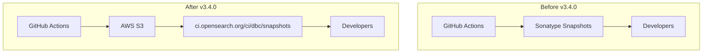

# User Behavior Insights Build

## Summary

This release item updates the User Behavior Insights (UBI) plugin build infrastructure to migrate Maven snapshot publishing from Sonatype to the new OpenSearch S3-based snapshot repository. This is part of a broader OpenSearch project initiative to consolidate snapshot publishing across all plugins.

## Details

### What's New in v3.4.0

The UBI plugin now publishes Maven snapshots to the OpenSearch-managed S3 repository (`ci.opensearch.org`) instead of Sonatype. This migration was necessary because Sonatype implemented new policies removing snapshots older than 30 days.

### Technical Changes

#### Architecture Changes



#### New Components

| Component | Description |
|-----------|-------------|
| `backport.yml` | New GitHub Actions workflow for automated backporting of PRs |
| `delete_backport_branch.yml` | Workflow to clean up backport branches after merge |

#### New Configuration

| Setting | Description | Default |
|---------|-------------|---------|
| `MAVEN_SNAPSHOTS_S3_REPO` | S3 repository URL for snapshot publishing | `ci.opensearch.org/ci/dbc/snapshots/maven/` |
| `MAVEN_SNAPSHOTS_S3_ROLE` | IAM role for S3 access | (from secrets) |

#### Build Changes

The `build.gradle` file was updated to:
1. Replace Sonatype repository URLs with the new S3 snapshot repository
2. Use AWS credentials (via IAM role assumption) instead of Sonatype username/password
3. Configure `AwsCredentials` for S3 publishing

### Usage Example

Developers pulling UBI snapshots should update their `build.gradle`:

```groovy
repositories {
    maven { url "https://ci.opensearch.org/ci/dbc/snapshots/maven/" }
    mavenCentral()
}
```

### Migration Notes

- No action required for end users
- Developers using UBI snapshots should update repository URLs in their build configurations
- The old Sonatype URLs will no longer receive new snapshots

## Limitations

- Requires AWS credentials for publishing (handled automatically in CI)
- S3 repository browsing may differ from Sonatype's web interface

## References

### Documentation
- [UBI Documentation](https://docs.opensearch.org/3.0/search-plugins/ubi/index/): Official OpenSearch UBI documentation
- [User Behavior Insights Repository](https://github.com/opensearch-project/user-behavior-insights): Main UBI repository

### Pull Requests
| PR | Description |
|----|-------------|
| [#140](https://github.com/opensearch-project/user-behavior-insights/pull/140) | Onboarding new maven snapshots publishing to s3 (UBI) |
| [#127](https://github.com/opensearch-project/user-behavior-insights/pull/127) | Increment version to 3.3.0-SNAPSHOT |

### Issues (Design / RFC)
- [Issue #5360](https://github.com/opensearch-project/opensearch-build/issues/5360): Migration from sonatype snapshots repo to ci.opensearch.org snapshots repo

## Related Feature Report

- [Full feature documentation](../../../../features/user-behavior-insights/user-behavior-insights-build.md)
