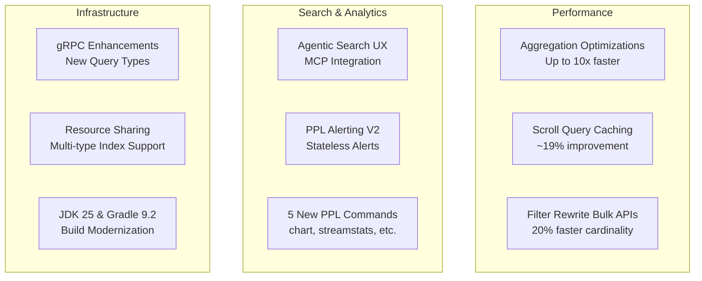

# OpenSearch v3.4.0 Release Summary

## Summary

OpenSearch 3.4.0 delivers significant performance improvements, expanded PPL capabilities, enhanced agentic search experiences, and new alerting functionality. This release focuses on query performance with up to 10x faster aggregations, introduces PPL-based alerting (V2), and brings a redesigned no-code agentic search UI with MCP integration. Key highlights include faster scroll queries, bulk collection APIs for aggregations, five new PPL commands, and SEISMIC nested field support for text chunking workflows.

## Highlights

## New Features

| Feature | Description | Report |
|---------|-------------|--------|
| PPL Alerting V2 | New alerting API with PPL query support, stateless alerts, per-result/result-set triggers | [Details](features/alerting/ppl-alerting.md) |
| Agentic Search UX | No-code agent builder with MCP server integration, conversational memory, pairwise comparison | [Details](features/dashboards-search-relevance/agentic-search.md) |
| PPL Commands (Calcite) | New `chart`, `streamstats`, `multisearch`, `replace`, `appendpipe` commands | [Details](features/sql/ppl-commands-calcite.md) |
| SEISMIC Nested Fields | Sparse ANN support for nested fields enabling text chunking search workflows | [Details](features/neural-search/seismic-nested-field.md) |
| Dashboards Explore | Histogram breakdowns, Field Statistics tab, trace flyout, correlations, cancel query | [Details](features/opensearch-dashboards/dashboards-explore.md) |
| Context-Aware Segments | Collocate related documents into same segments for improved query performance | [Details](features/opensearch/context-aware-segments.md) |
| k-NN Memory Optimized Warmup | Optimized warmup for memory-optimized search reducing cold start latency | [Details](features/k-nn/k-nn-memory-optimized-warmup.md) |

## Performance Improvements

| Area | Description | Report |
|------|-------------|--------|
| Aggregation Optimizations | Hybrid cardinality collector, filter rewrite + skip list (up to 10x), MergingDigest for percentiles (97% faster), matrix_stats (80% faster) | [Details](features/opensearch/aggregation-optimizations.md) |
| Filter Rewrite Bulk APIs | Bulk collection for sub-aggregations with up to 20% improvement for cardinality | [Details](features/opensearch/filter-rewrite-optimization.md) |
| Scroll Query Caching | Cache StoredFieldsReader per segment for ~19% improvement | [Details](features/opensearch/scroll-query-optimization.md) |
| PPL Query Optimization | 33 enhancements including sort pushdown, aggregation pushdown, distinct count approx | [Details](features/sql/ppl-query-optimization.md) |
| Terms Query Optimization | Pack terms once for keyword fields with index and docValues enabled | [Details](features/opensearch/terms-query-optimization.md) |

## Enhancements

| Area | Description | Report |
|------|-------------|--------|
| gRPC Transport | Pluggable interceptors, thread context preservation, CBOR/SMILE/YAML support, new query types | [Details](features/opensearch/grpc-transport.md) |
| Pull-based Ingestion | Offset-based lag metrics, periodic flush, message mappers, dynamic consumer config | [Details](features/opensearch/pull-based-ingestion-enhancements.md) |
| Resource Sharing | Multi-type index support, ResourceProvider interface refactoring, POST API support | [Details](features/security/resource-sharing.md) |
| Security Configuration | Dedicated config reloading thread, dynamic resource settings, X509v3 SAN authentication | [Details](features/security/security-configuration.md) |
| Flow Framework Access Control | Onboard flow-framework plugin to resource-sharing framework | [Details](features/flow-framework/flow-framework-access-control.md) |
| ISM Exclusion Pattern | Support exclusion patterns in index patterns for ISM policies | [Details](features/index-management/ism-exclusion-pattern.md) |
| Anomaly Detection | Auto-switch access control, suggest/validate transport actions, auto-create detectors | [Details](features/anomaly-detection/anomaly-detection-enhancements.md) |

## Bug Fixes

| Fix | Description | PR |
|-----|-------------|-----|
| Scroll Query Performance | Fix performance regression in versions >= 2.6.0 | [#20112](https://github.com/opensearch-project/OpenSearch/pull/20112) |
| Security Multi-tenancy | Fix `.kibana` system index updates with multi-tenancy enabled | [#5778](https://github.com/opensearch-project/security/pull/5778) |
| k-NN Score Calculation | Fix score to distance calculation for inner product in Faiss | [#2992](https://github.com/opensearch-project/k-NN/pull/2992) |
| PPL Memory Exhaustion | Fix memory exhaustion for multiple filtering operations | [#4841](https://github.com/opensearch-project/sql/pull/4841) |
| SEISMIC Disk Recovery | Fix disk free space recovery problem with Sparse ANN | [#1683](https://github.com/opensearch-project/neural-search/pull/1683) |
| Cross-Cluster Replication | Fix empty request body requirement in pause replication | [#1603](https://github.com/opensearch-project/cross-cluster-replication/pull/1603) |

## Infrastructure Updates

| Change | Description | Report |
|--------|-------------|--------|
| JDK 25 & Gradle 9.2 | Build tool upgrades across all plugins | [Details](features/multi-plugin/jdk-25-gradle-9.2-upgrades.md) |
| Maven Snapshots | Migrate snapshot publishing to S3-backed repository | [Details](features/opensearch/maven-snapshots-publishing.md) |
| Lucene 10.3.2 | Upgrade with MaxScoreBulkScorer bug fix | [Details](features/opensearch/lucene-upgrade.md) |
| Dependency Updates | 32 dependency updates including Netty 4.2.4 for HTTP/3 readiness | [Details](features/opensearch/dependency-updates-opensearch-core.md) |

## Breaking Changes

| Change | Migration | Report |
|--------|-----------|--------|
| ResourceProvider Interface | Update implementations from record to interface | [Details](features/security/resource-sharing.md) |
| System Indices Deprecation | `plugins.security.system_indices.indices` deprecated | [Details](features/security/security-features.md) |
| Stats Builder Pattern | 30+ Stats class constructors deprecated in favor of Builder pattern | [Details](features/opensearch/stats-builder-pattern-deprecations.md) |

## Dependencies

Notable dependency updates in this release:

- **Apache Lucene**: 10.3.1 → 10.3.2
- **Netty**: 4.2.4 (HTTP/3 readiness)
- **Gradle**: 9.2.0
- **JDK**: 25 (bundled)
- **Apache Calcite**: 1.41.0
- **Protobuf**: 0.24.0 (gRPC)
- **Logback**: 1.5.19/1.5.20

## References

- [Official Release Notes](https://github.com/opensearch-project/opensearch-build/blob/main/release-notes/opensearch-release-notes-3.4.0.md)
- [OpenSearch Core Release Notes](https://github.com/opensearch-project/OpenSearch/blob/main/release-notes/opensearch.release-notes-3.4.0.md)
- [OpenSearch Dashboards Release Notes](https://github.com/opensearch-project/OpenSearch-Dashboards/blob/main/release-notes/opensearch-dashboards.release-notes-3.4.0.md)
- [Feature Reports](features/)
