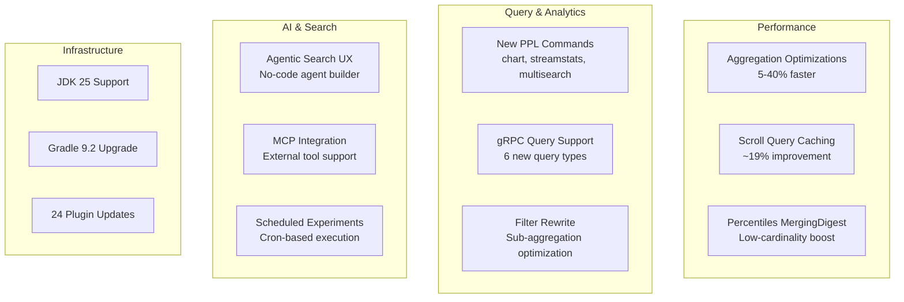

---
tags:
  - dashboards
  - ml
  - performance
  - search
  - sql
---

# OpenSearch v3.4.0 Release Summary

## Summary

OpenSearch 3.4.0 delivers significant performance improvements, expanded PPL functionality, and a redesigned agentic search experience. Key highlights include up to 40% faster aggregation workloads through Lucene's bulk collection API, ~19% improvement in scroll query performance, enhanced gRPC transport with expanded query support, and new PPL commands for data exploration. The release also introduces a no-code agentic search UI with MCP integration and comprehensive infrastructure upgrades to JDK 25 and Gradle 9.2 across all plugins.

## Highlights

## New Features

| Feature | Description | Report |
|---------|-------------|--------|
| PPL Alerting | V2 alerting API with PPL query support, stateless alerts, per-result and result-set trigger modes | [Details](features/alerting/ppl-alerting.md) |
| Agentic Search UX | No-code agent builder with MCP server support, conversational memory, and simplified configuration | [Details](features/dashboards-flow-framework/dashboards-agent-assistant.md) |
| Scheduled Experiments | Cron-based scheduling for recurring search relevance experiments with historical tracking | [Details](features/search-relevance/scheduled-experiments.md) |
| ISM Exclusion Pattern | Support exclusion patterns in ISM templates using `-` prefix for selective index management | [Details](features/index-management/ism-exclusion-pattern.md) |
| k-NN Memory Optimized Warmup | Optimized warmup procedure for memory-optimized search with page cache pre-loading | [Details](features/k-nn/k-nn-memory-optimized-warmup.md) |
| Query Version-Aware Settings | Dynamic feature detection based on cluster version for Query Insights Dashboards | [Details](features/query-insights-dashboards/query-version-aware-settings.md) |
| WLM Security Attributes | Security attribute extraction for WLM rule-based auto-tagging (username, roles) | [Details](features/security/wlm-security-attributes.md) |
| Anomaly Detection Daily Insights | AI-powered anomaly correlation with automated detector creation via ML agents | [Details](features/anomaly-detection-dashboards-plugin/anomaly-detection-daily-insights.md) |
| Remote Store CMK Support | Customer-managed key encryption/decryption with STS role assumption for cross-account access | [Details](features/opensearch-remote-metadata-sdk/remote-store-cmk-support.md) |
| Flow Framework Access Control | Integration with centralized Resource Sharing and Access Control framework | [Details](features/flow-framework/flow-framework-access-control.md) |

## Improvements

| Area | Description | Report |
|------|-------------|--------|
| Aggregation Performance | Hybrid cardinality collector, filter rewrite + skip list (up to 10x), MergingDigest for percentiles, matrix_stats 5x speedup | [Details](features/opensearch/aggregation-optimizations.md) |
| Scroll Query Performance | Cache StoredFieldsReader per segment for ~19% improvement | [Details](features/opensearch/scroll-query-optimization.md) |
| gRPC Transport | Support for ConstantScoreQuery, FuzzyQuery, MatchBoolPrefixQuery, MatchPhrasePrefix, PrefixQuery, MatchQuery; CBOR/SMILE/YAML formats | [Details](features/opensearch/grpc-transport.md) |
| PPL Commands | New chart, streamstats, multisearch, replace, appendpipe commands; bucket_nullable, usenull options | [Details](features/sql/ppl-commands-calcite.md) |
| PPL Functions | New mvindex, mvdedup, mvappend, tostring functions; per_second/minute/hour/day for timechart | [Details](features/sql/ppl-eval-functions.md) |
| PPL Query Optimization | 33 enhancements including sort pushdown, distinct count approx, case-to-range queries | [Details](features/sql/ppl-query-optimization.md) |
| Security Configuration | Dedicated config reloading thread, dynamic resource settings, X509v3 SAN authentication, securityadmin timeout | [Details](features/security/security-configuration.md) |
| Resource Sharing | Multi-type index support, ResourceProvider interface, Builder pattern, REST API improvements | [Details](features/security/resource-sharing.md) |
| Dashboards Explore | Histogram breakdowns, Field Statistics tab, trace flyout, correlations, cancel query | [Details](features/opensearch-dashboards/dashboards-explore.md) |
| Dashboards Chat | Global search integration, suggestion system, state persistence, session storage | [Details](features/opensearch-dashboards/dashboards-chat.md) |
| ML Commons | Sensitive parameter filtering, resource type support, increased batch task limits (max: 10,000) | [Details](features/ml-commons/ml-commons-enhancements.md) |
| k-NN Enhancements | Native SIMD scoring for FP16, VectorSearcherHolder memory optimization | [Details](features/k-nn/k-nn-enhancements.md) |
| SEISMIC Nested Field | Support nested field ingestion and query for text chunking workflows | [Details](features/neural-search/seismic-nested-field.md) |

## Bug Fixes

| Area | Description | PR |
|------|-------------|-----|
| SQL/PPL | 48 bug fixes including memory exhaustion, race conditions, rex nested capture groups | [Details](features/sql/sql-ppl-bugfixes.md) |
| Security | Multi-tenancy `.kibana` index fix, WildcardMatcher empty string handling, DLS/FLS internal request fix | [Details](features/security/security-bugfixes.md) |
| k-NN | Memory optimized search fixes, race condition in KNNQueryBuilder, Faiss inner product score calculation | [Details](features/k-nn/k-nn-bugfixes.md) |
| Query Bugfixes | Fix crashes in wildcard queries, aggregations, highlighters, script score queries | [Details](features/opensearch/query-bugfixes.md) |
| gRPC Transport | Fix ClassCastException for large requests, Bulk API fixes, node bootstrap with streaming transport | [Details](features/opensearch/grpc-transport-bugfixes.md) |
| Index Management | Fix ISM policy rebinding, SM deletion snapshot pattern parsing, rollup test race conditions | [Details](features/index-management/index-management-bugfixes.md) |
| ML Commons | Agent type update validation, QueryPlanningTool model ID parsing, agentic memory multi-node fixes | [Details](features/ml-commons/ml-commons-bugfixes.md) |
| Neural Search | SEISMIC IT failures, query handling without method_parameters, disk space recovery | [Details](features/neural-search/seismic-bugfixes.md) |
| Anomaly Detection | 3-AZ forecast results index creation, frequency-aware missing data detection | [Details](features/anomaly-detection/anomaly-detection-bugfixes.md) |
| Search Relevance | Hybrid optimizer floating-point precision, query serialization for LTR plugins | [Details](features/search-relevance/search-relevance-bugfixes.md) |

## Breaking Changes

| Change | Migration | Report |
|--------|-----------|--------|
| Stats Builder Pattern | 30+ Stats classes deprecated constructors in favor of Builder pattern | [Details](features/opensearch/stats-builder-pattern-deprecations.md) |
| System Indices Deprecation | `plugins.security.system_indices.indices` setting deprecated | [Details](features/security/security-features.md) |
| AccessController Migration | Migrate from `java.security.AccessController` to `org.opensearch.secure_sm.AccessController` | [Details](features/security/security-accesscontroller-migration.md) |

## Dependencies

Notable dependency updates in this release:

- **Lucene**: 10.3.1 → 10.3.2 (MaxScoreBulkScorer bug fix)
- **Gradle**: 9.2.0 across all plugins
- **JDK**: 25 support across all plugins
- **Netty**: 4.2.4 (HTTP/3 readiness)
- **Calcite**: 1.41.0 for SQL plugin
- **Security**: 28 dependency updates addressing CVE-2025-11226, CVE-2025-58457, CVE-2025-41249

See [Dependency Updates](features/multi-repo/dependency-updates.md) and [JDK 25 & Gradle 9.2 Upgrades](features/multi-plugin/jdk-25-gradle-9.2-upgrades.md) for details.

## References

- [Official Release Notes](https://github.com/opensearch-project/opensearch-build/blob/main/release-notes/opensearch-release-notes-3.4.0.md)
- [OpenSearch Core Release Notes](https://github.com/opensearch-project/OpenSearch/blob/main/release-notes/opensearch.release-notes-3.4.0.md)
- [OpenSearch Dashboards Release Notes](https://github.com/opensearch-project/OpenSearch-Dashboards/blob/main/release-notes/opensearch-dashboards.release-notes-3.4.0.md)
- [Feature Reports](features/)
