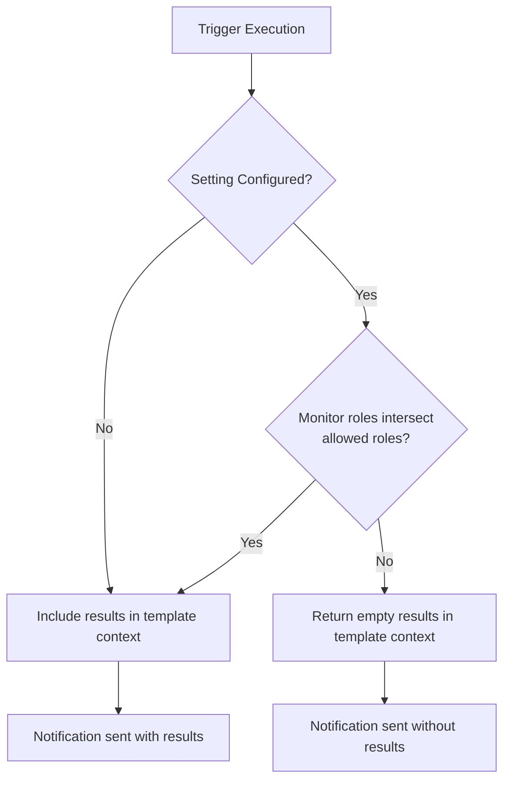

---
tags:
  - alerting
---
# Alerting Access Control

## Summary

OpenSearch v3.5.0 introduces role-based access control for trigger execution context results in the Alerting plugin. A new cluster setting `plugins.alerting.notification_context_results_allowed_roles` allows administrators to restrict which user roles can include query results in notification message templates, preventing potential exposure of sensitive data through alert notifications.

## Details

### What's New in v3.5.0

This release adds a security enhancement to control access to monitor results in notification templates. When configuring alerting actions, users can include `ctx.results` in message templates to interpolate query results that triggered the alert. While useful, this could expose sensitive data through unencrypted notifications like email.

### New Configuration Setting

| Setting | Description | Default |
|---------|-------------|---------|
| `plugins.alerting.notification_context_results_allowed_roles` | List of user roles allowed to include results in notification templates | `[]` (empty - all roles allowed) |

### Behavior



- **Setting not configured (default)**: Original behavior preserved - all monitors can include results in notification templates
- **Setting configured with roles**: Only monitors owned by users with at least one matching role can access results in templates
- **No role intersection**: The `results` field in the template context returns an empty list

### Technical Changes

The implementation modifies the `TriggerExecutionContext` class hierarchy:

| Class | Change |
|-------|--------|
| `TriggerExecutionContext` | Added `templateResults` property with role-based filtering logic |
| `QueryLevelTriggerExecutionContext` | Updated to pass `ClusterSettings` and use `templateResults` |
| `BucketLevelTriggerExecutionContext` | Updated to pass `ClusterSettings` and use `templateResults` |
| `DocumentLevelTriggerExecutionContext` | Updated to pass `ClusterSettings` and use `templateResults` |
| `AlertingSettings` | Added `NOTIFICATION_CONTEXT_RESULTS_ALLOWED_ROLES` setting |

### Usage Example

To restrict results access to only `admin` and `security_analyst` roles:

```json
PUT _cluster/settings
{
  "persistent": {
    "plugins.alerting.notification_context_results_allowed_roles": ["admin", "security_analyst"]
  }
}
```

With this setting, monitors created by users without these roles will have empty `results` in their notification templates, even if they use `{{ctx.results}}` in the message body.

## Limitations

- The setting applies cluster-wide and cannot be configured per-monitor
- Existing monitors are affected immediately when the setting is changed
- The setting only affects the `results` field in notification templates; other context fields remain accessible
- Document-level monitors always return empty results in templates (by design, as they don't populate results in the execution context)

## References

### Pull Requests

| PR | Description | Related Issue |
|----|-------------|---------------|
| [#1991](https://github.com/opensearch-project/alerting/pull/1991) | Access control for results in trigger execution context | [#1986](https://github.com/opensearch-project/alerting/issues/1986) |

### Related Issues

- [#1986](https://github.com/opensearch-project/alerting/issues/1986) - Feature request: Access control for using monitor results in email template
