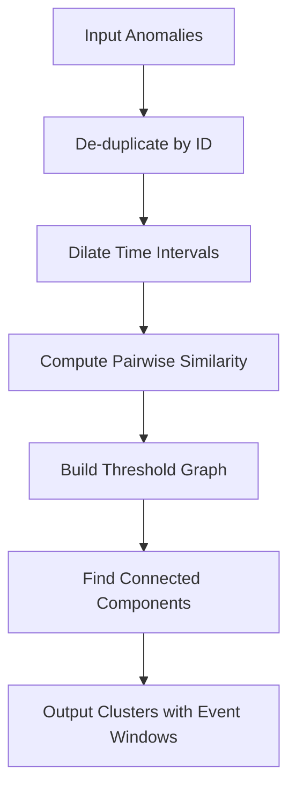

---
tags:
  - anomaly-detection
---
# Anomaly Detection Correlation

## Summary

OpenSearch v3.5.0 introduces a new anomaly correlation feature that clusters anomalies from multiple detectors based on temporal overlap similarity. This enables users to identify related anomalies that may indicate the same underlying incident, even when detected by different detectors with varying configurations.

## Details

### What's New in v3.5.0

The anomaly correlation feature uses a threshold-graph clustering algorithm based on temporal overlap similarity to group related anomalies.

### Algorithm Overview

### Similarity Computation

The algorithm computes similarity between anomaly pairs using:

1. **Temporal Overlap**: Measures how much time windows overlap after dilation
   - IoU (Jaccard over time) for general cases
   - Overlap coefficient for containment cases
   - Hybrid mode blends both for strong containment scenarios

2. **Duration Penalty**: Discourages linking anomalies with very different durations using exponential decay

3. **Backward Dilation**: Extends start times for coarse detectors (≥30 min intervals) with community aggregations to account for detection lag

### Key Parameters

| Parameter | Default | Description |
|-----------|---------|-------------|
| `delta` | 5 min | Time tolerance for interval dilation |
| `alpha` | 0.30 | Minimum similarity threshold |
| `kappa` | 30 min | Duration penalty scale |
| `minOverlap` | 3 min | Minimum overlap required |
| `temporalMode` | HYBRID | IOU, OVL, or HYBRID |

### Output Structure

Each cluster contains:
- List of correlated anomalies
- Event window spanning `[min(start), max(end)]` across members

### Bug Fixes

This release also includes:
- **Test Infrastructure Fix**: Serialized `integTestRemote` on remote clusters to avoid index wipe races during parallel test execution
- **Security Dependency Updates**: Bumped lodash and lodash-es from 4.17.21 to 4.17.23 to address prototype pollution vulnerability

## Limitations

- Correlation is computed in-memory; large anomaly sets may impact performance
- Requires detector configurations to be available for interval-aware dilation
- Single-element clusters are included by default but can be filtered

## References

### Pull Requests

| PR | Description | Repository |
|----|-------------|------------|
| [#1641](https://github.com/opensearch-project/anomaly-detection/pull/1641) | Correlating Anomalies via Temporal Overlap Similarity | anomaly-detection |
| [#1654](https://github.com/opensearch-project/anomaly-detection/pull/1654) | Serialize integTestRemote on remote clusters to avoid index wipe races | anomaly-detection |
| [#1135](https://github.com/opensearch-project/anomaly-detection-dashboards-plugin/pull/1135) | Bump lodash from 4.17.21 to 4.17.23 | anomaly-detection-dashboards-plugin |
| [#1134](https://github.com/opensearch-project/anomaly-detection-dashboards-plugin/pull/1134) | Bump lodash-es from 4.17.21 to 4.17.23 | anomaly-detection-dashboards-plugin |
