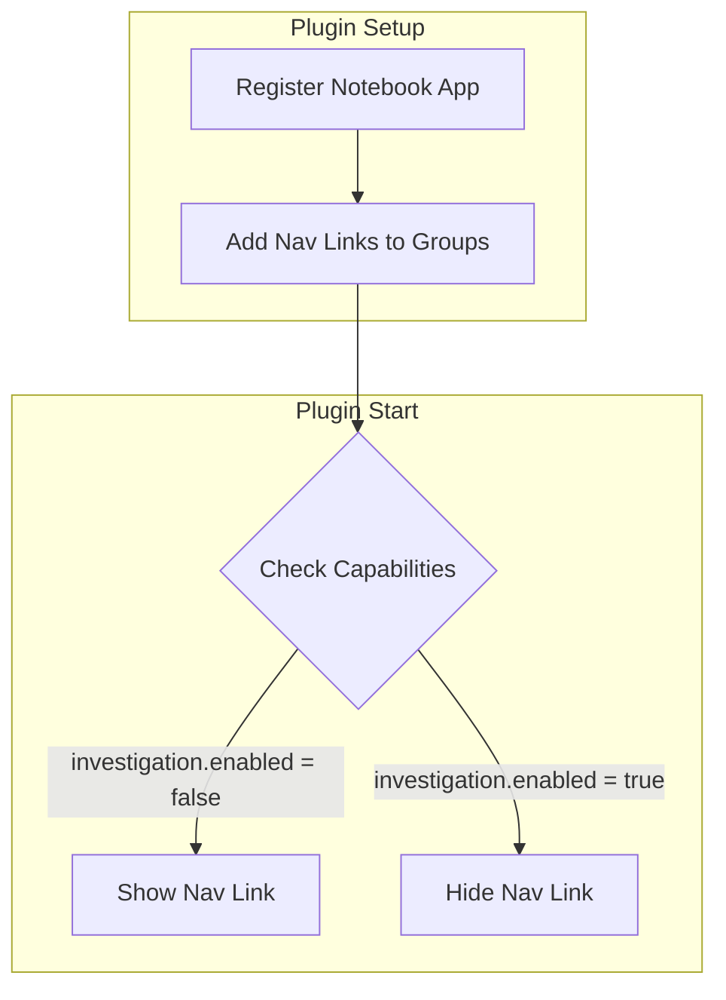

---
tags:
  - dashboards-observability
---
# Observability Notebooks

## Summary

In v3.5.0, the Observability Notebooks feature introduces capability-based visibility control. The Notebook navigation entry can now be dynamically shown or hidden based on the `investigation` capability, enabling better integration with the Investigation plugin and supporting the ongoing migration of Notebooks to OpenSearch Dashboards core.

## Details

### What's New in v3.5.0

The primary change is the introduction of capability-based visibility for the Notebooks navigation entry:

- **Dynamic Configuration**: Instead of checking for the presence of the `investigationDashboards` plugin at setup time, the visibility is now controlled at runtime using OpenSearch Dashboards capabilities
- **Investigation Integration**: When `capabilities.investigation.enabled` is `true`, the Notebook navigation link is automatically hidden to avoid duplication with the Investigation plugin's notebook functionality
- **Backward Compatibility**: The Notebook application is always registered; only the navigation visibility changes based on capabilities

### Technical Changes

The implementation uses `BehaviorSubject` and `AppUpdater` to dynamically update the application's navigation status:

```typescript
// Application registration with updater$
core.application.register({
  id: observabilityNotebookID,
  title: observabilityNotebookTitle,
  category: OBSERVABILITY_APP_CATEGORIES.observability,
  order: observabilityNotebookPluginOrder,
  mount: appMountWithStartPage('notebooks'),
  updater$: this.appUpdater$,
});

// Runtime visibility control based on capabilities
if (core.application.capabilities.investigation?.enabled) {
  this.appUpdater$.next(() => ({
    navLinkStatus: AppNavLinkStatus.hidden,
  }));
}
```

### Architecture



### Benefits

| Aspect | Before | After |
|--------|--------|-------|
| Visibility Control | Static plugin dependency check | Dynamic capability-based |
| Configuration | Requires plugin presence | Configurable via capabilities |
| Integration | Hard dependency on investigationDashboards | Flexible integration |

## Limitations

- The capability check occurs at plugin start time; changes to capabilities require a page refresh
- The Notebook application is still registered even when hidden, consuming minimal resources

## References

### Pull Requests
| PR | Description | Related Issue |
|----|-------------|---------------|
| [#2512](https://github.com/opensearch-project/dashboards-observability/pull/2512) | Use capabilities to show notebook | - |

### Issues (Design / RFC)
- [Issue #2442](https://github.com/opensearch-project/dashboards-observability/issues/2442): RFC for moving Notebook from Observability to OpenSearch Dashboards Core
