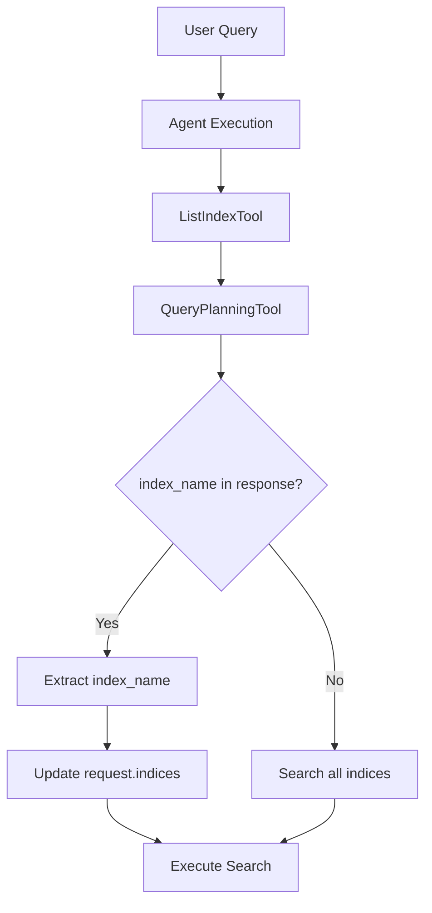

---
tags:
  - dashboards-search-relevance
---
# Agentic Search

## Summary

This release enhances the Agentic Search experience with UI/UX improvements in Search Relevance Workbench and intelligent index selection in the neural-search plugin.

## Details

### What's New in v3.5.0

#### UI/UX Enhancements (dashboards-search-relevance)

1. **Loading State Indicator**: Added a spinner with "Searching..." text during agent search execution, providing visual feedback while the LLM processes queries.

2. **Documentation Link**: Added a link to the [Agentic Search Documentation](https://docs.opensearch.org/latest/vector-search/ai-search/agentic-search/index/) in the single pairwise comparison helper flyout.

3. **Styling Improvements**:
   - "Continue conversation" link aligned with other content
   - AgentInfo panels alignment improved
   - "Continue conversation" icon changed to chat icon (`editorComment`)
   - Simplified button styling using `EuiLink` instead of `EuiButtonEmpty`

#### Intelligent Index Selection (neural-search)

The agent can now automatically select the appropriate index based on the `ListIndexTool` response:

1. **Index Extraction**: When the `QueryPlanningTool` is invoked, the system extracts the `index_name` parameter from the tool call arguments.

2. **Automatic Index Targeting**: If an index is returned from the tool, the search request is automatically updated to target that specific index instead of searching all indices.

3. **Multi-LLM Support**: Index extraction works with both Claude (Bedrock) and OpenAI response formats.

### Technical Changes

#### AgentExecutionDTO Enhancement

```java
public class AgentExecutionDTO {
    private final String dslQuery;
    private final String agentStepsSummary;
    private final String memoryId;
    private final String selectedIndex;  // New field
}
```

#### Index Selection Flow



#### Claude Response Parsing

The system parses Claude's `toolUse` content to extract the index name:

```json
{
  "output": {
    "message": {
      "content": [
        {"text": "I'll search the products index."},
        {
          "toolUse": {
            "name": "QueryPlanningTool",
            "input": {
              "question": "Find products",
              "index_name": "products-index"
            }
          }
        }
      ]
    }
  }
}
```

#### OpenAI Response Parsing

For OpenAI format, the system parses the `tool_calls` array:

```json
{
  "choices": [{
    "message": {
      "content": "I'll search for products.",
      "tool_calls": [{
        "function": {
          "name": "QueryPlanningTool",
          "arguments": "{\"question\":\"Find products\",\"index_name\":\"products-index\"}"
        }
      }]
    }
  }]
}
```

## Limitations

- Index selection only works when `QueryPlanningTool` explicitly returns an `index_name` parameter
- The feature requires a conversational agent type for index extraction

## References

### Pull Requests
| PR | Description | Repository |
|----|-------------|------------|
| [#728](https://github.com/opensearch-project/dashboards-search-relevance/pull/728) | Add agentic search UI/UX enhancements | dashboards-search-relevance |
| [#1713](https://github.com/opensearch-project/neural-search/pull/1713) | Select explicit index for Agentic Query if returned from ListIndexTool | neural-search |

### Related PRs
| PR | Description |
|----|-------------|
| [#693](https://github.com/opensearch-project/dashboards-search-relevance/pull/693) | Add support for agent search in pairwise comparison |
