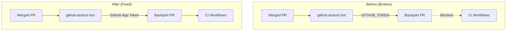

---
tags:
  - dashboards-search-relevance
---
# Dashboards CI/CD

## Summary

Fixed CI workflows for automated backport PRs in the dashboards-search-relevance plugin. Backport PRs created by the github-actions bot were not triggering CI workflows due to GitHub's security policy preventing GITHUB_TOKEN from triggering workflows.

## Details

### What's New in v3.5.0

The backport workflow was updated to use GitHub App tokens instead of GITHUB_TOKEN to enable CI workflows for automated backport PRs.

### Technical Changes

| Change | Before | After |
|--------|--------|-------|
| Token Type | `GITHUB_TOKEN` | GitHub App Token |
| Backport Action | `VachaShah/backport@v2` | `VachaShah/backport@v2.2.0` |
| Token Generation | N/A | `tibdex/github-app-token@v2.1.0` |
| Branch Template | Default | `backport/backport-<%= number %>-to-<%= base %>` |

### Root Cause

GitHub's security policy prevents `GITHUB_TOKEN` from triggering workflows when used to create PRs. This is documented behavior to prevent recursive workflow runs.

### Solution

The `backport.yml` workflow was updated to:
1. Generate a GitHub App token using `tibdex/github-app-token@v2.1.0`
2. Use the App token for the backport action instead of `GITHUB_TOKEN`
3. Add explicit permissions for `contents: write` and `pull-requests: write`

## Limitations

- Requires GitHub App configuration with `APP_ID` and `APP_PRIVATE_KEY` secrets
- Installation ID must be configured for the repository

## References

### Pull Requests
| PR | Description | Related Issue |
|----|-------------|---------------|
| [#720](https://github.com/opensearch-project/dashboards-search-relevance/pull/720) | Enable CI workflows for automated backport PRs | N/A |

### External References
- [GitHub Actions: Automatic Token Authentication](https://docs.github.com/en/actions/security-guides/automatic-token-authentication)
- [Similar Issue in Karpenter](https://github.com/aws/karpenter-provider-aws/issues/4525)
