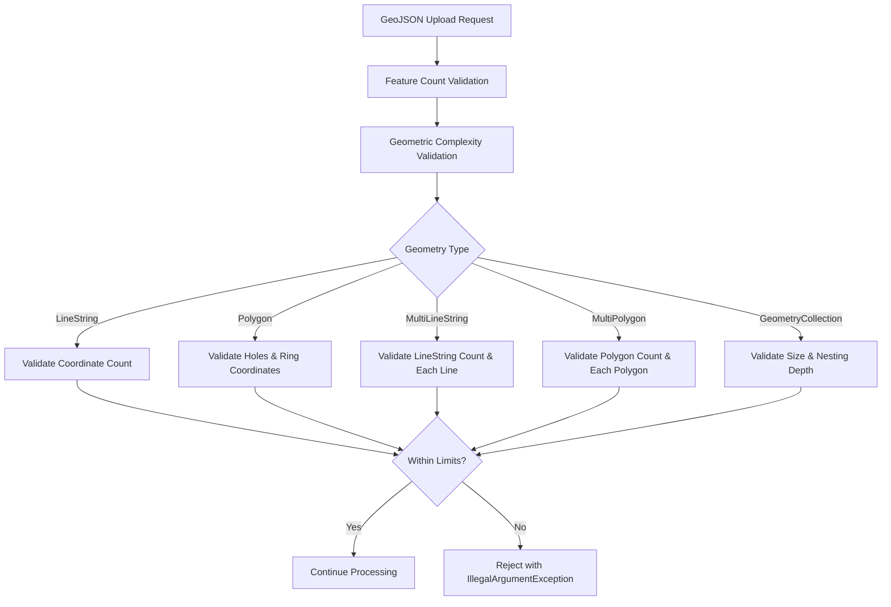

---
tags:
  - geospatial
---
# Geospatial Validation

## Summary

OpenSearch v3.5.0 introduces geometric complexity validation for the GeoJSON upload API (`POST /_plugins/geospatial/geojson/_upload`). This feature prevents Out-of-Memory (OOM) errors and node crashes caused by uploading overly complex geometries such as polygons with millions of coordinates or excessive holes.

## Details

### What's New in v3.5.0

The geospatial plugin now validates geometric complexity during GeoJSON upload to ensure system stability. Four new cluster settings control the validation limits:

| Setting | Description | Default |
|---------|-------------|---------|
| `plugins.geospatial.geojson.max_coordinates_per_geo` | Maximum coordinates per geometry (LineString, Polygon rings) | 10,000 |
| `plugins.geospatial.geojson.max_holes_per_polygon` | Maximum holes allowed in a Polygon | 1,000 |
| `plugins.geospatial.geojson.max_multi_gemoetries` | Maximum geometries in MultiLineString, MultiPolygon, or GeometryCollection | 100 |
| `plugins.geospatial.geojson.max_geometry_collection_nested_depth` | Maximum nesting depth for GeometryCollections | 5 |

### Technical Changes

The validation is implemented in `UploadGeoJSONRequestContent.java` using an iterative queue-based approach to avoid stack overflow on deeply nested structures:

Key implementation details:
- Settings are dynamically configurable at runtime via cluster settings API
- Validation uses `GeospatialSettingsAccessor` to access current limit values
- All geometry types are validated: LineString, Polygon, MultiLineString, MultiPolygon, GeometryCollection
- Nested GeometryCollections are processed iteratively with depth tracking

### Validated Geometry Types

| Geometry Type | Validation |
|---------------|------------|
| LineString | Coordinate count ≤ `max_coordinates_per_geo` |
| Polygon | Holes ≤ `max_holes_per_polygon`, each ring ≤ `max_coordinates_per_geo` |
| MultiLineString | LineString count ≤ `max_multi_gemoetries`, each line validated |
| MultiPolygon | Polygon count ≤ `max_multi_gemoetries`, each polygon validated |
| GeometryCollection | Geometry count ≤ `max_multi_gemoetries`, nesting depth ≤ `max_geometry_collection_nested_depth` |

## Limitations

- Validation only applies to the GeoJSON upload API endpoint
- Settings are node-scoped but dynamically updatable
- Point and MultiPoint geometries are not validated (no complexity concerns)

## References

### Pull Requests

| PR | Description | Related Issue |
|----|-------------|---------------|
| [#829](https://github.com/opensearch-project/geospatial/pull/829) | Add coordinate limit validation for lines, polygons, and holes | [#828](https://github.com/opensearch-project/geospatial/issues/828) |

### Issues

| Issue | Description |
|-------|-------------|
| [#828](https://github.com/opensearch-project/geospatial/issues/828) | Enforces geometric complexity limits to ensure system stability |
