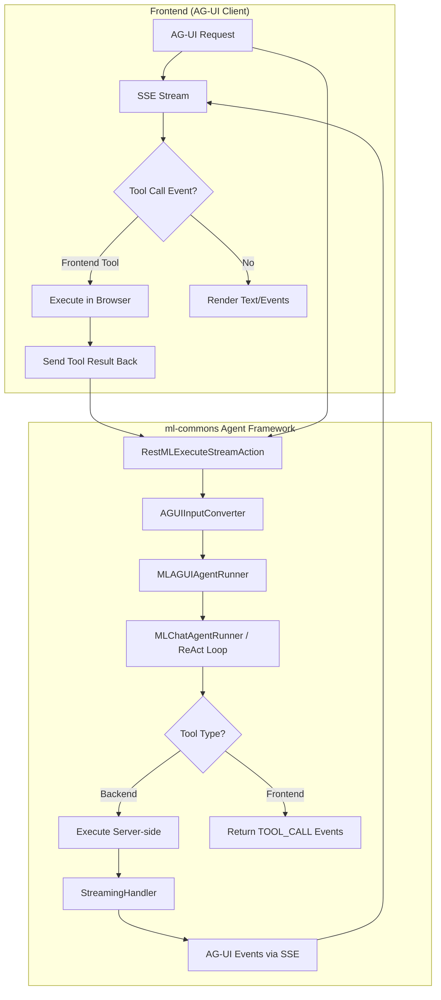

---
tags:
  - ml-commons
---

# AG-UI (Agent-User Interaction) Protocol Support

## Summary

OpenSearch v3.5.0 introduces AG-UI (Agent-User Interaction) protocol support in the ml-commons Agent Framework. AG-UI is an open, lightweight, event-based protocol that standardizes how AI agents connect to user-facing frontend applications. This implementation adds a new `AG_UI` agent type that enables real-time streaming interactions between OpenSearch agents and any AG-UI compatible frontend, including OpenSearch Dashboards' new chat interface.

## Key Changes

### New AG_UI Agent Type
- New `MLAGUIAgentRunner` class that processes AG-UI protocol requests and delegates to the existing `MLChatAgentRunner` for execution
- Agent registration with `"type": "AG_UI"` to create AG-UI compatible agents
- Feature flag `plugins.ml_commons.ag_ui_enabled` to control availability

### AG-UI Protocol Input Format
- Accepts AG-UI standard request format with `threadId`, `runId`, `messages[]`, `tools[]`, `context[]`, `state`, and `forwardedProps`
- `AGUIInputConverter` automatically detects and converts AG-UI requests to ml-commons `AgentMLInput` format
- Supports message roles: `user`, `assistant`, and `tool` (for frontend tool results)

### Server-Sent Events (SSE) Streaming Output
- Streaming via `/_plugins/_ml/agents/{agent_id}/_execute/stream` endpoint
- AG-UI event types emitted during streaming:
  - Run lifecycle: `RUN_STARTED`, `RUN_FINISHED`, `RUN_ERROR`
  - Text streaming: `TEXT_MESSAGE_START`, `TEXT_MESSAGE_CONTENT`, `TEXT_MESSAGE_END`
  - Tool calls: `TOOL_CALL_START`, `TOOL_CALL_ARGS`, `TOOL_CALL_END`, `TOOL_CALL_RESULT`
  - State: `MESSAGES_SNAPSHOT` (reserved for memory integration)

### Hybrid Tool Execution Model
- Backend tools (e.g., `ListIndexTool`, `SearchIndexTool`) execute server-side within the ReAct loop
- Frontend tools (defined in the request `tools[]` array) are delegated back to the client via `TOOL_CALL_*` events
- The frontend executes the tool and sends results back in a follow-up request with `tool` role messages
- LLM sees both backend and frontend tools in a unified view, enabling seamless multi-tool reasoning

### Tool Message Support in Agent Revamp
- Support for `tool` role messages in the unified agent interface for both Bedrock and OpenAI model providers
- Tool message processing logic moved from AG-UI agent to the agent revamp layer for reuse
- Image support in streaming responses

### Multi-LLM Provider Support
- `_llm_interface` parameter supports `bedrock/converse/claude` and OpenAI-compatible APIs
- `FunctionCalling` interface handles provider-specific tool call formatting
- `BedrockStreamingHandler` and `HttpStreamingHandler` generate AG-UI events from respective provider streams

## Configuration

### Enable AG-UI
```json
POST /_cluster/settings
{
    "persistent": {
        "plugins.ml_commons.stream_enabled": true,
        "plugins.ml_commons.ag_ui_enabled": true
    }
}
```

### Register AG-UI Agent
```json
POST /_plugins/_ml/agents/_register
{
    "name": "AG-UI chat agent",
    "type": "AG_UI",
    "llm": {
        "model_id": "{{model_id}}",
        "parameters": {
            "max_iteration": 50,
            "system_prompt": "You are a helpful assistant.",
            "prompt": "Context:${parameters.context}\nQuestion:${parameters.question}"
        }
    },
    "memory": { "type": "conversation_index" },
    "parameters": { "_llm_interface": "bedrock/converse/claude" },
    "tools": [{ "type": "ListIndexTool", "name": "ListIndexTool" }]
}
```

### Execute with Streaming
```json
POST /_plugins/_ml/agents/{{agent_id}}/_execute/stream
{
    "threadId": "thread-123",
    "runId": "run-456",
    "messages": [
        { "id": "msg-1", "role": "user", "content": "list my indices" }
    ],
    "tools": [],
    "context": [],
    "state": {},
    "forwardedProps": {}
}
```

## Architecture



## Limitations

- AG-UI agent requires `plugins.ml_commons.ag_ui_enabled` feature flag to be explicitly enabled
- Conversational agents registered via the new unified interface do not yet work with `/_execute/stream` (only AG-UI agents support streaming with the unified format)
- The `MLAGUIAgentRunner` previously hard-coded to include only the latest tool result; multi-tool support improvements are tracked in Issue #4548
- System role messages were initially ignored in AG-UI agent execution; fix tracked in Issue #4548

## References

- PR: https://github.com/opensearch-project/ml-commons/pull/4549 (AG-UI support in Agent Framework, merged v3.5.0)
- PR: https://github.com/opensearch-project/ml-commons/pull/4347 (Initial AG-UI support, merged to feature branch)
- PR: https://github.com/opensearch-project/ml-commons/pull/4596 (Tool messages in agent revamp)
- RFC: https://github.com/opensearch-project/ml-commons/issues/4409 (AG-UI Support in Agent Framework)
- Issue: https://github.com/opensearch-project/ml-commons/issues/4211 (Feature request)
- Issue: https://github.com/opensearch-project/ml-commons/issues/4548 (Improve AG-UI Agent Features)
- Issue: https://github.com/opensearch-project/ml-commons/issues/4604 (Unified interface + agent execute stream)
- RFC: https://github.com/opensearch-project/ml-commons/issues/4552 (Simplify agent creation and standardize agent input)
- AG-UI Protocol: https://github.com/ag-ui-protocol/ag-ui
- Docs Issue: https://github.com/opensearch-project/documentation-website/issues/11799
