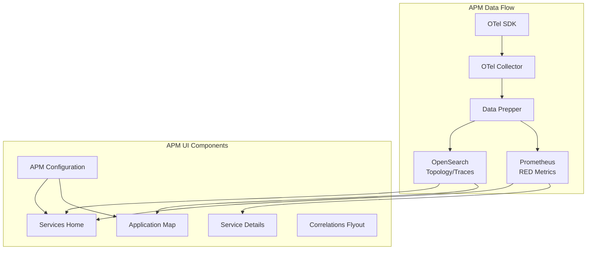

---
tags:
  - observability
---
# APM (Application Performance Monitoring)

## Summary

OpenSearch v3.5.0 introduces Application Performance Monitoring (APM) capabilities to the Observability plugin, providing comprehensive service monitoring with RED metrics (Rate, Errors, Duration), interactive service topology visualization, and detailed service-level analytics.

## Details

### What's New in v3.5.0

APM is a new feature that enables users to monitor distributed systems through:

- **Services Landing Page**: Interactive table displaying all services with metrics including latency (P95), throughput, failure ratio, and sparkline visualizations
- **Application Map**: Interactive topology visualization showing service dependencies using CelestialMap library with group-by functionality
- **Service Details Pages**: Comprehensive drill-down views with Overview, Operations, and Dependencies tabs
- **Correlations Flyout**: Quick view of correlated spans and associated logs with filtering capabilities

### Architecture

### Components

| Component | Description |
|-----------|-------------|
| APM Configuration Page | Stores trace dataset, service map dataset, and Prometheus saved object |
| APM Context Provider | Provides resolved configuration to all APM pages |
| Services Home Page | Landing page with services table, filters, and fault rate widgets |
| Application Map Page | Interactive service topology visualization with CelestialMap |
| Service Details Page | Detailed metrics with Overview, Operations, Dependencies tabs |
| Correlations Flyout | View correlated spans and logs with filtering |

### New Hooks

| Hook | Purpose |
|------|---------|
| `useServiceMap` | Fetches service topology from OpenSearch |
| `useServiceMapMetrics` | Batch fetches RED metrics for all services |
| `useEdgeMetrics` | Fetches metrics for service dependencies |
| `useOperations` | Fetches service operations with call counts |
| `useDependencies` | Fetches service dependencies with grouping |
| `useOperationMetrics` | Fetches RED metrics per operation |
| `useDependencyMetrics` | Fetches RED metrics per dependency |
| `usePromQLChartData` | Transforms PromQL responses for time-series charts |
| `useCorrelatedLogsByTrace` | Fetches logs correlated via traceIds |

### Query Services

- **PPL Search Service**: Queries OpenSearch span/service data for topology and operations
- **PromQL Search Service**: Queries Prometheus for RED metrics (latency, throughput, error rate)

### Visibility Control

APM visibility is controlled by the `explore.discoverTracesEnabled` capability:

| UI Setting | Traces Capability | Result |
|------------|-------------------|--------|
| Enabled | Enabled | APM visible, Trace Analytics hidden |
| Enabled | Disabled | APM hidden, Trace Analytics visible |
| Disabled | Any | Trace Analytics visible (fallback) |

## Limitations

- Requires both OpenSearch and Prometheus backends configured
- Service map visualization depends on CelestialMap library
- Metrics accuracy depends on proper OpenTelemetry instrumentation

## References

### Pull Requests

| PR | Description | Related Issue |
|----|-------------|---------------|
| [#2556](https://github.com/opensearch-project/dashboards-observability/pull/2556) | Add APM Configuration page and server components | [#2545](https://github.com/opensearch-project/dashboards-observability/issues/2545) |
| [#2557](https://github.com/opensearch-project/dashboards-observability/pull/2557) | Add APM config and context provider | [#2545](https://github.com/opensearch-project/dashboards-observability/issues/2545) |
| [#2558](https://github.com/opensearch-project/dashboards-observability/pull/2558) | Add Services landing page | [#2545](https://github.com/opensearch-project/dashboards-observability/issues/2545) |
| [#2561](https://github.com/opensearch-project/dashboards-observability/pull/2561) | Add support for correlations flyout in services pages | [#2545](https://github.com/opensearch-project/dashboards-observability/issues/2545) |
| [#2565](https://github.com/opensearch-project/dashboards-observability/pull/2565) | Add hooks and utility functions for service details | [#2545](https://github.com/opensearch-project/dashboards-observability/issues/2545) |
| [#2566](https://github.com/opensearch-project/dashboards-observability/pull/2566) | Add service details pages for APM | [#2545](https://github.com/opensearch-project/dashboards-observability/issues/2545) |
| [#2574](https://github.com/opensearch-project/dashboards-observability/pull/2574) | Add Application Map page for APM with topology visualization | [#2545](https://github.com/opensearch-project/dashboards-observability/issues/2545) |

### Related Issues

- [#2545](https://github.com/opensearch-project/dashboards-observability/issues/2545) - [RFC] OpenSearch Application Performance Monitoring
