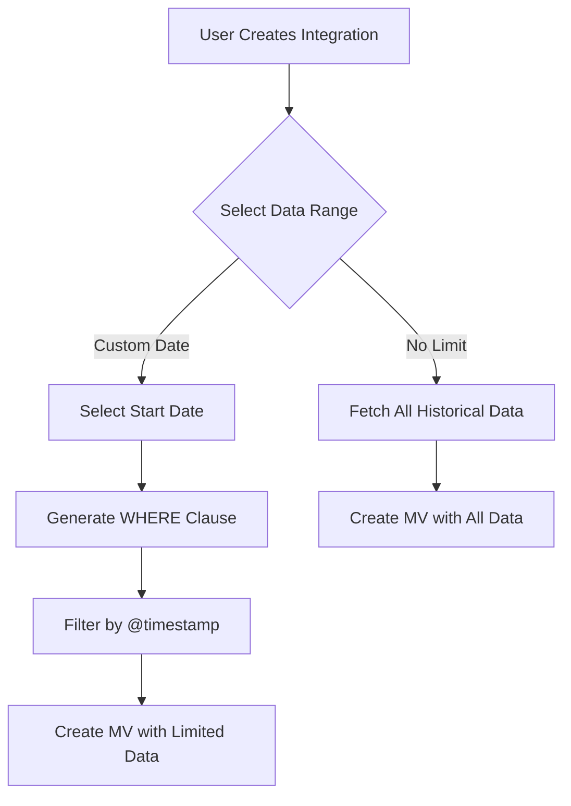

---
tags:
  - observability
---
# Observability Integration

## Summary

OpenSearch v3.5.0 introduces the Initial Data Range feature for Integrations, allowing users to control the time window for initial data loading when creating materialized views (MVs). This enhancement provides flexibility to limit data fetching during integration setup, improving performance and resource utilization.

## Details

### What's New in v3.5.0

#### Initial Data Range for MV Creation

The integration creation flow now includes a date picker UI component that allows users to specify the initial data range for materialized view creation:

- **No Limit Mode**: Fetches all historical data from the beginning (original behavior)
- **Custom Date Mode**: Users can select a past date to limit the initial data fetch range

#### Technical Implementation

The feature introduces a universal timestamp filter strategy that works across all integration types:

| Component | Description |
|-----------|-------------|
| `refreshRangeDays` | Configuration parameter for days to look back (0 = no limit) |
| `generateTimestampFilter()` | Generates SQL WHERE clause for `@timestamp` filtering |
| `{refresh_range_filter}` | Template placeholder replaced in MV creation queries |

The timestamp filter uses the standardized `@timestamp` field that all MV SQL files transform to, ensuring consistent filtering regardless of the source data format.

#### UI Changes

The integration setup form now includes:
- A toggle switch for "Load all data (no time limit)"
- A date picker (when custom range is selected) to choose the start date
- Default value of 7 days for new integrations

### Additional Enhancements

#### Correlation Object Updates (PR #2570)

- Added echarts dependency (^6.0.0) to the observability plugin
- Updated correlations object type check
- Changed default UI setting to true

#### Test Utilities Improvements (PR #11138)

- Switched workspace, dataset, and datasource creation to use APIs instead of UI interactions
- Navigation now uses URLs instead of UI navigation
- Removed usage of `cy.reload()` to reduce test flakiness in authenticated environments

## Limitations

- The timestamp filter relies on the `@timestamp` field being present in the MV schema
- Custom date selection is limited to past dates only (cannot select future dates)
- The feature is only available for S3-based integrations that use materialized views

## References

### Pull Requests
| PR | Repository | Description | Related Issue |
|----|------------|-------------|---------------|
| [#2546](https://github.com/opensearch-project/dashboards-observability/pull/2546) | dashboards-observability | Implement 1st MV Refresh Window For Integration | [#2506](https://github.com/opensearch-project/dashboards-observability/issues/2506) |
| [#2570](https://github.com/opensearch-project/dashboards-observability/pull/2570) | dashboards-observability | Update correlation object client, settings check | [#2545](https://github.com/opensearch-project/dashboards-observability/issues/2545) |
| [#11226](https://github.com/opensearch-project/OpenSearch-Dashboards/pull/11226) | OpenSearch-Dashboards | Implement 1st MV Refresh Window For Integration Creation | [#11227](https://github.com/opensearch-project/OpenSearch-Dashboards/issues/11227) |
| [#11138](https://github.com/opensearch-project/OpenSearch-Dashboards/pull/11138) | OpenSearch-Dashboards | Improve the Integration Utils | - |
