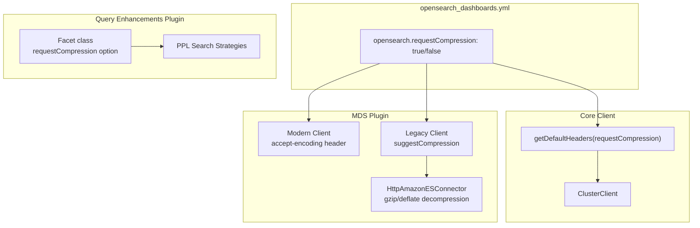

---
tags:
  - opensearch-dashboards
---
# Dashboards gzip Support

## Summary

OpenSearch Dashboards v3.5.0 adds optional gzip/deflate HTTP response compression for communication between Dashboards and OpenSearch clusters. This reduces response payload sizes by up to 98% and can improve end-to-end query latency by up to 81%, particularly for large result sets in Discover/Explore workloads. The feature is controlled by a new `opensearch.requestCompression` configuration flag, which defaults to `false`.

## Details

### What's New in v3.5.0

#### Core Compression Support (PR #11135)

The initial implementation added `accept-encoding: gzip, deflate` to the `DEFAULT_HEADERS` in `src/core/server/opensearch/default_headers.ts`, enabling compression by default for all OpenSearch requests from Dashboards. This applied to:

- The default OpenSearch client (core server)
- The Multi-Data Source (MDS) modern client (`data_source/server/client/client_config.ts`)
- The MDS legacy client (`data_source/server/legacy/client_config.ts`) via `suggestCompression: true`

#### IAM Sigv4 Decompression Fix (PR #11158)

The `HttpAmazonESConnector` used for IAM Sigv4 authentication in MDS did not handle compressed responses, causing garbled data. This fix updated `streamToString()` in `connector.js` to detect `content-encoding` headers and decompress gzip/deflate responses using Node.js `zlib` (`createGunzip`, `createInflate`).

#### Feature Flag Introduction (PR #11205)

After discovering that some internal clients (e.g., ml-commons chat client) did not support gzip responses, compression was moved behind a configurable flag:

| Setting | Description | Default |
|---------|-------------|---------|
| `opensearch.requestCompression` | Request compressed responses from OpenSearch | `false` |

The `DEFAULT_HEADERS` no longer includes `accept-encoding` by default. Instead, a new `getDefaultHeaders(requestCompression)` function conditionally adds the header. The flag is propagated through:

- `OpenSearchConfig` → core client config
- `SharedGlobalConfigKeys` → plugin initializer context
- `DataSourcePluginConfigType` → MDS client configs

Configuration in `opensearch_dashboards.yml`:

```yaml
# Request compressed responses from OpenSearch
opensearch.requestCompression: true
```

#### PPL Query Compression (PR #11240)

Added independent gzip compression support for PPL queries in the `query_enhancements` plugin. The `Facet` class gained a `requestCompression` option that adds `accept-encoding: gzip, deflate` headers to individual requests. This is enabled for PPL search strategies only:

- `ppl_search_strategy.ts`
- `ppl_async_search_strategy.ts`
- `ppl_raw_search_strategy.ts`

SQL queries and other plugins are not affected.

### Technical Changes



### Performance Impact

Benchmarked with 40,000 documents (~54 MB, 100+ fields, 10,000 row result set):

| Metric | Before | After | Improvement |
|--------|--------|-------|-------------|
| End-to-End Query Time | 9,625 ms | 1,835 ms | -81% |
| Response Payload Size | 15.8 MB | 355 KB | -98% |

## Limitations

- Compression is disabled by default (`opensearch.requestCompression: false`) to avoid compatibility issues with clients that do not handle compressed responses
- PPL query compression via the `Facet` class operates independently from the global flag
- SQL queries in the `query_enhancements` plugin do not have compression enabled
- Custom plugins making direct OpenSearch calls may need their own compression handling

## References

### Pull Requests
| PR | Description | Related Issue |
|----|-------------|---------------|
| [#11135](https://github.com/opensearch-project/OpenSearch-Dashboards/pull/11135) | Support gzip for OpenSearch responses | [#11130](https://github.com/opensearch-project/OpenSearch-Dashboards/issues/11130) |
| [#11158](https://github.com/opensearch-project/OpenSearch-Dashboards/pull/11158) | Fix decompression in HttpAmazonESConnector | [#11135](https://github.com/opensearch-project/OpenSearch-Dashboards/pull/11135) |
| [#11205](https://github.com/opensearch-project/OpenSearch-Dashboards/pull/11205) | Add opensearch.requestCompression flag | [#11158](https://github.com/opensearch-project/OpenSearch-Dashboards/pull/11158) |
| [#11240](https://github.com/opensearch-project/OpenSearch-Dashboards/pull/11240) | Add gzip compression for PPL queries | [#11130](https://github.com/opensearch-project/OpenSearch-Dashboards/issues/11130) |

### Issues
- [#11130](https://github.com/opensearch-project/OpenSearch-Dashboards/issues/11130) - [RFC] Enable HTTP Response Compression for OpenSearch Clients in Dashboards
