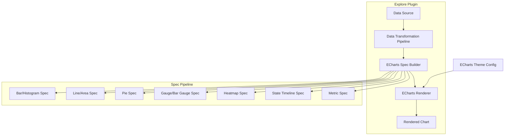

---
tags:
  - opensearch-dashboards
---
# ECharts Migration

## Summary

OpenSearch Dashboards v3.5.0 completes a comprehensive migration of the Explore (Discover) visualization layer from Vega-Lite to Apache ECharts. This effort spans 17 PRs covering 10 chart types (bar, line, area, pie, heatmap, gauge, bar gauge, metric, histogram, and state timeline), along with infrastructure work (theme support, embeddable rendering) and multiple bug fixes for axis handling, layout, and UX polish.

## Details

### What's New in v3.5.0

The visualization rendering engine in the Explore plugin has been replaced. Previously, charts were rendered using Vega-Lite specifications. In v3.5.0, all chart types now use ECharts, providing better performance, richer interactivity, and a unified spec-based chart pipeline.

### Chart Types Migrated

| Chart Type | PR | Description |
|---|---|---|
| Bar chart | [#11077](https://github.com/opensearch-project/OpenSearch-Dashboards/pull/11077) | Initial ECharts setup with bar chart refactor from Vega |
| Line chart | [#11113](https://github.com/opensearch-project/OpenSearch-Dashboards/pull/11113) | Line and faceted bar chart with multi-grid rendering |
| Area chart | [#11111](https://github.com/opensearch-project/OpenSearch-Dashboards/pull/11111) | Simple, multi-series, faceted, category-based, and stacked area |
| Pie chart | [#11116](https://github.com/opensearch-project/OpenSearch-Dashboards/pull/11116) | Pie with dynamic titles, legend positioning, truncation control |
| Gauge | [#11170](https://github.com/opensearch-project/OpenSearch-Dashboards/pull/11170) | Threshold-based coloring, improved value display |
| Heatmap | [#11192](https://github.com/opensearch-project/OpenSearch-Dashboards/pull/11192) | Threshold color and color schema support |
| State timeline | [#11136](https://github.com/opensearch-project/OpenSearch-Dashboards/pull/11136) | 4 chart subtypes, value/range mapping, threshold color switching |
| Bar gauge | [#11163](https://github.com/opensearch-project/OpenSearch-Dashboards/pull/11163) | Horizontal bar gauge with unfilled area toggle, invalid value handling |
| Metric | [#11155](https://github.com/opensearch-project/OpenSearch-Dashboards/pull/11155) | Threshold-driven colors, sparklines, percentage-change display |
| Histogram | [#11164](https://github.com/opensearch-project/OpenSearch-Dashboards/pull/11164) | Numeric data binning with aggregation (SUM, MEAN, MAX, MIN, COUNT) |

### Infrastructure Changes

| Change | PR | Description |
|---|---|---|
| ECharts initialization | [#11077](https://github.com/opensearch-project/OpenSearch-Dashboards/pull/11077) | Added `__DEVELOPMENT__.discover.vis.render` flag for vega/echarts switching, unified spec-based chart pipeline |
| Theme support | [#11184](https://github.com/opensearch-project/OpenSearch-Dashboards/pull/11184) | ECharts theme configuration, explore_embeddable support for ECharts rendering |
| Axes panel refactor | [#10935](https://github.com/opensearch-project/OpenSearch-Dashboards/pull/10935) | StandardAxes component for line & area chart axes panel |
| Data transformation | [#11124](https://github.com/opensearch-project/OpenSearch-Dashboards/pull/11124) | Discover vis data transformation refactor with flatten function |

### Bug Fixes

| Fix | PR | Description |
|---|---|---|
| Embeddable rendering | [#11184](https://github.com/opensearch-project/OpenSearch-Dashboards/pull/11184) | Explore embeddable not able to render ECharts |
| UX improvements | [#11230](https://github.com/opensearch-project/OpenSearch-Dashboards/pull/11230) | Responsive grid sizing, legend overlap fix, gauge title switch, table crash fix, area opacity, single-series legend removal, hover-only line dots |
| ECharts bugs | [#11244](https://github.com/opensearch-project/OpenSearch-Dashboards/pull/11244) | Address various bugs for ECharts migration |
| Dual Y-axis | [#11257](https://github.com/opensearch-project/OpenSearch-Dashboards/pull/11257) | Y_two axis not working |
| Histogram x-axis | [#11298](https://github.com/opensearch-project/OpenSearch-Dashboards/pull/11298) | Histogram x-axis incorrectly using type 'category' |

### Technical Architecture

## Limitations

- The migration is scoped to the Explore (Discover) visualization plugin; legacy Visualize editor charts are not affected
- Heatmap color scale may not be visually obvious when data is centered around a narrow range
- State timeline value mapping takes priority over range mapping when both are configured

## References

### Pull Requests
| PR | Description | Related Issue |
|----|-------------|---------------|
| [#11077](https://github.com/opensearch-project/OpenSearch-Dashboards/pull/11077) | Introducing ECharts to discover visualization | - |
| [#11111](https://github.com/opensearch-project/OpenSearch-Dashboards/pull/11111) | Migrate explore area chart from vega-lite to echarts | - |
| [#11113](https://github.com/opensearch-project/OpenSearch-Dashboards/pull/11113) | Migrate line and facet bar chart to echart | - |
| [#11116](https://github.com/opensearch-project/OpenSearch-Dashboards/pull/11116) | Migrate pie chart | - |
| [#11170](https://github.com/opensearch-project/OpenSearch-Dashboards/pull/11170) | Migrate gauge to ECharts | - |
| [#11192](https://github.com/opensearch-project/OpenSearch-Dashboards/pull/11192) | Migrate heatmap to echarts | - |
| [#11136](https://github.com/opensearch-project/OpenSearch-Dashboards/pull/11136) | Migrate state timeline | - |
| [#11163](https://github.com/opensearch-project/OpenSearch-Dashboards/pull/11163) | Migrate bar gauge | - |
| [#11184](https://github.com/opensearch-project/OpenSearch-Dashboards/pull/11184) | Add theme config for echarts / embeddable fix | - |
| [#11230](https://github.com/opensearch-project/OpenSearch-Dashboards/pull/11230) | Discover visualization fix and UX improvements | - |
| [#11244](https://github.com/opensearch-project/OpenSearch-Dashboards/pull/11244) | Address bugs for echarts migration | - |
| [#11257](https://github.com/opensearch-project/OpenSearch-Dashboards/pull/11257) | Bug y_two axis not working | - |
| [#11298](https://github.com/opensearch-project/OpenSearch-Dashboards/pull/11298) | Histogram x-axis incorrectly have type 'category' | - |
| [#10935](https://github.com/opensearch-project/OpenSearch-Dashboards/pull/10935) | Axes panel of line & area chart to use StandardAxes | - |
| [#11124](https://github.com/opensearch-project/OpenSearch-Dashboards/pull/11124) | Discover vis data transformation refactor with flatten function | - |
| [#11155](https://github.com/opensearch-project/OpenSearch-Dashboards/pull/11155) | Add echarts implementation of metric visualization | - |
| [#11164](https://github.com/opensearch-project/OpenSearch-Dashboards/pull/11164) | Echarts implementation of histogram visualization | - |
