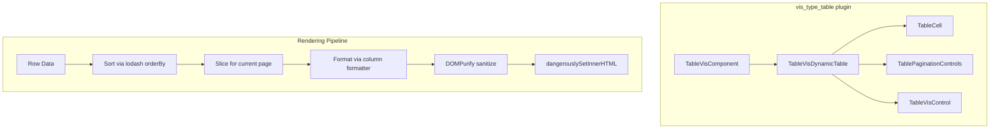

---
tags:
  - opensearch-dashboards
---
# Table Visualization Rewrite

## Summary

The table visualization in OpenSearch Dashboards has been completely rewritten in v3.5.0. The previous implementation based on `OuiDataGrid` (EUI Data Grid) has been replaced with a custom `<table>`-based component (`TableVisDynamicTable`) that provides improved performance, dynamic column sizing, interactive column resizing, and a redesigned pagination system.

## Details

### What's New in v3.5.0

The core change replaces the `EuiDataGrid`-based rendering in `TableVisComponent` with a new `TableVisDynamicTable` component. This is a full rewrite of the table visualization rendering layer within the `vis_type_table` plugin.

### Technical Changes

#### New Component: `TableVisDynamicTable`

The new component (`src/plugins/vis_type_table/public/components/table_vis_dynamic_table.tsx`) is a ~560-line React component that implements:

- **Native HTML `<table>` rendering**: Replaces `EuiDataGrid` with semantic `<table>`, `<thead>`, `<tbody>`, and `<tfoot>` elements.
- **Dynamic column width calculation**: Uses a hidden measuring `
` element to calculate optimal column widths based on actual cell content and header text. Columns are proportionally scaled when total width exceeds the container.
- **Interactive column resizing**: Headers support mouse-drag resizing via `mousedown`/`mousemove`/`mouseup` event listeners. A 5px drag threshold distinguishes resize from sort click.
- **Sortable headers**: Clicking a column header toggles sort direction (asc → desc). Sort icons appear on hover/focus with CSS transitions.
- **Per-cell filtering**: Filterable columns show "Filter for value" (`magnifyWithPlus`) and "Filter out value" (`magnifyWithMinus`) buttons on cell hover, dispatching `filterBucket` events.
- **Footer totals**: When `showTotal` is enabled in `visConfig`, a `<tfoot>` row displays `formattedTotal` values.
- **Custom pagination**: A new `TablePaginationControls` component provides page navigation and a "Rows per page" selector with options of 10, 20, 50, and 100.
- **HTML sanitization**: Cell content is formatted via column formatters and sanitized with DOMPurify before rendering via `dangerouslySetInnerHTML`.

#### Simplified `TableVisComponent`

The `TableVisComponent` was reduced from ~133 lines to ~11 lines. All rendering logic (sorting, pagination, column management, cell rendering, footer) was moved into `TableVisDynamicTable`. The component now simply passes props through.

#### Header Row UI Fix (PR #11056)

A follow-up fix addressed header alignment and truncation:

- Header text alignment changed to `text-align: left` and content uses `display: flex` with `align-items: center`.
- `HEADER_BUTTON_SPACE` reduced from 64px to 24px.
- Column width calculation now accounts for header text width in addition to cell content width.
- Header truncation threshold relaxed from `headerTextWidth > availableHeaderWidth` to `headerTextWidth > availableHeaderWidth * 1.5`.

### Key Constants

| Constant | Value | Description |
|----------|-------|-------------|
| `MIN_COLUMN_WIDTH` | 80px | Minimum column width during resize/scaling |
| `COLUMN_BUFFER` | 32px | Extra padding added to calculated column width |
| `HEADER_BUTTON_SPACE` | 24px | Space reserved for sort icon in header |
| `DEFAULT_PAGE_SIZE` | 10 | Default rows per page |
| `PAGE_SIZE_OPTIONS` | [10, 20, 50, 100] | Available page size choices |

### Architecture

### Files Changed

| File | Change |
|------|--------|
| `table_vis_component.tsx` | Gutted: delegates to `TableVisDynamicTable` |
| `table_vis_dynamic_table.tsx` | New: 558 lines, core table rendering |
| `table_vis_dynamic_table.scss` | New: 121 lines, table styles |
| `table_vis_dynamic_table.test.tsx` | New: 375 lines, unit tests |
| `table_vis_component.test.tsx` | Updated: tests now verify `TableVisDynamicTable` delegation |

## Limitations

- Column resizing uses mouse events only (no keyboard support for resize).
- The measuring element approach for column widths requires DOM access and may not work in SSR contexts.
- HTML content is rendered via `dangerouslySetInnerHTML` (sanitized with DOMPurify).

## References

### Pull Requests
| PR | Description | Related Issue |
|----|-------------|---------------|
| [#11031](https://github.com/opensearch-project/OpenSearch-Dashboards/pull/11031) | Table visualization re-write | - |
| [#11056](https://github.com/opensearch-project/OpenSearch-Dashboards/pull/11056) | Fix table vis header row UI | - |
