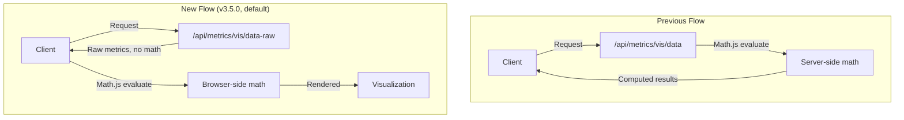

---
tags:
  - opensearch-dashboards
---
# TSVB Enhancements

## Summary

OpenSearch Dashboards v3.5.0 adds client-side math expression evaluation for TSVB (Time Series Visual Builder) visualizations. This security-focused enhancement moves arbitrary math expression evaluation from the Node.js server to the browser, reducing the server-side attack surface and improving scalability by offloading computation to clients.

## Details

### What's New in v3.5.0

This change introduces a parallel data pipeline for TSVB that separates raw metric retrieval from math expression evaluation. A new `/api/metrics/vis/data-raw` endpoint returns individual metric values without evaluating math expressions. The browser then evaluates those expressions client-side using a security-hardened Math.js wrapper.

### Architecture

### Technical Changes

#### New Server-Side Components

| File | Purpose |
|------|---------|
| `server/routes/vis_raw.ts` | Route handler for `/api/metrics/vis/data-raw` |
| `server/lib/get_vis_data_raw.ts` | Vis data handler (skips math evaluation) |
| `server/lib/vis_data/get_series_data_raw.js` | Series data handler (no math) |
| `server/lib/vis_data/series/handle_response_body_raw.js` | Response handler using `processorsRaw` |
| `server/lib/vis_data/response_processors/series/index_raw.js` | Processor list excluding `mathAgg` |
| `server/lib/vis_data/response_processors/series/std_metric_raw.js` | Metric processor appending metric ID to series ID |
| `server/lib/vis_data/response_processors/series/std_sibling_raw.js` | Sibling processor appending metric ID to series ID |

#### New Client-Side Components

| File | Purpose |
|------|---------|
| `public/lib/mathjs_wrapper.js` | Security-hardened Math.js wrapper blocking dangerous functions (`import`, `parse`, `evaluate`, `createUnit`, `simplify`, `derivative`) |
| `public/lib/process_math_series.js` | TSVB math processor building evaluation context (`params.a`, `params._index`, `params._timestamp`, `params._all`, `params._interval`) |
| `public/request_handler_raw.js` | Request handler calling `/api/metrics/vis/data-raw` and applying client-side math |

#### Configuration

| Setting | Key | Default | Description |
|---------|-----|---------|-------------|
| TSVB client-side math evaluation | `metrics:clientSideEvaluation` | `true` | Toggle between client-side and server-side math evaluation. Requires page reload. |

The setting is available under Advanced Settings → Visualization category.

#### Integration Points

- `public/metrics_type.ts` and `public/metrics_fn.ts` use a wrapper function that reads the `metrics:clientSideEvaluation` UI setting at runtime to select between the original `metricsRequestHandler` and the new `metricsRequestHandlerRaw`.

#### Bug Fixes Included

- Fixed null handling in server-side `math.js` processor: `typeof result === 'object'` check now also verifies `result !== null` to avoid errors when math evaluation returns null.
- Added stricter error propagation in `get_series_data.js` by re-throwing non-body errors instead of silently swallowing them.
- Added missing series-not-found error handling in `handle_response_body.js`.

### Backwards Compatibility

Fully backwards compatible:

- Existing `/api/metrics/vis/data` endpoint is unchanged
- Server-side evaluation remains available via UI setting toggle
- Saved visualizations work without changes
- No schema changes or migration required

## Limitations

- The `metrics:clientSideEvaluation` setting requires a page reload to take effect
- Table panel type always uses server-side processing (only time series panels use the new raw endpoint)
- Client-side evaluation adds Math.js library to the browser bundle size

## References

### Pull Requests
| PR | Description | Related Issue |
|----|-------------|---------------|
| [#11129](https://github.com/opensearch-project/OpenSearch-Dashboards/pull/11129) | Add Client-Side Math Expression Evaluation for TSVB | [#11081](https://github.com/opensearch-project/OpenSearch-Dashboards/issues/11081) |

### Issues (Design / RFC)
- [#11081](https://github.com/opensearch-project/OpenSearch-Dashboards/issues/11081): RFC: Redesign Math Expression Calculation Architecture for Enhanced Security
