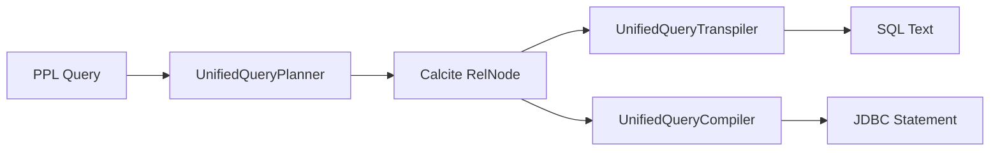

---
tags:
  - sql
---
# SQL/PPL Engine

## Summary

OpenSearch v3.5.0 brings significant enhancements to the SQL/PPL Engine, including new PPL commands and eval functions, a Unified Query API for external consumers, query profiling capabilities, and important bug fixes for PIT context management and query optimization.

## Details

### What's New in v3.5.0

#### New PPL Commands

| Command | Description | PR |
|---------|-------------|-----|
| `transpose` | Transposes rows and columns in query results | [#4786](https://github.com/opensearch-project/sql/pull/4786) |
| `spath` | Extracts fields from JSON data with field resolution | [#5028](https://github.com/opensearch-project/sql/pull/5028) |
| `mvcombine` | Combines multi-value fields | [#5025](https://github.com/opensearch-project/sql/pull/5025) |
| `addtotals` / `addcoltotals` | Adds row/column totals to results | [#4754](https://github.com/opensearch-project/sql/pull/4754) |

#### New Eval Functions

| Function | Description | PR |
|----------|-------------|-----|
| `tonumber` | Converts string to number | [#4514](https://github.com/opensearch-project/sql/pull/4514) |
| `mvzip` | Zips multi-value fields together | [#4805](https://github.com/opensearch-project/sql/pull/4805) |
| `split` | Splits string into multi-value field | [#4814](https://github.com/opensearch-project/sql/pull/4814) |
| `mvfind` | Finds values in multi-value fields | [#4839](https://github.com/opensearch-project/sql/pull/4839) |
| `mvmap` | Maps function over multi-value fields | [#4856](https://github.com/opensearch-project/sql/pull/4856) |

#### Unified Query API

A new Unified Query API enables external consumers to execute PPL queries end-to-end using a Calcite-based evaluator:

- **UnifiedQueryTranspiler**: Converts Calcite `RelNode` plans into SQL texts via Calcite `SqlDialect` ([#4871](https://github.com/opensearch-project/sql/pull/4871))
- **UnifiedQueryCompiler**: Compiles Calcite logical plans into executable JDBC statements ([#4974](https://github.com/opensearch-project/sql/pull/4974))
- **UnifiedQueryContext**: Shared configuration management with proper lifecycle handling ([#4933](https://github.com/opensearch-project/sql/pull/4933))



#### Query Profiling

New profiling framework for PPL queries captures per-phase metrics across planning, optimization, execution, and response formatting ([#4983](https://github.com/opensearch-project/sql/pull/4983)):

```bash
POST /_plugins/_ppl?profile=true
{
  "query": "source=my_index | stats count() by status"
}
```

### Query Optimization Enhancements

| Enhancement | Description | PR |
|-------------|-------------|-----|
| Nested field filter pushdown | Pushes filters on nested fields as nested queries | [#4825](https://github.com/opensearch-project/sql/pull/4825) |
| SortMergeJoin optimization | Supports sort expression pushdown for SortMergeJoin | [#4830](https://github.com/opensearch-project/sql/pull/4830) |
| Join with TopHits | Pushes join with `max=n` option to TopHits aggregation | [#4929](https://github.com/opensearch-project/sql/pull/4929) |
| Dedup pushdown | Supports pushdown dedup with expression and Object fields | [#4957](https://github.com/opensearch-project/sql/pull/4957), [#4991](https://github.com/opensearch-project/sql/pull/4991) |
| Nested aggregation | Supports nested aggregation when Calcite enabled | [#4979](https://github.com/opensearch-project/sql/pull/4979) |
| Enumerable TopK | Supports enumerable TopK for efficient top-k queries | [#4993](https://github.com/opensearch-project/sql/pull/4993) |

### Bug Fixes

| Fix | Description | PR |
|-----|-------------|-----|
| PIT context leak | Fixed Point-in-Time context leak in Legacy SQL for non-paginated queries | [#5009](https://github.com/opensearch-project/sql/pull/5009) |
| NOT BETWEEN query | Fixed NOT BETWEEN to use range query correctly | [#5016](https://github.com/opensearch-project/sql/pull/5016) |
| Dot-containing field names | Improved error handling for field names containing dots | [#4907](https://github.com/opensearch-project/sql/pull/4907) |
| Aggregation logic | Replaced duplicated aggregation logic with `aggregateWithTrimming()` | [#4926](https://github.com/opensearch-project/sql/pull/4926) |

### Other Enhancements

- ML command supports `category_field` parameter ([#3909](https://github.com/opensearch-project/sql/pull/3909))
- Time unit unification for bin/stats commands ([#4450](https://github.com/opensearch-project/sql/pull/4450))
- Enhanced error message handling for `bins` on time-related fields ([#4713](https://github.com/opensearch-project/sql/pull/4713))
- Added scalar min/max to BuiltinFunctionName ([#4967](https://github.com/opensearch-project/sql/pull/4967))

### Documentation Improvements

- Migrated PPL documentation from RST to Markdown ([#4912](https://github.com/opensearch-project/sql/pull/4912))
- Added version numbers for all settings in docs ([#5019](https://github.com/opensearch-project/sql/pull/5019))
- Added PPL docs website exporter script ([#4950](https://github.com/opensearch-project/sql/pull/4950))
- Added Frequently Used Big5 PPL Queries ([#4976](https://github.com/opensearch-project/sql/pull/4976))

## Limitations

- Query profiling is only available for PPL queries (not SQL)
- `spath` command requires explicit field references; wildcards not supported in initial implementation
- Unified Query API is experimental

## References

### Pull Requests

| PR | Title | Category |
|----|-------|----------|
| [#4514](https://github.com/opensearch-project/sql/pull/4514) | Feature tonumber function | feature |
| [#4754](https://github.com/opensearch-project/sql/pull/4754) | Feature addtotals and addcoltotals | feature |
| [#4786](https://github.com/opensearch-project/sql/pull/4786) | Implement transpose command | feature |
| [#4805](https://github.com/opensearch-project/sql/pull/4805) | Support mvzip eval function | feature |
| [#4814](https://github.com/opensearch-project/sql/pull/4814) | Support split eval function | feature |
| [#4839](https://github.com/opensearch-project/sql/pull/4839) | Support mvfind eval function | feature |
| [#4856](https://github.com/opensearch-project/sql/pull/4856) | Support mvmap eval function | feature |
| [#5025](https://github.com/opensearch-project/sql/pull/5025) | Feature mvcombine | feature |
| [#5028](https://github.com/opensearch-project/sql/pull/5028) | Implement spath command with field resolution | feature |
| [#4871](https://github.com/opensearch-project/sql/pull/4871) | Add unified query transpiler API | enhancement |
| [#4974](https://github.com/opensearch-project/sql/pull/4974) | Add unified query compiler API | enhancement |
| [#4983](https://github.com/opensearch-project/sql/pull/4983) | Support profile options for PPL | enhancement |
| [#5009](https://github.com/opensearch-project/sql/pull/5009) | Fix PIT context leak in Legacy SQL | bugfix |
| [#5016](https://github.com/opensearch-project/sql/pull/5016) | Fix NOT BETWEEN to use range query | bugfix |
