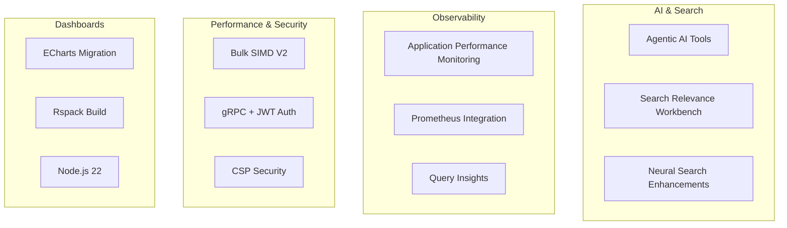

---
tags:
  - release
---
# OpenSearch v3.5.0 Release Summary

## Summary

OpenSearch 3.5.0 delivers significant enhancements across search, observability, and AI-powered applications. Key highlights include agentic AI tools with persistent conversation memory, expanded Prometheus support in Dashboards, Search Relevance Workbench upgrades with LLM-as-judge evaluation, and major performance improvements for vector search with Bulk SIMD V2 implementation.

## Highlights

## New Features

| Feature | Description | Report |
|---------|-------------|--------|
| Bulk SIMD V2 | 15-31% throughput improvement for FP16 vector distance computation | k-NN Vector Search |
| Asymmetric Embedding Models | Support for query/passage prefix differentiation in neural search | Neural Search |
| SEISMIC Query Explanation | Detailed explain API support for Sparse ANN queries | SEISMIC Sparse ANN |
| Multi-Tier Rollups | Hierarchical data aggregation with rollup-on-rollup support | Index State Management |
| Cardinality Metric for Rollups | HLL++ sketch-based approximate distinct counts | Index State Management |
| APM (Application Performance Monitoring) | RED metrics, service topology, and correlations flyout | APM |
| Prometheus in Explore | PromQL queries, autocomplete, and AI-powered query generation | Prometheus Metrics in Explore |
| LLM Judgment Customization | Customizable prompt templates for relevance evaluation | Search Relevance |
| User Attribution for Queries | Username and roles captured for top N queries | Query Insights |
| JWT Authentication for gRPC | Secure JWT-based authentication over gRPC transport | Security Enhancements |
| HTTP/3 Server Support | QUIC-based communication for improved performance | Security Enhancements |
| DLS Write Blocking | New setting to block writes when DLS restrictions apply | Security Enhancements |
| Mattermost Notifications | Native notification channel for Mattermost | Mattermost Notifications |
| Anomaly Correlation | Temporal overlap clustering for related anomalies | Anomaly Detection Correlation |
| Geospatial Validation | Geometric complexity limits for GeoJSON uploads | Geospatial Validation |
| ECharts Migration | Complete visualization migration from Vega-Lite to ECharts | ECharts Migration |
| Slash Command System | Extensible command registry with autocomplete for AI chat | Dashboards Chat/AI |
| Table Visualization Rewrite | Custom table component with dynamic column sizing | Table Visualization Rewrite |
| TSVB Client-Side Math | Security-focused math evaluation moved to browser | TSVB Enhancements |
| gzip Response Compression | Up to 98% payload reduction for large result sets | Dashboards gzip Support |

## Improvements

| Improvement | Description | Report |
|-------------|-------------|--------|
| GRPC Hybrid Query | High-performance hybrid search via gRPC transport | Neural Search |
| min_score in Hybrid Search | Score filtering for hybrid query results | Neural Search |
| SEISMIC Multi-Thread Performance | Lock-free LRU cache for concurrent queries | SEISMIC Sparse ANN |
| Lucene ef_search Correction | Fixed recall degradation for small k values | k-NN Vector Search |
| Nested k-NN Filter Improvements | Parent document efficient filtering for nested queries | k-NN Vector Search |
| New PPL Commands | transpose, spath, mvcombine, addtotals, addcoltotals | SQL/PPL Engine |
| New Eval Functions | tonumber, mvzip, split, mvfind, mvmap | SQL/PPL Engine |
| Unified Query API | Calcite-based PPL query execution for external consumers | SQL/PPL Engine |
| Query Profiling | Per-phase metrics for PPL queries | SQL/PPL Engine |
| Optimized Query Storage | 58% storage reduction with string-based source field | Query Insights |
| Dedicated Settings API | Fine-grained access control for Dashboard configuration | Query Insights |
| search_only ISM Action | Automatic scale-down for Reader/Writer Separation | Index State Management |
| Nested JWT Claims | Dot notation access to deeply nested JWT structures | Security Enhancements |
| Observability Notebooks | Capability-based visibility control | Observability Notebooks |
| Agentic Search Index Selection | Automatic index targeting from ListIndexTool | Agentic Search |
| RED Metrics for Traces | Rate, Errors, Duration charts in Discover:Traces | Observability Traces |
| Explore Enhancements | Rare values in field stats, condensed UI, logs default columns | Explore Enhancements |
| CSP Nonce-Based Styles | Per-request cryptographic nonces for style protection | Dashboards CSP Security |
| Data Importer Integration | Import data directly from Explore page | Data Importer |
| Rspack Build Migration | Rust-based bundler replacing Webpack 4 | Dashboards Build |
| Node.js 22 Upgrade | Runtime upgrade from Node.js 20 to 22.22.0 | Dashboards Dependencies |

## Bug Fixes

| Fix | Description | Report |
|-----|-------------|--------|
| MOS Reentrant Search | Fixed byte index reentrant search bug | k-NN Vector Search |
| Warmup Integer Overflow | Fixed overflow for large index files (>2GB) | k-NN Vector Search |
| Nested Docs with Missing Vectors | Fixed EOF exceptions on .vec files | k-NN Vector Search |
| BinaryCagra Score Conversion | Fixed float-to-int score conversion | k-NN Vector Search |
| PIT Context Leak | Fixed Point-in-Time context leak in Legacy SQL | SQL/PPL Engine |
| NOT BETWEEN Query | Fixed to use range query correctly | SQL/PPL Engine |
| Hybrid Query Collapse | Fixed bugs with collapse functionality | Neural Search |
| RRF Score Calculation | Fixed global rank calculation in subqueries | Neural Search |
| Partial Cache Update | Fixed cache update post snapshot restore | Security Enhancements |
| LDAP Recursive Role Search | Fixed NPE in recursive role search | Security Enhancements |
| CCR Test Stability | Fixed multi-node integration test flakiness | Cross-Cluster Replication |
| Patterns Table Pagination | Fixed React memoization for pagination handlers | Explore Enhancements |
| Timechart Interval Change | Fixed data table update on interval change | Explore Enhancements |

## Breaking Changes

| Change | Description |
|--------|-------------|
| Node.js 20 Deprecation | Node.js 20 deprecated; upgraded to Node.js 22 |
| Webpack 4 Replacement | Webpack 4 replaced with Rspack bundler |

## Experimental Features

| Feature | Description |
|---------|-------------|
| AG-UI Protocol | Agent-User Interaction protocol for AI chatbots |
| HTTP/3 Support | Server-side HTTP/3 protocol support |
| Advanced Explore Settings | Histogram breakdowns and field statistics in Explore |

## References

### Official Release Notes
- [OpenSearch and OpenSearch Dashboards 3.5.0 Release Notes](https://github.com/opensearch-project/opensearch-build/blob/main/release-notes/opensearch-release-notes-3.5.0.md)

### Feature Reports
- k-NN Vector Search
- Neural Search
- SEISMIC Sparse ANN
- SQL/PPL Engine
- Security Enhancements
- Query Insights
- Index State Management
- Search Relevance
- APM (Application Performance Monitoring)
- Prometheus Metrics in Explore
- Mattermost Notifications
- Anomaly Detection Correlation
- Geospatial Validation
- Alerting Access Control
- Observability Notebooks
- Agentic Search
- Remote Store
- Cross-Cluster Replication
- Dashboards Chat/AI
- ECharts Migration
- Explore Enhancements
- Observability Traces
- Table Visualization Rewrite
- Dashboards gzip Support
- Dashboards CSP Security
- TSVB Enhancements
- Data Importer
- Dashboards Build (Rspack Migration)
- Dashboards Dependencies
- Job Scheduler
