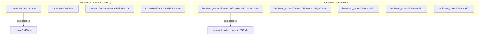

---
tags:
  - custom-codecs
---
# Custom Codecs

## Summary

In OpenSearch 3.6.0, the Custom Codecs plugin was updated for Lucene 10.4 compatibility. All codec implementations were migrated from Lucene 10.3 (`Lucene103*`) to Lucene 10.4 (`Lucene104*`), with the previous Lucene 10.3 codecs moved to backward compatibility packages. Additionally, the build infrastructure was updated: the backward compatibility (BWC) test framework version was bumped to OpenSearch 3.6, and the plugin zip publication to Maven local was fixed to ensure proper artifact availability for downstream consumers like k-NN.

## Details

### What's New in v3.6.0

#### Lucene 10.4 Codec Migration

All custom codec classes were upgraded from Lucene 10.3 to Lucene 10.4:

| Old Class (now BWC) | New Class | Purpose |
|---------------------|-----------|---------|
| `Lucene103CustomCodec` | `Lucene104CustomCodec` | Base ZSTD codec |
| `Lucene103CustomStoredFieldsFormat` | `Lucene104CustomStoredFieldsFormat` | ZSTD stored fields format |
| `Lucene103QatCodec` | `Lucene104QatCodec` | Base QAT codec |
| `Lucene103QatStoredFieldsFormat` | `Lucene104QatStoredFieldsFormat` | QAT stored fields format |
| `Zstd103Codec` | `Zstd104Codec` | ZSTD with dictionary |
| `ZstdNoDict103Codec` | `ZstdNoDict104Codec` | ZSTD without dictionary |
| `QatLz4103Codec` | `QatLz4104Codec` | QAT LZ4 |
| `QatDeflate103Codec` | `QatDeflate104Codec` | QAT DEFLATE |
| `QatZstd103Codec` | `QatZstd104Codec` | QAT ZSTD |

The new Lucene 104 codecs delegate to `org.apache.lucene.codecs.lucene104.Lucene104Codec` as the base codec. The previous Lucene 103 classes were moved to `backward_codecs/lucene103/` package and now import from `org.apache.lucene.backward_codecs.lucene103.Lucene103Codec` to maintain read compatibility with indexes created using the older codec format.

This migration was required because Lucene 10.4 removed the `org.apache.lucene.codecs.lucene103` package, causing build failures (Issue #312).

#### Build Infrastructure Fixes

- **BWC test framework version**: Updated `opensearch_version` in `bwc-test/build.gradle` from `3.4.0-SNAPSHOT` to `3.6.0-SNAPSHOT` to align with the current release.
- **Maven local zip publication**: Fixed the build pipeline to explicitly publish the custom codecs plugin zip artifact to Maven local. Previously, `publishPluginZipPublicationToMavenLocal` was excluded in `settings.gradle`. This was removed from the exclusion list, and a Gradle task ordering dependency was added to ensure `generatePomFileForPluginZipPublication` runs after `publishNebulaPublicationToMavenLocal`. The `scripts/build.sh` was also updated to separate jar and zip publication steps. This fix partially resolves a k-NN build issue where the custom-codecs zip was not available locally.

### Technical Changes

## Limitations

- No new user-facing features or configuration changes in this release
- This is a maintenance/compatibility update — existing index settings and codec names remain unchanged

## References

### Pull Requests
| PR | Description | Related Issue |
|----|-------------|---------------|
| [#311](https://github.com/opensearch-project/custom-codecs/pull/311) | Update for Lucene 10.4 compatibility | [#312](https://github.com/opensearch-project/custom-codecs/issues/312) |
| [#321](https://github.com/opensearch-project/custom-codecs/pull/321) | Explicitly publish custom codecs zip to Maven local | [k-NN#3156](https://github.com/opensearch-project/k-NN/issues/3156) |
| [#322](https://github.com/opensearch-project/custom-codecs/pull/322) | Update BWC build framework version to OpenSearch 3.6 | |
| [#318](https://github.com/opensearch-project/custom-codecs/pull/318) | Add release notes for 2.19.5 (backport) | |
