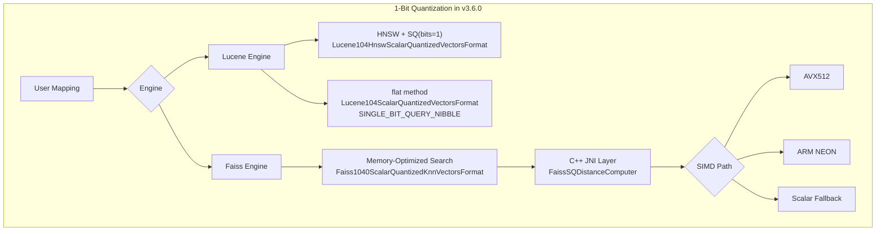

---
tags:
  - k-nn
---
# Vector Search (k-NN) - 1-Bit Quantization

## Summary

OpenSearch v3.6.0 introduces 1-bit scalar quantization (32x compression) for both the Lucene and Faiss engines in the k-NN plugin. This enables extreme memory savings by compressing each float32 vector component to a single bit, achieving 32x storage reduction while maintaining acceptable recall through automatic rescoring.

## Key Changes

### Lucene Engine: BBQ Integration (HNSW + Flat)

The Lucene engine now supports 1-bit quantization via Lucene's Better Binary Quantization (BBQ) through two methods:

**HNSW with SQ encoder (bits=1)**

The existing `sq` encoder for the `hnsw` method now accepts `bits: 1`, which uses `Lucene104HnswScalarQuantizedVectorsFormat` internally.

```json
PUT /my-index
{
  "mappings": {
    "properties": {
      "my_vector": {
        "type": "knn_vector",
        "dimension": 128,
        "method": {
          "name": "hnsw",
          "engine": "lucene",
          "space_type": "l2",
          "parameters": {
            "encoder": {
              "name": "sq",
              "parameters": {
                "bits": 1
              }
            }
          }
        }
      }
    }
  }
}
```

**New `flat` method**

A new `flat` method provides BBQ flat (non-graph) search using `Lucene104ScalarQuantizedVectorsFormat` with `SINGLE_BIT_QUERY_NIBBLE` encoding. It only supports 32x compression and does not accept `mode` or additional parameters.

```json
PUT /my-index
{
  "mappings": {
    "properties": {
      "my_vector": {
        "type": "knn_vector",
        "dimension": 128,
        "compression_level": "32x",
        "method": {
          "name": "flat"
        }
      }
    }
  }
}
```

**Default compression change**: For indices created on v3.6.0+, Lucene `on_disk` mode now defaults to 32x compression (1-bit SQ) instead of the previous 4x. Existing indices created before v3.6.0 retain 4x behavior.

### Faiss Engine: SQ 1-Bit with Memory-Optimized Search (MOS)

The Faiss engine gains end-to-end 1-bit scalar quantization support through the memory-optimized search (MOS) path:

- **Indexing**: `MemOptimizedScalarQuantizedIndexBuildStrategy` builds Faiss SQ indices with C++ JNI integration, skipping the bottom storage layer for efficiency
- **Codec**: New `Faiss1040ScalarQuantizedKnnVectorsFormat` with dedicated Reader/Writer for SQ on Faiss
- **Search**: `FaissSQDistanceComputer` with batched distance computation (`distances_batch_4`) and rescore context support
- **SIMD acceleration**: Bulk scoring for L2, inner product, and cosine with AVX512 and ARM NEON implementations, plus a default (non-SIMD) fallback
- **Encoder**: `FaissSQEncoder` with `SQConfig` and `SQConfigParser` for 32x compression (1-bit SQ)

For Faiss, 32x compression is now the default for `on_disk` mode on indices created with v3.6.0+.

### Bug Fix: Default Encoder for Faiss 32x

PR #3210 fixes the Faiss 32x compression to correctly use the SQ 1-bit encoder instead of the previous QFrameBit encoder. The `shouldUseSQOneBitForX32` method now returns `true` for indices created on v3.6.0+, and removes incompatible `type` and `clip` defaults when auto-resolving to `bits=1`.

## Architecture



## Limitations

- Lucene `flat` method only supports 32x compression; no other compression levels are allowed
- Lucene `flat` method does not support `mode` parameter
- `bits=1` for Lucene SQ encoder does not support `confidence_interval` or other additional parameters
- 1-bit quantization is only available for indices created on v3.6.0 or later
- Faiss SQ 1-bit is currently limited to the memory-optimized search path

## References

- `https://github.com/opensearch-project/k-NN/pull/3144` - Lucene BBQ integration for HNSW (1-bit SQ encoder)
- `https://github.com/opensearch-project/k-NN/pull/3154` - Lucene BBQ Flat format support
- `https://github.com/opensearch-project/k-NN/pull/3208` - Faiss SQ 1-bit with MOS, SIMD acceleration, codec integration
- `https://github.com/opensearch-project/k-NN/pull/3210` - Fix default encoder to SQ 1-bit for Faiss 32x compression
- `https://github.com/opensearch-project/k-NN/issues/2805` - Original issue for Lucene BBQ support
- `https://github.com/opensearch-project/k-NN/issues/3169` - Faiss SQ 1-bit tracking issue
