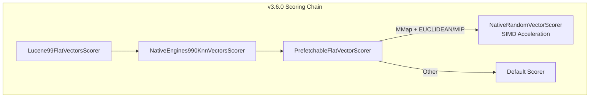

---
tags:
  - k-nn
---
# Vector Search (k-NN) - Memory-Optimized Search

## Summary

OpenSearch v3.6.0 brings significant performance and reliability improvements to memory-optimized search (MOS / Lucene-on-Faiss). Key enhancements include prefetch integration for FP16 and sparse float vector values, decoupled native SIMD scoring via a new `NativeEngines990KnnVectorsScorer` decorator, and up to 35% faster FP16 bulk similarity through precomputed tail masks. Several critical bug fixes address integer overflow on large-scale indexes, optimistic search correctness on nested CAGRA indexes, random entry point generation edge cases, and prefetch failures due to out-of-bound exceptions.

## Details

### What's New in v3.6.0

#### Prefetch Integration for Memory-Optimized Search

Lucene's `IndexInput.prefetch()` API is now integrated into the MOS search path, enabling the OS to pre-load vector data from disk into the page cache before it is needed during HNSW graph traversal. This reduces memory access latency for disk-resident vectors.

- FP16-based indexes: Prefetch works with both standard and BulkSIMD scoring paths (PR #3195)
- Sparse float vector values: Prefetch extended to `SparseFloatVectorValues` for Faiss indexes covering fp32, fp16, and binary formats (PR #3197)
- Prefetch failure fix: `FaissScorableByteVectorValues` now properly exposes the `HasIndexSlice` interface when the underlying delegate supports it, and correctly delegates `byteVectorLength`, preventing out-of-bound exceptions (PR #3240)

#### Decoupled Native SIMD Scoring Architecture

The native SIMD scoring selection logic has been extracted from `FaissMemoryOptimizedSearcher` into a dedicated `NativeEngines990KnnVectorsScorer` decorator (PR #3184). This architectural change:

- Places `NativeEngines990KnnVectorsScorer` inside `PrefetchableFlatVectorScorer` in the decorator chain
- Enables native SIMD acceleration for all scoring paths, including HNSW graph traversal with prefetch support
- Allows `PrefetchableFlatVectorScorer` to wrap `NativeRandomVectorScorer`, issuing prefetch hints for memory-mapped vector data before native SIMD scoring
- Simplifies `FaissMemoryOptimizedSearcher` by removing the native scoring branch and `determineNativeFunctionType()`
- Refactors `NativeRandomVectorScorer` to extend `AbstractRandomVectorScorer`

#### FP16 Bulk Similarity Performance Improvement

The FP16 bulk similarity computation now precomputes the tail mask instead of recomputing it in each loop iteration, yielding up to 35% performance gain in microbenchmarks (PR #3172):

| Dimension | Old (IP) | New (IP) | Improvement |
|-----------|----------|----------|-------------|
| 384 | 58.2 M/s | 73.9 M/s | ~27% |
| 768 | 30.4 M/s | 40.5 M/s | ~33% |
| 1536 | 15.6 M/s | 21.0 M/s | ~35% |

#### Correct Vector Scorer and maxConn for MOS

Two correctness improvements for MOS (PR #3117):

1. When segments are initialized via SPI (shard movements, cluster restarts), the correct `FlatVectorScorerUtil.getLucene99FlatVectorsScorer()` is now used, ensuring `PanamaVectorScorer` is selected when available
2. `maxConn` now correctly returns `M` (e.g., 16) instead of `2*M` (32) for the last HNSW layer, consistent with Lucene's behavior and reducing per-query heap pressure

### Bug Fixes

#### Integer Overflow on Large-Scale Indexes (PR #3130)

Fixed `MonotonicIntegerSequenceEncoder.encode()` failing with `ArithmeticException: integer overflow` when converting Faiss HNSW `offsets` from `long` to `int` on large-scale indexes (10B+ vectors, ~43M per shard after force merge). Resolves Issue #3108.

#### Nested CAGRA Index Optimistic Search (PR #3155)

Fixed three bugs in the optimistic search strategy for nested CAGRA indexes:

1. `RandomEntryPointsKnnSearchStrategy` generated duplicate entry points — fixed with O(1) memory random sampling algorithm (`RobustUniqueRandomIterator`)
2. Second deep-dive search ignored seeded entry points from the first phase, using random entry points instead — now honors `KnnSearchStrategy.Seeded`
3. Nested index search used `TopKnnCollectorManager` instead of `DiversifyingNearestChildrenKnnCollectorManager`, failing to track best parent scores — now selects collector manager based on whether the index is nested

#### Random Entry Point Generation Edge Case (PR #3161)

Fixed `RobustUniqueRandomIterator` throwing `IllegalArgumentException: numPopulate > maxValExclusive` when `numVectors < entryPoints` in CagraIndex. Now returns all docs as entry points when the vector count is smaller than the requested entry point count.

#### Prefetch Out-of-Bound Exception (PR #3240)

Fixed `FaissScorableByteVectorValues` not properly delegating `HasIndexSlice` interface and `byteVectorLength`, which caused Lucene's prefetch optimization to fail with an out-of-range exception.

## Limitations

- Prefetch for `SparseByteVectorValues` is not yet supported due to differences in how Lucene and Faiss store byte data (planned for a future PR)
- Prefetch benefits depend on OS page cache behavior and may vary by hardware

## References

### Pull Requests
| PR | Description | Related Issue |
|----|-------------|---------------|
| [#3195](https://github.com/opensearch-project/k-NN/pull/3195) | Integrate prefetch with FP16-based index for MOS | [#2577](https://github.com/opensearch-project/k-NN/issues/2577) |
| [#3197](https://github.com/opensearch-project/k-NN/pull/3197) | Integrate prefetch for SparseFloatVectorValues with Faiss indices | [#2577](https://github.com/opensearch-project/k-NN/issues/2577) |
| [#3184](https://github.com/opensearch-project/k-NN/pull/3184) | Decouple native SIMD scoring into NativeEngines990KnnVectorsScorer | |
| [#3172](https://github.com/opensearch-project/k-NN/pull/3172) | Speed up FP16 bulk similarity by precomputing tail mask (up to 35%) | |
| [#3117](https://github.com/opensearch-project/k-NN/pull/3117) | Use correct vector scorer via SPI and correct maxConn for MOS | |
| [#3130](https://github.com/opensearch-project/k-NN/pull/3130) | Fix integer overflow for large-scale MOS indexes | [#3108](https://github.com/opensearch-project/k-NN/issues/3108) |
| [#3155](https://github.com/opensearch-project/k-NN/pull/3155) | Fix optimistic search bugs on nested CAGRA index | |
| [#3161](https://github.com/opensearch-project/k-NN/pull/3161) | Fix random entry point generation when numVectors < entryPoints | |
| [#3240](https://github.com/opensearch-project/k-NN/pull/3240) | Fix prefetch failure due to out-of-bound exception | [#2577](https://github.com/opensearch-project/k-NN/issues/2577) |
