---
tags:
  - k-nn
---
# Vector Search (k-NN) - Merge & Indexing

## Summary

OpenSearch 3.6.0 improves k-NN index merge behavior and fixes a critical derived source bug affecting bulk indexing with dynamic templates. The merge policy defaults for k-NN indices are now less aggressive, reducing CPU contention during concurrent search and indexing workloads. A bug where vectors were incorrectly returned as the mask value `1` during bulk indexing with dynamic templates and `knn.derived_source.enabled=true` has been fixed.

## Details

### What's New in v3.6.0

#### Less Aggressive Merge Policy for k-NN Indices

OpenSearch core changed its default merge policy settings to more aggressive values (`max_merge_at_once=30`, `floor_segment=16mb`). For k-NN indices, where FAISS graph creation during merges is CPU-intensive, this caused excessive CPU usage that degraded concurrent search performance.

The k-NN plugin now automatically overrides these defaults for k-NN indices:

| Setting | Core Default | k-NN Override |
|---------|-------------|---------------|
| `index.merge.policy.max_merge_at_once` | 30 | 10 |
| `index.merge.policy.floor_segment` | 16mb | 2mb |

These overrides are applied via `IndexSettingProvider.getAdditionalIndexSettings()` in `KNNPlugin.java` when `index.knn=true`. Users can still override these values explicitly in index settings.

The result is reduced CPU contention between merge operations and search queries, particularly beneficial for clusters handling concurrent indexing and search traffic.

#### Derived Source Fix for Dynamic Templates with Bulk Indexing

A critical bug was fixed where bulk indexing documents with dynamic templates and `knn.derived_source.enabled=true` caused vectors to be incorrectly stored as the mask value `1` instead of the actual vector array.

**Root Cause**: Segment attributes tracking which fields need derived source reconstruction were written in `fieldsWriter()` at segment creation time. At that point, only the first document's dynamic mapping existed in `mapperService.fieldTypes()`. Subsequent documents' dynamic mappings were created during parsing, after the segment attributes had already been written with an incomplete field list.

**Fix**: Segment attribute writing was moved from `fieldsWriter()` to `finish()`, which is called after all documents have been written to the segment and all dynamic mappings exist. For merge operations, explicit segment attribute handling was added in `merge()` since the delegate's `finish()` is called instead.

Key implementation changes:
- `KNN10010DerivedSourceStoredFieldsFormat`: Removed early attribute writing from `fieldsWriter()`, now passes `segmentInfo` and `mapperService` to the writer
- `KNN10010DerivedSourceStoredFieldsWriter`: Added attribute writing in `finish()` for normal indexing and in `merge()` for merge operations; added dynamic field detection via field count comparison
- `KNN10010DerivedSourceStoredFieldsReader`: Added `getDerivedVectorFields()` getter to support field collection during merge
- `DerivedSourceSegmentAttributeParser`: Changed parameter type from `List<String>` to `Set<String>` for field names

#### Unit Test Improvements

Unit tests for `ExactSearcherTests` and `KNNVectorValuesFactoryTests` were tightened with more realistic quantized byte vector values and multi-vector assertions that iterate all documents and verify `NO_MORE_DOCS` termination.

### Technical Changes

```mermaid
flowchart TB
    subgraph "Before Fix (Bug)"
        A1[fieldsWriter called] --> A2[Write segment attributes]
        A2 --> A3[Only 1st doc mapping exists]
        A3 --> A4[Parse remaining docs]
        A4 --> A5[New dynamic mappings created]
        A5 --> A6[Segment attributes incomplete]
    end

    subgraph "After Fix"
        B1[fieldsWriter called] --> B2[Skip attribute writing]
        B2 --> B3[Parse all docs]
        B3 --> B4[All dynamic mappings exist]
        B4 --> B5["finish() called"]
        B5 --> B6[Write complete segment attributes]
    end
```

## Limitations

- The merge policy overrides only apply to newly created k-NN indices; existing indices retain their current settings
- Users who explicitly set merge policy values will not have them overridden by the k-NN defaults
- The derived source fix requires re-indexing documents that were affected by the bug; existing corrupted data is not automatically repaired

## References

### Pull Requests
| PR | Description | Related Issue |
|----|-------------|---------------|
| [#3128](https://github.com/opensearch-project/k-NN/pull/3128) | Adjust merge policy settings to make merges less aggressive | - |
| [#3035](https://github.com/opensearch-project/k-NN/pull/3035) | Fix derived source with dynamic templates during bulk indexing | [#3012](https://github.com/opensearch-project/k-NN/issues/3012) |
| [#3112](https://github.com/opensearch-project/k-NN/pull/3112) | Improve unit tests by tightening assertions | - |
