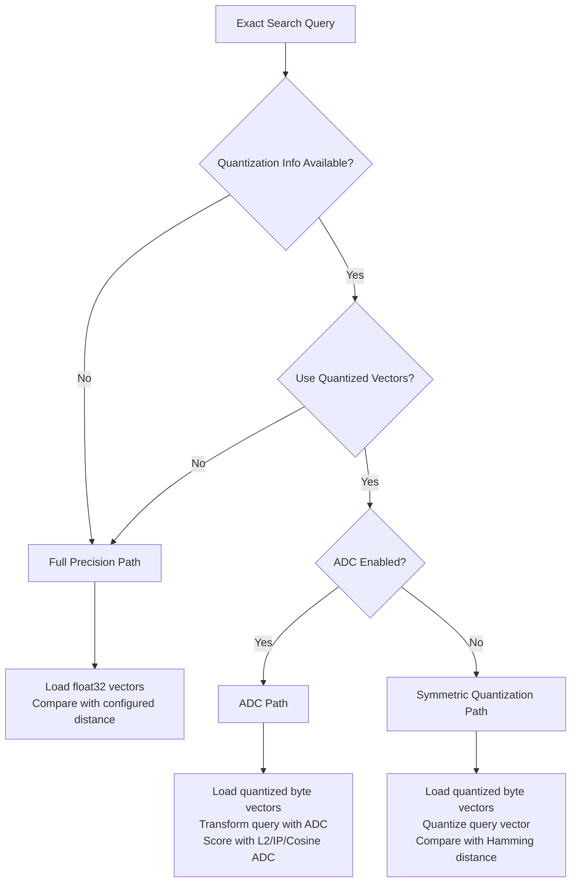

---
tags:
  - k-nn
---
# Vector Search (k-NN) - Pre-quantized Vectors

## Summary

OpenSearch 3.6.0 introduces pre-quantized vector support for exact search and Asymmetric Distance Computation (ADC) in the k-NN plugin. This optimization eliminates redundant quantization and vector re-reading during disk-based filtered vector search, improving query performance by retrieving quantized vectors directly from FAISS memory-optimized indexes.

## Key Changes

### Pre-quantized Vector Exact Search (PR #3095)

Previously, disk-based vector search with efficient filters performed exact search by:
1. Reading full-precision float32 vectors from disk
2. Quantizing them on-the-fly for distance computation
3. Re-reading the same vectors during rescoring

This caused redundant disk I/O and CPU overhead. The new implementation retrieves pre-quantized byte vectors directly from the FAISS memory-optimized searcher via `NativeEngines990KnnVectorsReader.getByteVectorValues()`, bypassing the redundant quantization step.

Key implementation details:
- `NativeEngines990KnnVectorsReader.getByteVectorValues()` now checks for FLOAT32 fields with quantization config (`QFRAMEWORK_CONFIG`) and returns quantized vectors from the `VectorSearcher` when available
- `VectorSearcher` interface extended with `getByteVectorValues()` method, implemented by `FaissMemoryOptimizedSearcher`
- `KNNVectorValuesFactory.getVectorValues()` gains a new overload accepting `shouldRetrieveQuantizedVectors` flag, using a dual-iterator pattern (`DocIdsIteratorValues` with both `FloatVectorValues` and `ByteVectorValues`)
- `ExactSearcher.getKNNIterator()` updated to use `BinaryVectorIdsExactKNNIterator` with Hamming distance when quantized query vectors are available

### Pre-quantized Vectors for ADC (PR #3113)

Extends the pre-quantized vector optimization to the ADC (Asymmetric Distance Computation) path. Previously, ADC scoring was embedded in `VectorIdsExactKNNIterator` which loaded full-precision float vectors and quantized document vectors on-the-fly. The new implementation:

- Moves ADC scoring logic from `VectorIdsExactKNNIterator` to `BinaryVectorIdsExactKNNIterator`, which now accepts float query vectors directly
- Adds `KNNScoringUtil.scoreWithADC()` as a centralized static method supporting L2, inner product, and cosine similarity space types
- Restructures `ExactSearcher.getKNNIterator()` into three clear execution paths:
  1. Full precision path (no quantization or rescoring)
  2. ADC path (transforms query vector, compares against quantized doc vectors)
  3. Symmetric quantization path (quantizes query, uses Hamming distance)
- Removes `shouldScoreWithADC()` and `scoreWithADC()` from `VectorIdsExactKNNIterator`, simplifying the class to only handle float-to-float comparisons

### Execution Path Architecture

## Supported Space Types for ADC

| Space Type | ADC Support | Score Translation |
|-----------|-------------|-------------------|
| L2 | Yes | `L2.scoreTranslation(l2SquaredADC(...))` |
| Inner Product | Yes | `IP.scoreTranslation(-1 * innerProductADC(...))` |
| Cosine Similarity | Yes | `COSINE.scoreTranslation(1 - innerProductADC(...))` |
| Hamming | No | Used for symmetric quantization path |

## Compression Level Support

The disk-based filtered exact search with pre-quantized vectors works with all compression levels:
- 4x (x4)
- 8x (x8)
- 16x (x16)
- 32x (x32)

## References

- PR: `https://github.com/opensearch-project/k-NN/pull/3095` — Pre-quantized vector exact search
- PR: `https://github.com/opensearch-project/k-NN/pull/3113` — Pre-quantized vectors for ADC
- Issue: `https://github.com/opensearch-project/k-NN/issues/2215` — Reducing double vector reading for disk-based filtered search
