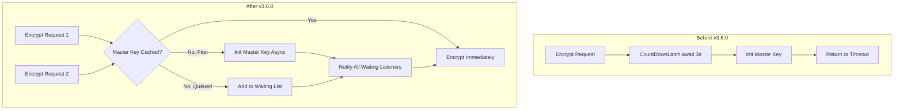

---
tags:
  - ml-commons
---
# ML Commons Encryption

## Summary

The `EncryptorImpl` class in ML Commons was refactored from a synchronous, blocking `CountDownLatch`-based design to a fully asynchronous `ActionListener`-based architecture. This eliminates thread blocking during master key initialization, fixes duplicate master key generation under concurrent requests, and enables batch encrypt/decrypt of multiple credentials in a single call.

## Details

### What's New in v3.6.0

1. **Asynchronous Encrypt/Decrypt API**: The `Encryptor` interface methods `encrypt()` and `decrypt()` now accept `List<String>` instead of a single `String`, and use `ActionListener<List<String>>` callbacks instead of returning values synchronously. This removes the 3-second `CountDownLatch` timeout that previously caused failures under load.

2. **Per-Tenant Listener Queuing**: A new `ConcurrentHashMap<String, List<ActionListener<Boolean>>>` (`tenantWaitingListenerMap`) queues concurrent requests for the same tenant's master key. Only the first request triggers key initialization; subsequent requests are notified via their listeners once the key is ready.

3. **Connector Encrypt/Decrypt Refactoring**: The `Connector` interface methods `encrypt()` and `decrypt()` were updated to use `TriConsumer<List<String>, String, ActionListener<List<String>>>` instead of `BiFunction<String, String, String>`. The `update()` method no longer takes an encrypt function parameter — encryption is now a separate async step.

4. **Connector Hierarchy Consolidation**: `McpConnector` and `McpStreamableHttpConnector` now extend `AbstractConnector` instead of directly implementing `Connector`, eliminating duplicated encrypt/decrypt logic across connector types.

### Technical Changes

| Component | Change |
|-----------|--------|
| `Encryptor` interface | `encrypt(String, String) → encrypt(List<String>, String, ActionListener<List<String>>)` |
| `Encryptor` interface | `decrypt(String, String) → decrypt(List<String>, String, ActionListener<List<String>>)` |
| `EncryptorImpl` | Removed `CountDownLatch`, added `tenantWaitingListenerMap` for concurrent request queuing |
| `EncryptorImpl` | Added `handleSuccess()` / `handleError()` methods to notify all waiting listeners |
| `Connector` interface | `encrypt(BiFunction, String) → encrypt(TriConsumer, String, ActionListener<Boolean>)` |
| `Connector` interface | `decrypt(String, BiFunction, String) → decrypt(String, TriConsumer, String, ActionListener<Boolean>)` |
| `Connector.update()` | Removed encrypt function parameter; encryption is now a separate step |
| `AbstractConnector` | New shared `encrypt()` / `decrypt()` implementations with `getAllHeaders()` abstract method |
| `McpConnector` | Now extends `AbstractConnector` (removed duplicate fields and encrypt/decrypt) |
| `McpStreamableHttpConnector` | Now extends `AbstractConnector` (removed duplicate fields and encrypt/decrypt) |
| `HttpConnector` | Removed synchronous `encrypt()` / `decrypt()` overrides; uses `AbstractConnector` |
| `Predictable.initModelAsync()` | Changed from `CompletionStage<Boolean>` return to `ActionListener<Predictable>` callback |
| `RemoteModel` | Refactored `initModelAsync()` to use `ActionListener` chain instead of `CompletableFuture` |
| `MLEngine` | `encrypt()` and `getConnectorCredential()` now async with `ActionListener` |
| `TransportCreateConnectorAction` | Encryption is now async before indexing |
| `UpdateConnectorTransportAction` | Encryption is now a separate async step after `connector.update()` |
| `UpdateModelTransportAction` | Encryption is now a separate async step after `connector.update()` |
| `ExecuteConnectorTransportAction` | Decryption is now async before connector execution |
| `CancelBatchJobTransportAction` | Decryption is now async before connector execution |

## Limitations

- The `RemoteAgenticConversationMemory.createInlineConnector()` still uses a `CountDownLatch` for synchronous decrypt behavior within a constructor context, as it cannot be easily converted to async.

## References

### Pull Requests
| PR | Description | Related Issue |
|----|-------------|---------------|
| `https://github.com/opensearch-project/ml-commons/pull/3919` | Improve EncryptorImpl with asynchronous handling for scalability and fix duplicate master key generation | `https://github.com/opensearch-project/ml-commons/issues/3510` |
