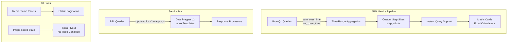

---
tags:
  - observability
---
# Observability Dashboards

## Summary

OpenSearch v3.6.0 delivers a comprehensive set of bug fixes and improvements for the Observability Dashboards plugin, primarily targeting the APM (Application Performance Monitoring) feature introduced in v3.5.0. Key areas include metric accuracy corrections, PromQL query improvements, service map compatibility with new Data Prepper index mappings, UI stability fixes, and a security dependency update. Two additional fixes in OpenSearch Dashboards core address a span flyout race condition and add Prometheus instant query support.

## Details

### What's New in v3.6.0

#### APM Metrics Accuracy Fixes

Multiple PRs addressed incorrect metric calculations in the APM dashboards:

- Server-side filtering: Added `remoteService=""` filter to all node-level PromQL queries so service dashboards display incoming (server-side) metrics instead of outgoing (client-side) metrics
- Chart-total consistency: Wrapped count chart queries (request, fault, error) with `sum_over_time[step]` so chart data points match health donut totals in the Application Map flyout
- Throughput normalization: Added configurable Window Duration field to APM Settings (default 60s). Throughput now displays as "req/s" instead of "req/int" by dividing gauge values by the configured window duration
- Metric card fix: Fixed `showTotal` mode that summed all data points and divided by 1 instead of `chartData.length`, causing inflated values (e.g., 575% fault rate)
- True percentile latency: Services Home latency column now uses an instant query with `sum_over_time` on histogram buckets to compute true P99/P90/P50 over the full time range, replacing the previous arithmetic mean of per-step P99 values
- Removed unused `getQueryAllOperationsFaultRate` and `getQueryAllDependenciesFaultRate` queries, saving unnecessary Prometheus API calls

#### PromQL Query Improvements

- Time-range aggregation: Updated all APM PromQL metric queries to use `sum_over_time`, `avg_over_time`, and `clamp_min` for proper aggregation over the selected time range
- Custom step sizes: Added `step_utils.ts` with `computeStepSeconds` and `formatPrometheusDuration` to calculate appropriate Prometheus step intervals for sparklines and line charts
- Instant metrics support: Updated `PromQLSearchService` to support instant queries alongside range queries for service map node and edge flyout metrics
- Dead code cleanup: Removed unused `promql_query_builder.ts` and `use_edge_metrics.ts` hook (~1,000 lines removed)

#### Service Map Data Prepper Compatibility

Updated PPL queries and response processors to support the new Data Prepper v2 service map index mappings (`otel-v2-apm-service-map-index-template.json`), replacing the older mapping format.

#### UI Stability Fixes

- Pagination reset fix: Restored `EuiResizableContainer` to Services Home, Operations, and Dependencies pages using `React.memo` on table panels to prevent mouse-event re-renders from resetting `EuiInMemoryTable` uncontrolled pagination state
- APM Settings modal: Updated layout and configuration flow
- Chart rendering: Improved PromQL line chart multi-series support and error handling
- Service map: Fixed graph, sidebar, and details panel rendering
- PPL timestamp formatting: Updated PPL queries to use date format from OSD settings
- Label cleanup: Renamed "Avg. Latency" → "Latency", "Avg. throughput" → "Throughput" in Services Home

#### Logs Correlation Fix

Fixed the Service Correlations Flyout logs query not including the `dataSource` field in the dataset config, causing 503 "No Living connections" errors when using external datasources. The spans query correctly passed `dataSource.id` but the logs query omitted it.

#### Patterns Tab Migration

Replaced the deprecated `ad` command PPL query in the Patterns tab with the new MLCommons RCF (Random Cut Forest) service, maintaining feature parity with the new anomaly detection approach.

#### Span Flyout Race Condition (OpenSearch Dashboards)

Fixed a race condition in the Discover Traces span flyout where `osdUrlStateStorage.get()` read empty values before `osdUrlStateStorage.set()` completed. The fix bypasses URL state entirely for flyouts by passing `traceId` and `spanId` directly as props, with a `disableUrlSync` parameter to isolate flyout state from page URL.

#### Prometheus Instant Query Support (OpenSearch Dashboards)

Added instant query support to the Prometheus search strategy in OpenSearch Dashboards core, enabling single-point-in-time metric queries via `options.queryType: "instant"`.

#### Security Update

Updated lodash to 4.18.1 to address CVE-2026-4800.

### Technical Changes

## Limitations

- Throughput normalization depends on correctly configured Window Duration matching the Data Prepper `window_duration` setting
- Prometheus instant query support requires the Prometheus data source to be properly configured

## References

### Pull Requests

| PR | Description | Related Issue |
|----|-------------|---------------|
| [#2596](https://github.com/opensearch-project/dashboards-observability/pull/2596) | Update APM service map PPL queries for new Data Prepper index mappings | [#2545](https://github.com/opensearch-project/dashboards-observability/issues/2545) |
| [#2601](https://github.com/opensearch-project/dashboards-observability/pull/2601) | Replace deprecated ad command PPL query with MLCommons RCF service | [#2600](https://github.com/opensearch-project/dashboards-observability/issues/2600) |
| [#2611](https://github.com/opensearch-project/dashboards-observability/pull/2611) | Use OSD core APM topology package instead of external npm dependency | - |
| [#2618](https://github.com/opensearch-project/dashboards-observability/pull/2618) | Fix APM UI pagination reset, settings modal, and chart rendering | [#2545](https://github.com/opensearch-project/dashboards-observability/issues/2545) |
| [#2621](https://github.com/opensearch-project/dashboards-observability/pull/2621) | Update APM PromQL queries with time-range aggregation and custom step sizes | [#2545](https://github.com/opensearch-project/dashboards-observability/issues/2545) |
| [#2623](https://github.com/opensearch-project/dashboards-observability/pull/2623) | Fix APM metrics accuracy: server-side filtering, chart totals, throughput normalization | [#2545](https://github.com/opensearch-project/dashboards-observability/issues/2545) |
| [#2624](https://github.com/opensearch-project/dashboards-observability/pull/2624) | Fix APM metric card calculations for fault rate, latency percentiles, throughput | [#2545](https://github.com/opensearch-project/dashboards-observability/issues/2545) |
| [#2625](https://github.com/opensearch-project/dashboards-observability/pull/2625) | Fix APM logs correlation query missing dataSource for external datasources | [#2545](https://github.com/opensearch-project/dashboards-observability/issues/2545) |
| [#2636](https://github.com/opensearch-project/dashboards-observability/pull/2636) | Update lodash to 4.18.1 to address CVE-2026-4800 | [#5966](https://github.com/opensearch-project/opensearch-build/issues/5966) |
| [#11554](https://github.com/opensearch-project/OpenSearch-Dashboards/pull/11554) | Support instant query API for Prometheus search strategy | - |
| [#11654](https://github.com/opensearch-project/OpenSearch-Dashboards/pull/11654) | Fix span flyout race condition by passing trace and span IDs as props | [#11648](https://github.com/opensearch-project/OpenSearch-Dashboards/issues/11648) |
