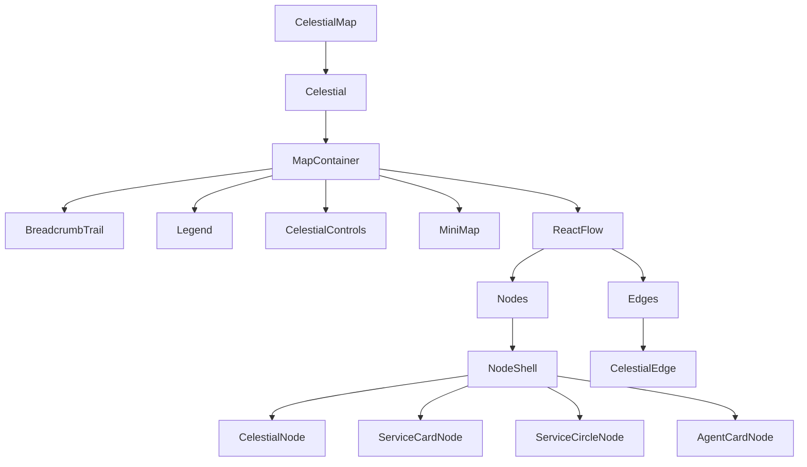

---
tags:
  - opensearch-dashboards
---
# APM & Observability

## Summary

OpenSearch Dashboards v3.6.0 introduces the `@osd/apm-topology` package — a React component library for rendering interactive APM service topology maps and GenAI agent trace visualizations. Built on ReactFlow (`@xyflow/react`) with automatic Dagre-based hierarchical layout, the package provides four node types, styled edges with animations, health donuts, breadcrumb navigation, minimap, legend, and full dark-mode support.

## Details

### What's New in v3.6.0

The `@osd/apm-topology` package is a new addition to the `packages/` directory of OpenSearch Dashboards. It provides a reusable topology visualization component that can be consumed by any OSD plugin.

#### Node Types

Four node types are included, all wrapped in a shared `NodeShell` component that provides consistent selection glow, fade state, border color, keyboard accessibility, and 8 ReactFlow connection handles:

| Node Type | Component | Use Case |
|-----------|-----------|----------|
| CelestialNode | `celestialNode` (default) | APM card with health donut, SLI status badge, request metrics, "View insights" button |
| ServiceCardNode | `serviceCard` | Modern APM card with TypeBadge, MetricBar, custom action button |
| ServiceCircleNode | `serviceCircle` | Compact circle with HealthArc segments, center icon + metric value |
| AgentCardNode | `agentCard` | GenAI trace card with 7 node kinds, provider icons, duration/token metric bars |

#### GenAI Agent Trace Visualization

The `AgentCardNode` supports 7 node kinds for visualizing GenAI/LLM agent traces:

| Kind | Color | Description |
|------|-------|-------------|
| `agent` | Teal (#54B399) | Orchestrator — `create_agent`, `execute_agent`, `invoke_agent` |
| `llm` | Pink (#DD0A73) | LLM calls — `chat`, `text_completion`, `generate_content` |
| `tool` | Coral (#E7664C) | Tool execution — `execute_tool` |
| `retrieval` | Tan (#B9A888) | Retrieval operations |
| `embeddings` | Steel Blue (#6092C0) | Embedding operations |
| `content` | Amber (#D6BF57) | Document/knowledge-base operations |
| `other` | Gray (#98A2B3) | Unknown operations |

Provider icon resolution is included for OpenAI, Anthropic, AWS Bedrock, Azure AI, Google Vertex AI, Cohere, Mistral, and Meta.

#### Styled Edges

The `CelestialEdge` component supports custom edge rendering with configurable stroke patterns (`solid`, `dashed`, `dotted`), animations (`flow`, `pulse`), arrowhead markers (`arrow`, `arrowClosed`, `none`), custom colors, stroke widths, and mid-edge text labels.

#### Layout & Interaction

- Automatic Dagre-based hierarchical layout with configurable direction (LR, RL, TB, BT)
- Breadcrumb navigation with health donut icons per crumb
- Minimap (ReactFlow MiniMap), legend toggle, zoom controls, fit-to-view
- Node hover glow and selection glow ring effects
- Camera behaviors: zoom-to-node, zoom-to-neighborhood, zoom-to-edge
- Dark mode auto-detected from OSD theme via CSS `color-scheme`

### Technical Changes

- New package at `packages/osd-apm-topology/` with ~50+ source files
- Technology stack: React 18, `@xyflow/react` 12, `@dagrejs/dagre`, Tailwind CSS v4 (prefixed `osd:`), Ramda
- Tailwind CSS v4 integration with a custom `strip-layers.js` post-processor to remove `@layer` wrappers that conflict with OSD's unlayered styles
- CSS custom properties for node type colors, status colors, and glow effects
- Example plugin at `examples/apm_topology_example/` demonstrating all node types, edge styles, and interactive features
- Registered as `@osd/apm-topology` version 1.0.0 in the root `package.json`

### Architecture

## Limitations

- No milestone or version label on the PR; the package is at version 1.0.0
- Performance with large graphs (1000+ nodes) is not yet optimized
- No built-in search/filter within the topology view
- Timeline/replay mode for traces is listed as a future enhancement

## References

### Pull Requests

| PR | Description | Related Issue |
|----|-------------|---------------|
| `https://github.com/opensearch-project/OpenSearch-Dashboards/pull/11394` | Add `@osd/apm-topology` package for APM service map, trace map, and GenAI agent trace visualization | `https://github.com/opensearch-project/OpenSearch-Dashboards/issues/9898` |
