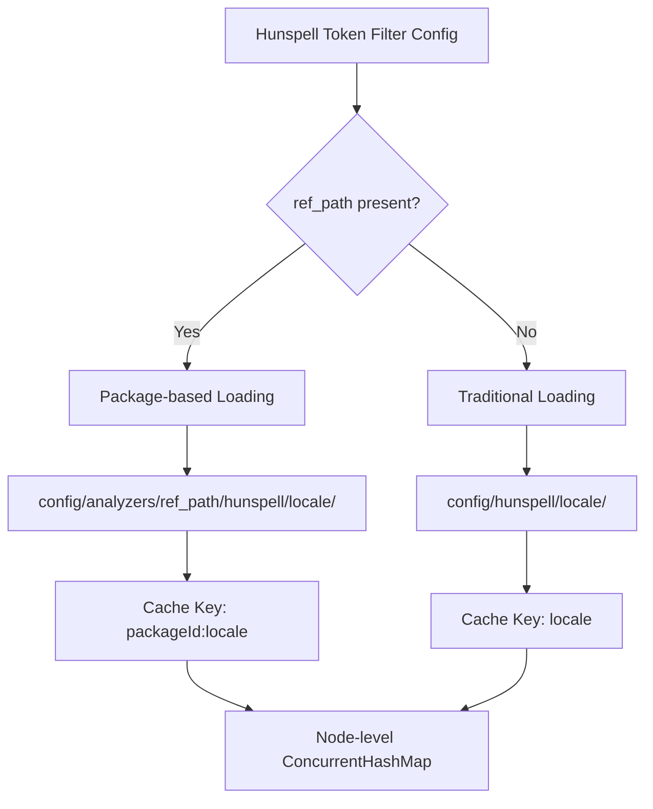

---
tags:
  - opensearch
---
# Analysis & Text Processing

## Summary

OpenSearch v3.6.0 adds `ref_path` support to the Hunspell token filter, enabling package-based dictionary loading with multi-tenant isolation. This allows multiple packages to maintain independent Hunspell dictionaries for the same locale, resolving the previous limitation where only one dictionary could exist per locale name.

## Details

### What's New in v3.6.0

A new optional `ref_path` parameter has been added to the `hunspell` token filter. When specified, it acts as a package identifier that directs dictionary loading to a package-specific directory instead of the traditional `config/hunspell/{locale}/` path.

**New parameter: `ref_path`**
- Specifies a package ID (e.g., `"pkg-1234"`)
- Must be used together with `locale`
- Dictionaries are loaded from `config/analyzers/{ref_path}/hunspell/{locale}/`
- Cache key format: `{packageId}:{locale}` (e.g., `"pkg-1234:en_US"`)

**Usage example (package-based):**
```json
{
  "type": "hunspell",
  "ref_path": "pkg-1234",
  "locale": "en_US",
  "dedup": true
}
```

**Traditional usage (unchanged):**
```json
{
  "type": "hunspell",
  "locale": "en_US"
}
```

### Technical Changes

**`HunspellTokenFilterFactory`** (`server/src/main/java/org/opensearch/index/analysis/HunspellTokenFilterFactory.java`):
- Reads the new `ref_path` setting alongside `locale`/`language`/`lang`
- Routes to `HunspellService.getDictionaryFromPackage()` when `ref_path` is present
- Adds `validatePackageIdentifier()` — an allowlist-based validator that permits only alphanumeric characters, hyphens, and underscores to prevent path traversal and cache key injection

**`HunspellService`** (`server/src/main/java/org/opensearch/indices/analysis/HunspellService.java`):
- New `getDictionaryFromPackage(String packageId, String locale)` method for package-based loading
- New `loadDictionaryFromPackage()` with multi-layer security: raw input validation, resolved path containment checks, and parent directory verification
- Refactored `loadDictionary()` to accept a `baseDir` parameter, enabling reuse for both traditional and package-based loading
- New `buildPackageCacheKey()` for `{packageId}:{locale}` cache key construction
- Stores `Environment` reference for resolving `config/analyzers/` base path



**Security measures:**
- Allowlist regex pattern: `^[a-zA-Z0-9][a-zA-Z0-9_-]*$`
- Raw input validation rejects `/`, `\`, `..`, `:`, spaces, and special characters
- Resolved path containment check ensures paths stay under `config/analyzers/`
- Parent directory verification ensures package ID resolves to exactly one level under `analyzers/`

### Backward Compatibility

- Traditional `locale`/`language`/`lang` parameters continue to work unchanged
- Existing index configurations require no changes
- Error message for missing locale has been improved to be more descriptive

## Limitations

- This is Part 1 of a 2-part implementation. Part 2 (REST API endpoints for cache info and invalidation, hot-reload support) is planned for a future release.
- No hot-reload support yet — once a dictionary is cached, it persists until node restart.
- The `updateable: true` flag for `_reload_search_analyzers` API support is not yet implemented in this PR.

## References

### Pull Requests
| PR | Description | Related Issue |
|----|-------------|---------------|
| `https://github.com/opensearch-project/OpenSearch/pull/20840` | Add ref_path support for package-based Hunspell dictionary loading | `https://github.com/opensearch-project/OpenSearch/issues/20712` |

### Related Issues
- `https://github.com/opensearch-project/OpenSearch/issues/20712` — RFC: Add ref_path support for Hunspell token filter to enable multi-package same-locale dictionaries
