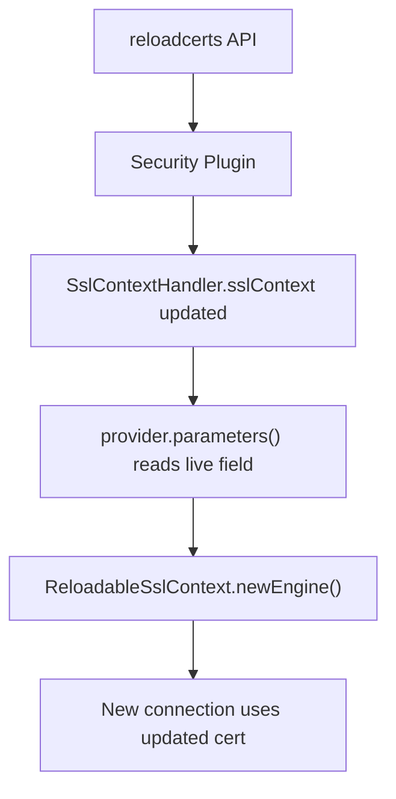

---
tags:
  - opensearch
---
# Arrow Flight Transport

## Summary

Fixed TLS certificate hot-reload for the Arrow Flight transport layer. Previously, when the Security plugin reloaded certificates via the `reloadcerts` API, the Flight server and client continued serving the old certificate until a node restart. A new `ReloadableSslContext` wrapper now delegates `newEngine()` to a supplier that reads the live certificate material on every new connection, matching the behavior of `SecureNetty4Transport`.

## Details

### What's New in v3.6.0

The `DefaultSslContextProvider` had a `// TODO - handle certificates reload` comment — the Flight transport was the only transport layer that did not pick up reloaded certificates without a restart.

This fix introduces three changes:

1. **`ReloadableSslContext`** — A new `SslContext` subclass that wraps a delegate supplier. On every `newEngine()` call (triggered by gRPC's `ServerTlsHandler` / `ClientTlsHandler` for each new TCP connection), it reads a fresh `SslContext` from the supplier. The supplier calls `SecureTransportSettingsProvider.parameters()`, which reads from the live `SslContextHandler.sslContext` field — the same field the security plugin's `reloadcerts` API replaces. Stable metadata methods (`cipherSuites()`, `isClient()`, `sessionContext()`, `applicationProtocolNegotiator()`) delegate to the initial context captured at startup.

2. **`DefaultSslContextProvider` refactored** — Server and client SSL contexts are now wrapped in `ReloadableSslContext` instances at construction time. The `buildServerSslContext()` and `buildClientSslContext()` methods are extracted as static helpers and passed as suppliers to the reloadable wrapper.

3. **`FlightTransport` client lifecycle change** — The shared `ConcurrentMap<String, ClientHolder>` cache of `FlightClient` instances is removed. `initiateChannel()` now creates a fresh `FlightClient` per connection (called once per node by `ClusterConnectionManager`), and `FlightClientChannel.close()` properly closes its owned `FlightClient`. This matches the per-connection pattern of `SecureNetty4Transport` and ensures each new connection uses the current certificate.

### Technical Changes

| File | Change |
|------|--------|
| `ReloadableSslContext.java` | New class — `SslContext` wrapper delegating `newEngine()` to supplier |
| `DefaultSslContextProvider.java` | Wraps server/client contexts in `ReloadableSslContext`; removes TODO |
| `FlightTransport.java` | Removes `FlightClient` cache; creates per-connection clients |
| `FlightClientChannel.java` | Adds `client.close()` in `close()` method |
| `ReloadableSslContextTests.java` | Unit tests verifying supplier delegation |
| `ReloadableSslContextFlightIT.java` | Integration test with real Flight server/client cert swap |

### Reload Chain

## Limitations

- Each new connection after reload uses the updated certificate; existing connections continue with the old certificate until they are closed and reconnected.

## References

### Pull Requests
| PR | Description | Related Issue |
|----|-------------|---------------|
| [#20700](https://github.com/opensearch-project/OpenSearch/pull/20700) | Flight transport TLS cert hot-reload | - |
